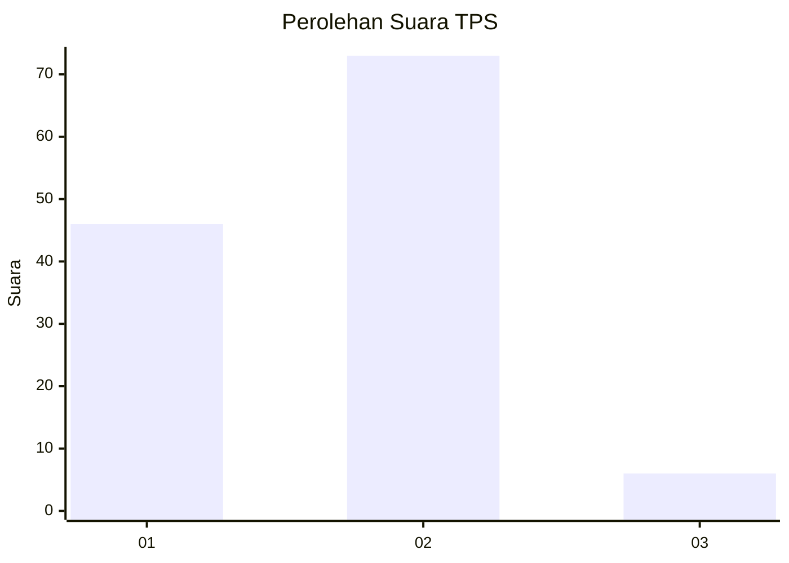
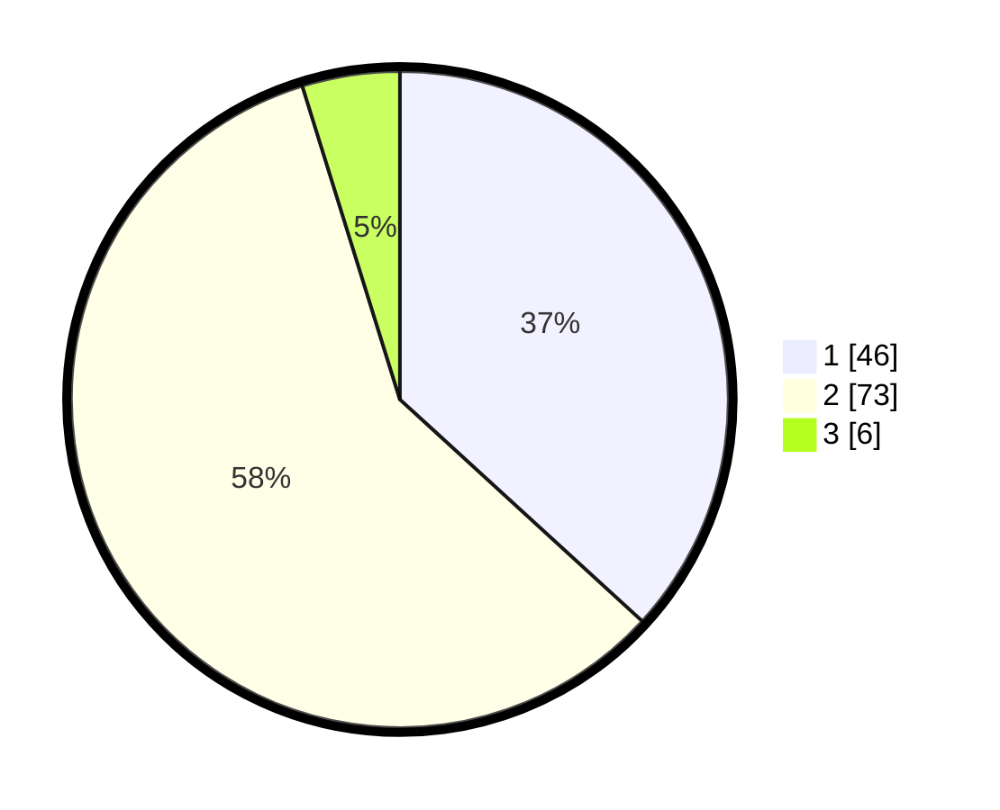

# Hasil

## Grafik

## Tabel

| No. | Nama Paslon    | Suara | Suara (raw) | Persentase |
|:--- |:-------------- | -----:| -----------:| ----------:|
| 1   | ANIES MUHAIMIN | 46    | [46][p-1]   | 36,80      |
| 2   | PRABOWO GIBRAN | 73    | [73][p-2]   | 58,40      |
| 3   | GANJAR MAHFUD  | 6     | [6][p-3]    | 4,80       |

[p-1]: https://github.com/gigit-pemilu/pemilu-2024-16-sumatera-selatan/blob/main/pilpres/hitung-suara/sub/16-sumatera-selatan/sub/71-kota-palembang/sub/04-ilir-barat-satu/sub/1002-lorokpakjo/sub/078-tps/sub/paslon-1.txt
[p-2]: https://github.com/gigit-pemilu/pemilu-2024-16-sumatera-selatan/blob/main/pilpres/hitung-suara/sub/16-sumatera-selatan/sub/71-kota-palembang/sub/04-ilir-barat-satu/sub/1002-lorokpakjo/sub/078-tps/sub/paslon-2.txt
[p-3]: https://github.com/gigit-pemilu/pemilu-2024-16-sumatera-selatan/blob/main/pilpres/hitung-suara/sub/16-sumatera-selatan/sub/71-kota-palembang/sub/04-ilir-barat-satu/sub/1002-lorokpakjo/sub/078-tps/sub/paslon-3.txt

## Foto C Plano

https://sirekap-obj-formc.kpu.go.id/dee1/pemilu/ppwp/16/71/04/10/02/1671041002078-20240219-211536--f74561e6-a2f3-4e8a-a066-2c3d49cd4e0f.jpg

https://sirekap-obj-formc.kpu.go.id/dee1/pemilu/ppwp/16/71/04/10/02/1671041002078-20240219-211649--9225182b-0776-4904-86c1-c678124929fe.jpg

https://sirekap-obj-formc.kpu.go.id/dee1/pemilu/ppwp/16/71/04/10/02/1671041002078-20240219-211847--4c25db37-ea05-43d7-bb60-ca26586ef784.jpg

## Metadata

| Key        | Value               |
| ---------- | ------------------- |
| Time Stamp | 2024-02-25 18:00:00 |

