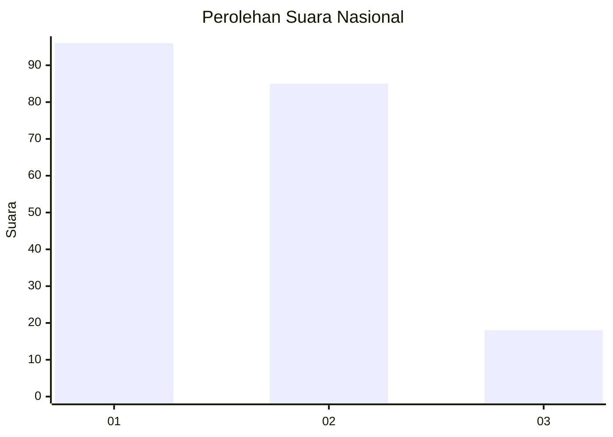
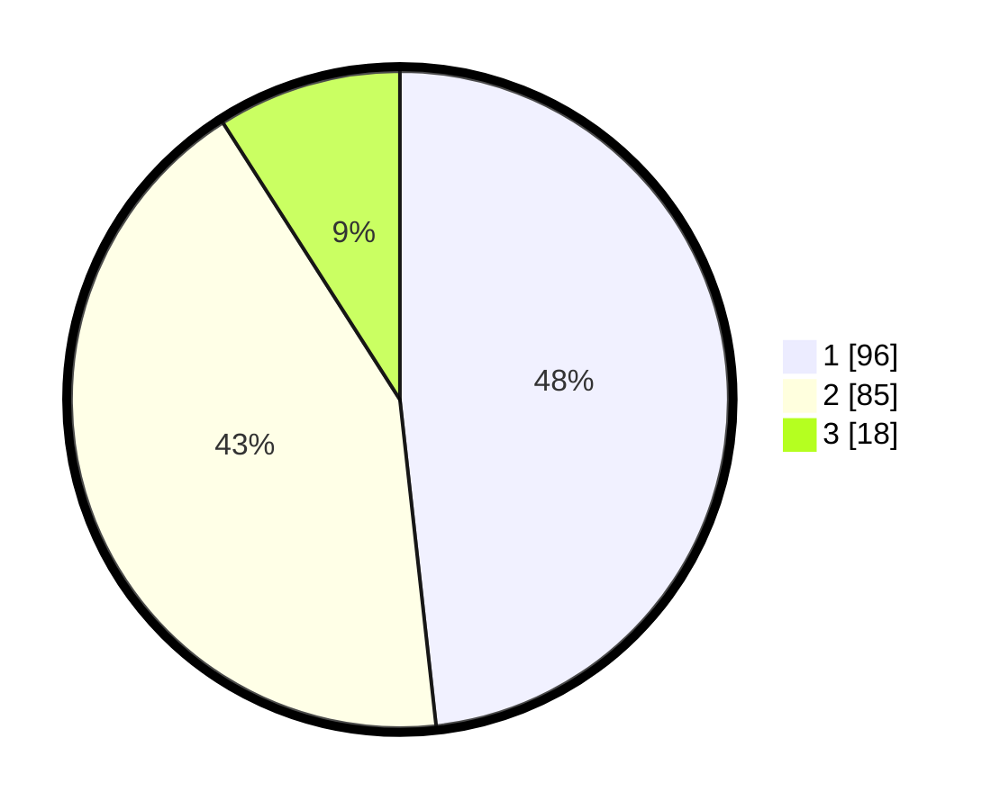

# Hasil

## Grafik

## Tabel

| No. | Nama Paslon    | Suara | Suara (raw) | Persentase |
|:--- |:-------------- | -----:| -----------:| ----------:|
| 1   | ANIES MUHAIMIN | 96    | [96][p-1]   | 48,24      |
| 2   | PRABOWO GIBRAN | 85    | [85][p-2]   | 42,71      |
| 3   | GANJAR MAHFUD  | 18    | [18][p-3]   | 9,05       |

[p-1]: https://github.com/gigit-pemilu/pemilu-2024/blob/main/pilpres/hitung-suara/sub/16-sumatera-selatan/sub/71-kota-palembang/sub/04-ilir-barat-satu/sub/1003-dua-puluh-enam-ilir-satu/sub/001-tps/sub/paslon-1.txt
[p-2]: https://github.com/gigit-pemilu/pemilu-2024/blob/main/pilpres/hitung-suara/sub/16-sumatera-selatan/sub/71-kota-palembang/sub/04-ilir-barat-satu/sub/1003-dua-puluh-enam-ilir-satu/sub/001-tps/sub/paslon-2.txt
[p-3]: https://github.com/gigit-pemilu/pemilu-2024/blob/main/pilpres/hitung-suara/sub/16-sumatera-selatan/sub/71-kota-palembang/sub/04-ilir-barat-satu/sub/1003-dua-puluh-enam-ilir-satu/sub/001-tps/sub/paslon-3.txt

## Foto C Plano

https://sirekap-obj-formc.kpu.go.id/964a/pemilu/ppwp/16/71/04/10/03/1671041003001-20240217-165421--6b65bf26-b9af-4228-b0a3-7ac8999150a2.jpg

https://sirekap-obj-formc.kpu.go.id/964a/pemilu/ppwp/16/71/04/10/03/1671041003001-20240217-163715--17f9dcfb-fb71-4c80-91ef-05a0a3ece134.jpg

https://sirekap-obj-formc.kpu.go.id/964a/pemilu/ppwp/16/71/04/10/03/1671041003001-20240217-163945--8d03b5e2-7c49-42d4-a5e3-f01e8a6db515.jpg

## Metadata

| Key        | Value               |
| ---------- | ------------------- |
| Time Stamp | 2024-02-25 21:00:00 |

