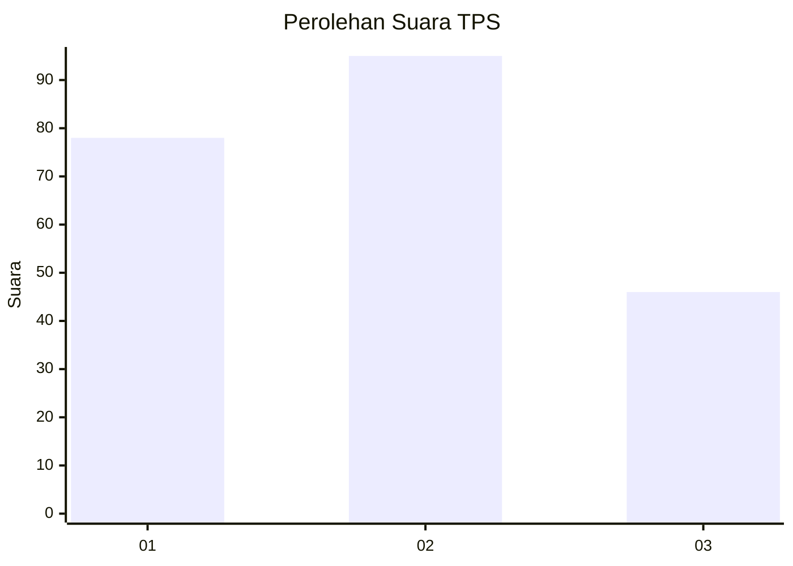
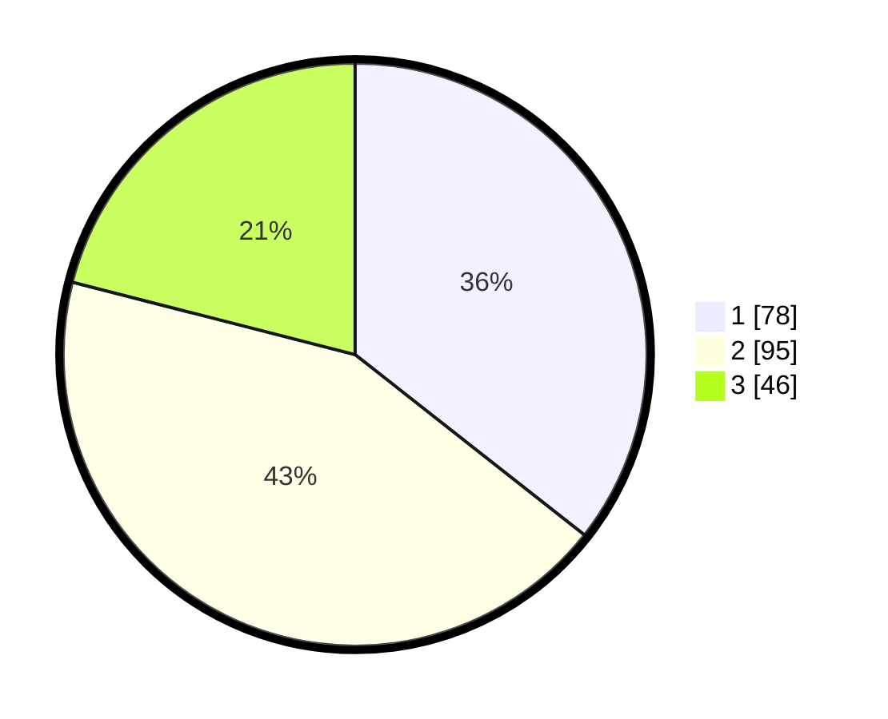

# Hasil

## Grafik

## Tabel

| No. | Nama Paslon    | Suara | Suara (raw) | Persentase |
|:--- |:-------------- | -----:| -----------:| ----------:|
| 1   | ANIES MUHAIMIN | 78    | [78][p-1]   | 35,62      |
| 2   | PRABOWO GIBRAN | 95    | [95][p-2]   | 43,38      |
| 3   | GANJAR MAHFUD  | 46    | [46][p-3]   | 21,00      |

[p-1]: https://github.com/gigit-pemilu/pemilu-2024-16-sumatera-selatan/blob/main/pilpres/hitung-suara/sub/16-sumatera-selatan/sub/71-kota-palembang/sub/04-ilir-barat-satu/sub/1003-dua-puluh-enam-ilir-satu/sub/002-tps/sub/paslon-1.txt
[p-2]: https://github.com/gigit-pemilu/pemilu-2024-16-sumatera-selatan/blob/main/pilpres/hitung-suara/sub/16-sumatera-selatan/sub/71-kota-palembang/sub/04-ilir-barat-satu/sub/1003-dua-puluh-enam-ilir-satu/sub/002-tps/sub/paslon-2.txt
[p-3]: https://github.com/gigit-pemilu/pemilu-2024-16-sumatera-selatan/blob/main/pilpres/hitung-suara/sub/16-sumatera-selatan/sub/71-kota-palembang/sub/04-ilir-barat-satu/sub/1003-dua-puluh-enam-ilir-satu/sub/002-tps/sub/paslon-3.txt

## Foto C Plano

https://sirekap-obj-formc.kpu.go.id/a0d1/pemilu/ppwp/16/71/04/10/03/1671041003002-20240222-213431--0db3b663-3b1a-4325-8767-e0f92ac47094.jpg

https://sirekap-obj-formc.kpu.go.id/a0d1/pemilu/ppwp/16/71/04/10/03/1671041003002-20240222-213237--0841e186-6ee0-428e-adb7-d82be41e7320.jpg

https://sirekap-obj-formc.kpu.go.id/a0d1/pemilu/ppwp/16/71/04/10/03/1671041003002-20240222-213321--86aafab0-12f6-4b93-9d8e-507ee6ecac64.jpg

## Metadata

| Key        | Value               |
| ---------- | ------------------- |
| Time Stamp | 2024-02-25 16:00:00 |

