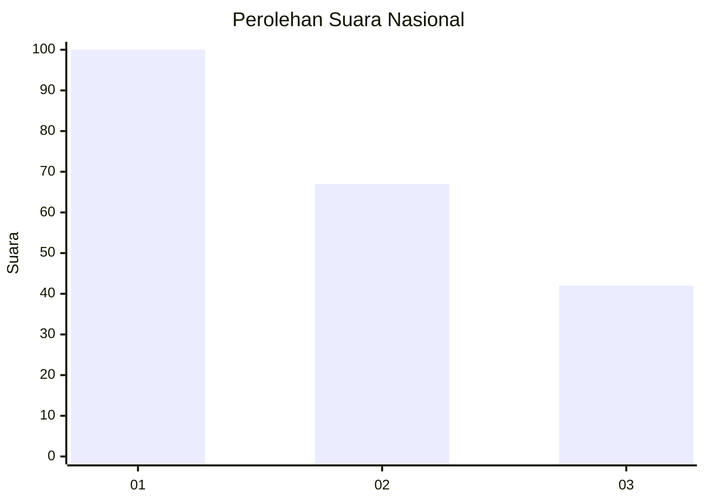
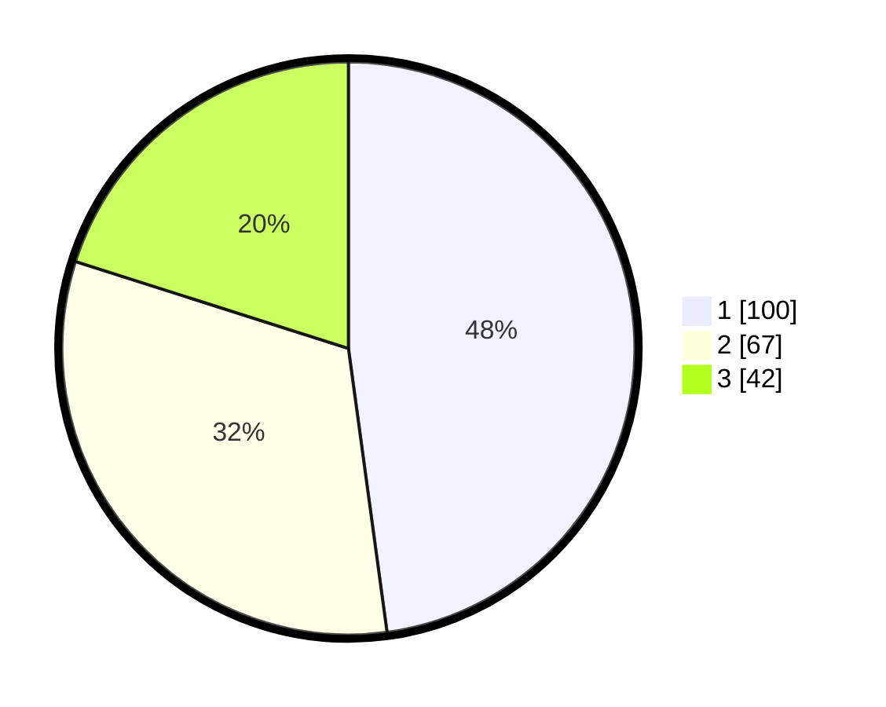

# Hasil

## Grafik

## Tabel

| No. | Nama Paslon    | Suara | Suara (raw) | Persentase |
|:--- |:-------------- | -----:| -----------:| ----------:|
| 1   | ANIES MUHAIMIN | 100   | [100][p-1]  | 47,85      |
| 2   | PRABOWO GIBRAN | 67    | [67][p-2]   | 32,06      |
| 3   | GANJAR MAHFUD  | 42    | [42][p-3]   | 20,10      |

[p-1]: https://github.com/gigit-pemilu/pemilu-2024/blob/main/pilpres/hitung-suara/sub/16-sumatera-selatan/sub/71-kota-palembang/sub/04-ilir-barat-satu/sub/1003-dua-puluh-enam-ilir-satu/sub/007-tps/sub/paslon-1.txt
[p-2]: https://github.com/gigit-pemilu/pemilu-2024/blob/main/pilpres/hitung-suara/sub/16-sumatera-selatan/sub/71-kota-palembang/sub/04-ilir-barat-satu/sub/1003-dua-puluh-enam-ilir-satu/sub/007-tps/sub/paslon-2.txt
[p-3]: https://github.com/gigit-pemilu/pemilu-2024/blob/main/pilpres/hitung-suara/sub/16-sumatera-selatan/sub/71-kota-palembang/sub/04-ilir-barat-satu/sub/1003-dua-puluh-enam-ilir-satu/sub/007-tps/sub/paslon-3.txt

## Foto C Plano

https://sirekap-obj-formc.kpu.go.id/d8fb/pemilu/ppwp/16/71/04/10/03/1671041003007-20240220-103232--0000c712-d6b7-4188-a017-084aa1417e2c.jpg

https://sirekap-obj-formc.kpu.go.id/d8fb/pemilu/ppwp/16/71/04/10/03/1671041003007-20240220-103348--fc174917-3238-4cf4-8422-0aaf37a1e15c.jpg

https://sirekap-obj-formc.kpu.go.id/d8fb/pemilu/ppwp/16/71/04/10/03/1671041003007-20240220-103455--e8fd5881-c40a-453d-a0f7-f8d945a65640.jpg

## Metadata

| Key        | Value               |
| ---------- | ------------------- |
| Time Stamp | 2024-02-26 12:00:00 |

