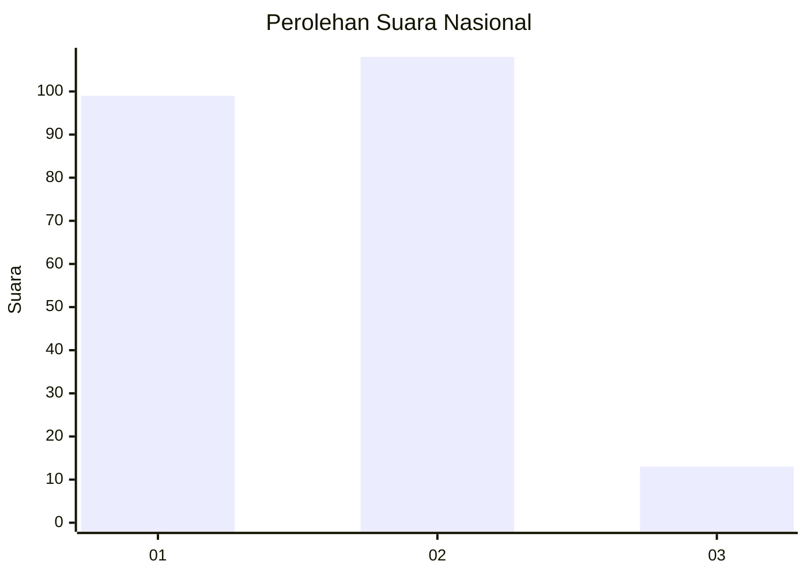
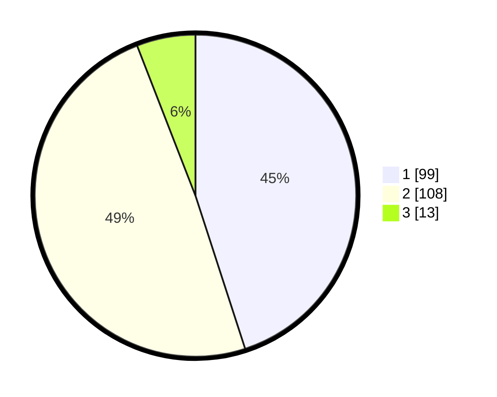

# Hasil

## Grafik

## Tabel

| No. | Nama Paslon    | Suara | Suara (raw) | Persentase |
|:--- |:-------------- | -----:| -----------:| ----------:|
| 1   | ANIES MUHAIMIN | 99    | [99][p-1]   | 45,00      |
| 2   | PRABOWO GIBRAN | 108   | [108][p-2]  | 49,09      |
| 3   | GANJAR MAHFUD  | 13    | [13][p-3]   | 5,91       |

[p-1]: https://github.com/gigit-pemilu/pemilu-2024/blob/main/pilpres/hitung-suara/sub/16-sumatera-selatan/sub/71-kota-palembang/sub/04-ilir-barat-satu/sub/1003-dua-puluh-enam-ilir-satu/sub/008-tps/sub/paslon-1.txt
[p-2]: https://github.com/gigit-pemilu/pemilu-2024/blob/main/pilpres/hitung-suara/sub/16-sumatera-selatan/sub/71-kota-palembang/sub/04-ilir-barat-satu/sub/1003-dua-puluh-enam-ilir-satu/sub/008-tps/sub/paslon-2.txt
[p-3]: https://github.com/gigit-pemilu/pemilu-2024/blob/main/pilpres/hitung-suara/sub/16-sumatera-selatan/sub/71-kota-palembang/sub/04-ilir-barat-satu/sub/1003-dua-puluh-enam-ilir-satu/sub/008-tps/sub/paslon-3.txt

## Foto C Plano

https://sirekap-obj-formc.kpu.go.id/0b22/pemilu/ppwp/16/71/04/10/03/1671041003008-20240220-112239--c398be89-8db7-48ac-b094-9651827d22c8.jpg

https://sirekap-obj-formc.kpu.go.id/0b22/pemilu/ppwp/16/71/04/10/03/1671041003008-20240220-110820--d4285a41-e181-4ee2-a0e8-e94f50ac9db9.jpg

https://sirekap-obj-formc.kpu.go.id/0b22/pemilu/ppwp/16/71/04/10/03/1671041003008-20240220-111828--561bdab7-54c0-4afd-82ac-ecac10999bba.jpg

## Metadata

| Key        | Value               |
| ---------- | ------------------- |
| Time Stamp | 2024-02-25 16:00:00 |

