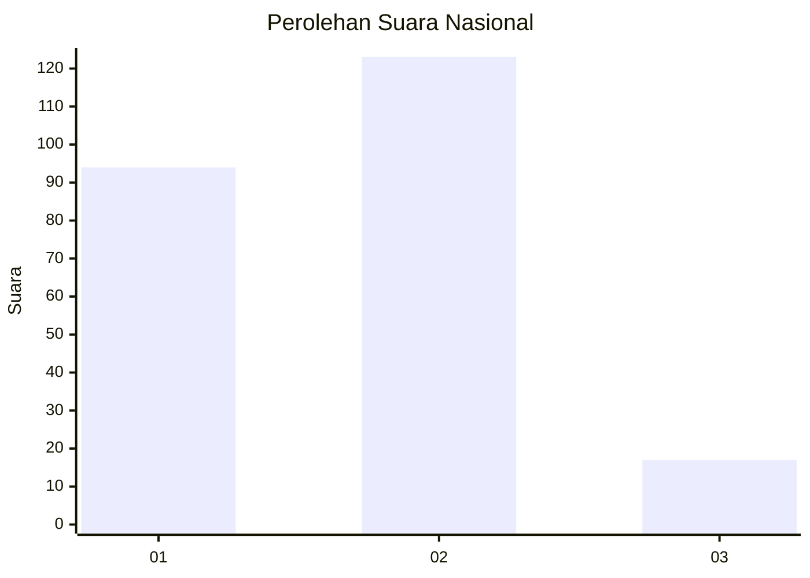

# Hasil

## Grafik

## Tabel

| No. | Nama Paslon    | Suara | Suara (raw) | Persentase |
|:--- |:-------------- | -----:| -----------:| ----------:|
| 1   | ANIES MUHAIMIN | 94    | [94][p-1]   | 40,17      |
| 2   | PRABOWO GIBRAN | 123   | [123][p-2]  | 52,56      |
| 3   | GANJAR MAHFUD  | 17    | [17][p-3]   | 7,26       |

[p-1]: https://github.com/gigit-pemilu/pemilu-2024/blob/main/pilpres/hitung-suara/sub/16-sumatera-selatan/sub/71-kota-palembang/sub/04-ilir-barat-satu/sub/1004-siringagung/sub/010-tps/sub/paslon-1.txt
[p-2]: https://github.com/gigit-pemilu/pemilu-2024/blob/main/pilpres/hitung-suara/sub/16-sumatera-selatan/sub/71-kota-palembang/sub/04-ilir-barat-satu/sub/1004-siringagung/sub/010-tps/sub/paslon-2.txt
[p-3]: https://github.com/gigit-pemilu/pemilu-2024/blob/main/pilpres/hitung-suara/sub/16-sumatera-selatan/sub/71-kota-palembang/sub/04-ilir-barat-satu/sub/1004-siringagung/sub/010-tps/sub/paslon-3.txt

## Foto C Plano

https://sirekap-obj-formc.kpu.go.id/b62f/pemilu/ppwp/16/71/04/10/04/1671041004010-20240221-112410--3508bdcd-eddc-4f8c-9e56-e75238f7a0ab.jpg

https://sirekap-obj-formc.kpu.go.id/b62f/pemilu/ppwp/16/71/04/10/04/1671041004010-20240221-112527--6d1be3e0-fa2a-415a-b0c9-9d2439ffa30d.jpg

https://sirekap-obj-formc.kpu.go.id/b62f/pemilu/ppwp/16/71/04/10/04/1671041004010-20240221-112628--4c6fb979-466d-4192-b425-8ba2259e7a3b.jpg

## Metadata

| Key        | Value               |
| ---------- | ------------------- |
| Time Stamp | 2024-02-21 12:00:00 |

## DATA PEMILIH TETAP

Jumlah pemilih dalam DPT: **296**.
 * L: **138**.
 * P: **158**.

## DATA PENGGUNA HAK PILIH

Jumlah pengguna hak pilih dalam DPT: **233**.
 * L: **3**.
 * P: **130**.

Jumlah pengguna hak pilih dalam DPTb: **857**.
 * L: **555**.
 * P: **587**.

Jumlah pengguna hak pilih dalam DPK: **1**.
 * L: **800**.
 * P: **401**.

Jumlah pengguna hak pilih: **31**.
 * L: **32**.
 * P: **35**.

## JUMLAH SUARA SAH DAN TIDAK SAH

JUMLAH SELURUH SUARA SAH: **234**.

JUMLAH SUARA TIDAK SAH: **1**.

JUMLAH SELURUH SUARA SAH DAN SUARA TIDAK SAH: **235**.

