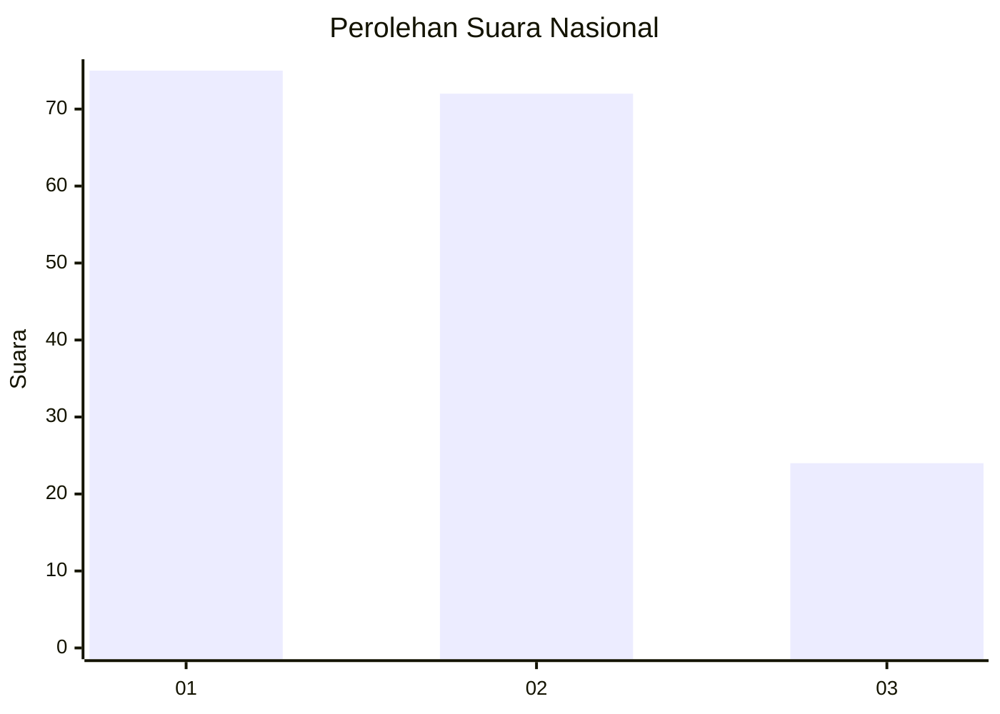
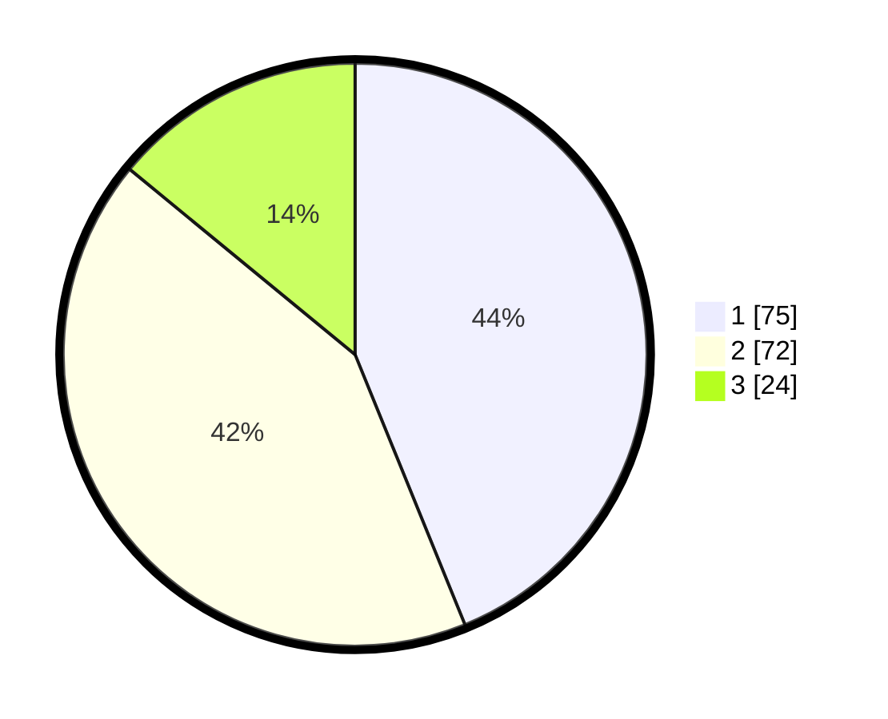

# Hasil

## Grafik

## Tabel

| No. | Nama Paslon    | Suara | Suara (raw) | Persentase |
|:--- |:-------------- | -----:| -----------:| ----------:|
| 1   | ANIES MUHAIMIN | 75    | [75][p-1]   | 43,86      |
| 2   | PRABOWO GIBRAN | 72    | [72][p-2]   | 42,11      |
| 3   | GANJAR MAHFUD  | 24    | [24][p-3]   | 14,04      |

[p-1]: https://github.com/gigit-pemilu/pemilu-2024/blob/main/pilpres/hitung-suara/sub/16-sumatera-selatan/sub/71-kota-palembang/sub/04-ilir-barat-satu/sub/1004-siringagung/sub/019-tps/sub/paslon-1.txt
[p-2]: https://github.com/gigit-pemilu/pemilu-2024/blob/main/pilpres/hitung-suara/sub/16-sumatera-selatan/sub/71-kota-palembang/sub/04-ilir-barat-satu/sub/1004-siringagung/sub/019-tps/sub/paslon-2.txt
[p-3]: https://github.com/gigit-pemilu/pemilu-2024/blob/main/pilpres/hitung-suara/sub/16-sumatera-selatan/sub/71-kota-palembang/sub/04-ilir-barat-satu/sub/1004-siringagung/sub/019-tps/sub/paslon-3.txt

## Foto C Plano

https://sirekap-obj-formc.kpu.go.id/f2b7/pemilu/ppwp/16/71/04/10/04/1671041004019-20240221-141847--c87b8d5e-be48-446b-9c2e-9ec6e9d53bbc.jpg

https://sirekap-obj-formc.kpu.go.id/f2b7/pemilu/ppwp/16/71/04/10/04/1671041004019-20240221-142123--9952e7af-469b-4376-9677-eb7221b4dc00.jpg

https://sirekap-obj-formc.kpu.go.id/f2b7/pemilu/ppwp/16/71/04/10/04/1671041004019-20240221-142213--e5ed95d7-1d01-4f2b-a580-5aee1fa530ac.jpg

## Metadata

| Key        | Value               |
| ---------- | ------------------- |
| Time Stamp | 2024-02-21 15:00:00 |

## DATA PEMILIH TETAP

Jumlah pemilih dalam DPT: **215**.
 * L: **0**.
 * P: **173**.

## DATA PENGGUNA HAK PILIH

Jumlah pengguna hak pilih dalam DPT: **169**.
 * L: **0**.
 * P: **88**.

Jumlah pengguna hak pilih dalam DPTb: **566**.
 * L: **555**.
 * P: **550**.

Jumlah pengguna hak pilih dalam DPK: **1**.
 * L: **7**.
 * P: **0**.

Jumlah pengguna hak pilih: **176**.
 * L: **2**.
 * P: **94**.

## JUMLAH SUARA SAH DAN TIDAK SAH

JUMLAH SELURUH SUARA SAH: **174**.

JUMLAH SUARA TIDAK SAH: **2**.

JUMLAH SELURUH SUARA SAH DAN SUARA TIDAK SAH: **175**.

