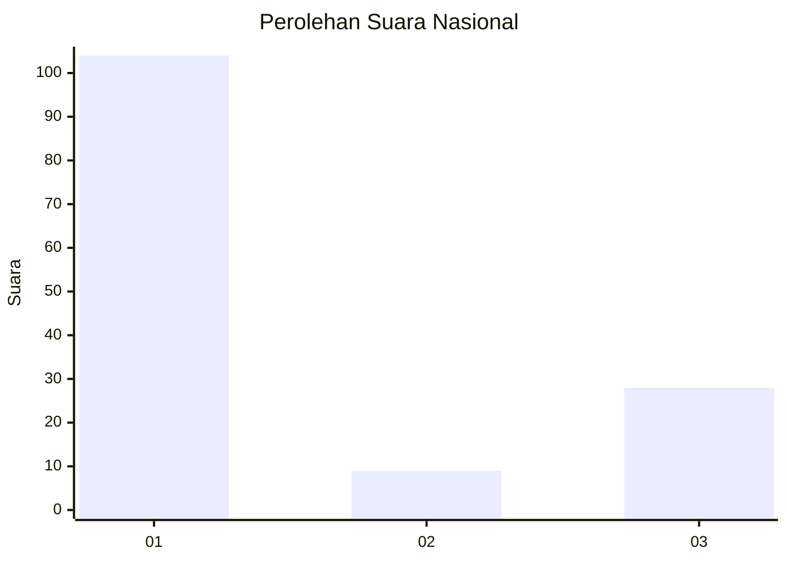
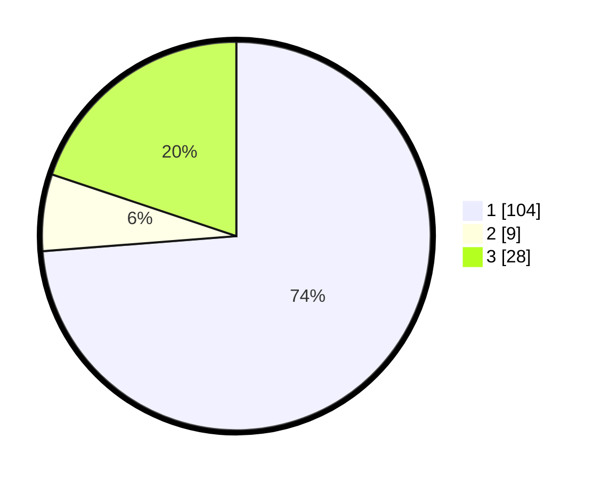

# Hasil

## Grafik

## Tabel

| No. | Nama Paslon    | Suara | Suara (raw) | Persentase |
|:--- |:-------------- | -----:| -----------:| ----------:|
| 1   | ANIES MUHAIMIN | 104   | [104][p-1]  | 73,76      |
| 2   | PRABOWO GIBRAN | 9     | [9][p-2]    | 6,38       |
| 3   | GANJAR MAHFUD  | 28    | [28][p-3]   | 19,86      |

[p-1]: https://github.com/gigit-pemilu/pemilu-2024/blob/main/pilpres/hitung-suara/sub/16-sumatera-selatan/sub/71-kota-palembang/sub/04-ilir-barat-satu/sub/1004-siringagung/sub/020-tps/sub/paslon-1.txt
[p-2]: https://github.com/gigit-pemilu/pemilu-2024/blob/main/pilpres/hitung-suara/sub/16-sumatera-selatan/sub/71-kota-palembang/sub/04-ilir-barat-satu/sub/1004-siringagung/sub/020-tps/sub/paslon-2.txt
[p-3]: https://github.com/gigit-pemilu/pemilu-2024/blob/main/pilpres/hitung-suara/sub/16-sumatera-selatan/sub/71-kota-palembang/sub/04-ilir-barat-satu/sub/1004-siringagung/sub/020-tps/sub/paslon-3.txt

## Foto C Plano

https://sirekap-obj-formc.kpu.go.id/f4a3/pemilu/ppwp/16/71/04/10/04/1671041004020-20240221-141528--f811aac0-cdac-4f58-8f52-e37ad75d9a18.jpg

https://sirekap-obj-formc.kpu.go.id/f4a3/pemilu/ppwp/16/71/04/10/04/1671041004020-20240221-141632--031a808e-bb30-4d80-9742-56fe283d92d7.jpg

https://sirekap-obj-formc.kpu.go.id/f4a3/pemilu/ppwp/16/71/04/10/04/1671041004020-20240221-141733--4b511997-15a6-41f6-bc28-e74255c6d76e.jpg

## Metadata

| Key        | Value               |
| ---------- | ------------------- |
| Time Stamp | 2024-02-21 15:00:00 |

## DATA PEMILIH TETAP

Jumlah pemilih dalam DPT: **270**.
 * L: **121**.
 * P: **144**.

## DATA PENGGUNA HAK PILIH

Jumlah pengguna hak pilih dalam DPT: **210**.
 * L: **41**.
 * P: **114**.

Jumlah pengguna hak pilih dalam DPTb: **3**.
 * L: **552**.
 * P: **501**.

Jumlah pengguna hak pilih dalam DPK: **1**.
 * L: **80**.
 * P: **1**.

Jumlah pengguna hak pilih: **214**.
 * L: **43**.
 * P: **131**.

## JUMLAH SUARA SAH DAN TIDAK SAH

JUMLAH SELURUH SUARA SAH: **211**.

JUMLAH SUARA TIDAK SAH: **7**.

JUMLAH SELURUH SUARA SAH DAN SUARA TIDAK SAH: **214**.

