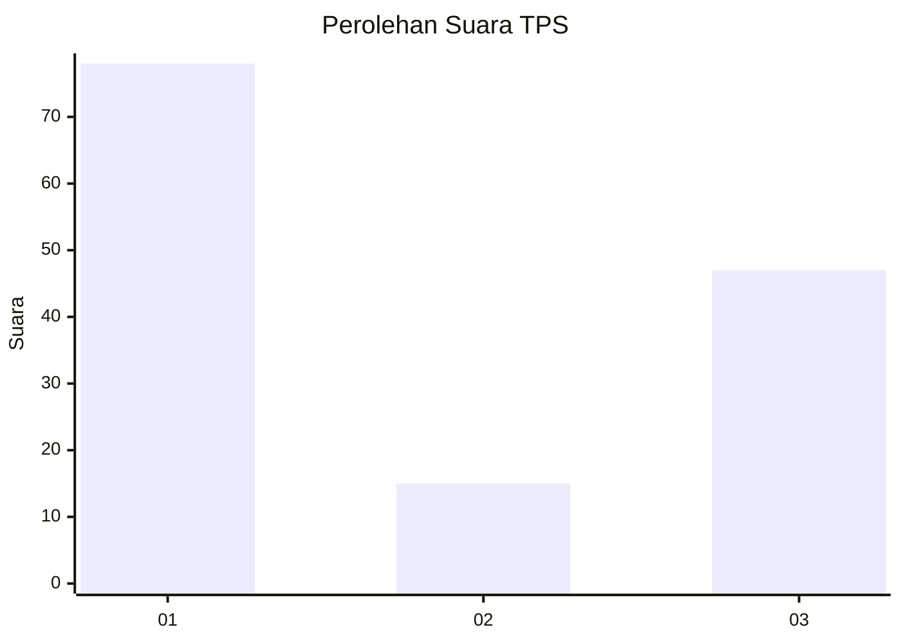
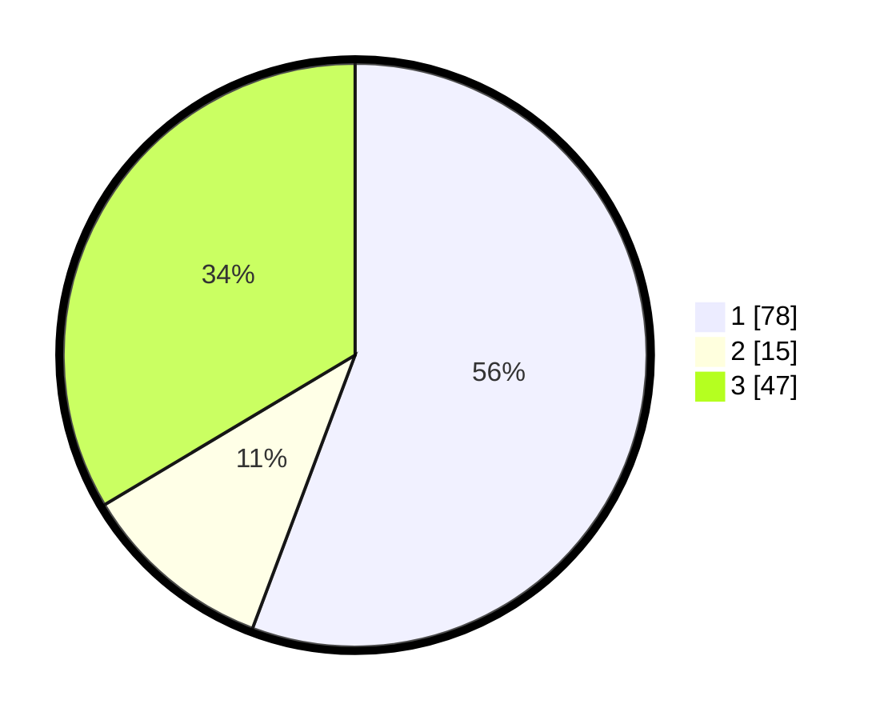

# Hasil

## Grafik

## Tabel

| No. | Nama Paslon    | Suara | Suara (raw) | Persentase |
|:--- |:-------------- | -----:| -----------:| ----------:|
| 1   | ANIES MUHAIMIN | 78    | [78][p-1]   | 55,71      |
| 2   | PRABOWO GIBRAN | 15    | [15][p-2]   | 10,71      |
| 3   | GANJAR MAHFUD  | 47    | [47][p-3]   | 33,57      |

[p-1]: https://github.com/gigit-pemilu/pemilu-2024-16-sumatera-selatan/blob/main/pilpres/hitung-suara/sub/16-sumatera-selatan/sub/71-kota-palembang/sub/04-ilir-barat-satu/sub/1004-siringagung/sub/022-tps/sub/paslon-1.txt
[p-2]: https://github.com/gigit-pemilu/pemilu-2024-16-sumatera-selatan/blob/main/pilpres/hitung-suara/sub/16-sumatera-selatan/sub/71-kota-palembang/sub/04-ilir-barat-satu/sub/1004-siringagung/sub/022-tps/sub/paslon-2.txt
[p-3]: https://github.com/gigit-pemilu/pemilu-2024-16-sumatera-selatan/blob/main/pilpres/hitung-suara/sub/16-sumatera-selatan/sub/71-kota-palembang/sub/04-ilir-barat-satu/sub/1004-siringagung/sub/022-tps/sub/paslon-3.txt

## Foto C Plano

https://sirekap-obj-formc.kpu.go.id/1227/pemilu/ppwp/16/71/04/10/04/1671041004022-20240221-150728--cf40b988-0c62-4a1c-9bba-2dad3701a54e.jpg

https://sirekap-obj-formc.kpu.go.id/1227/pemilu/ppwp/16/71/04/10/04/1671041004022-20240221-150948--f9ff9855-399e-4a5e-a84f-a955f9f61df7.jpg

https://sirekap-obj-formc.kpu.go.id/1227/pemilu/ppwp/16/71/04/10/04/1671041004022-20240221-151150--f6f41e7b-0acb-4887-8670-41793b9f5b6d.jpg

## Metadata

| Key        | Value               |
| ---------- | ------------------- |
| Time Stamp | 2024-02-21 16:00:00 |

## DATA PEMILIH TETAP

Jumlah pemilih dalam DPT: **275**.
 * L: **151**.
 * P: **522**.

## DATA PENGGUNA HAK PILIH

Jumlah pengguna hak pilih dalam DPT: **555**.
 * L: **22**.
 * P: **844**.

Jumlah pengguna hak pilih dalam DPTb: **220**.
 * L: **575**.
 * P: **525**.

Jumlah pengguna hak pilih dalam DPK: **82**.
 * L: **0**.
 * P: **8**.

Jumlah pengguna hak pilih: **23**.
 * L: **30**.
 * P: **842**.

## JUMLAH SUARA SAH DAN TIDAK SAH

JUMLAH SELURUH SUARA SAH: **211**.

JUMLAH SUARA TIDAK SAH: **7**.

JUMLAH SELURUH SUARA SAH DAN SUARA TIDAK SAH: **214**.

