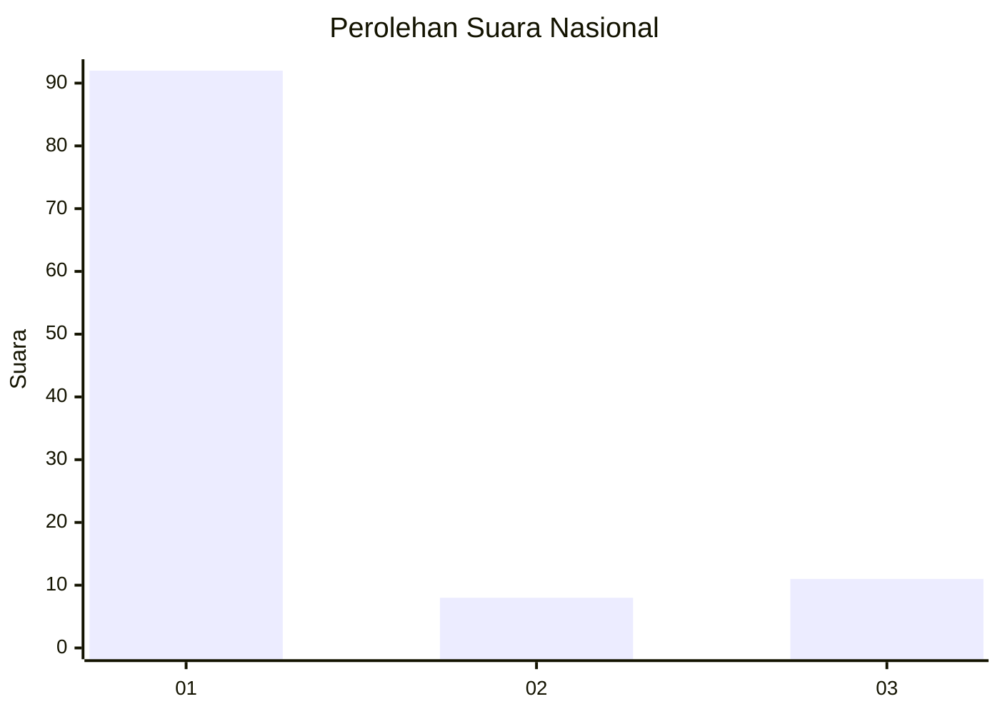
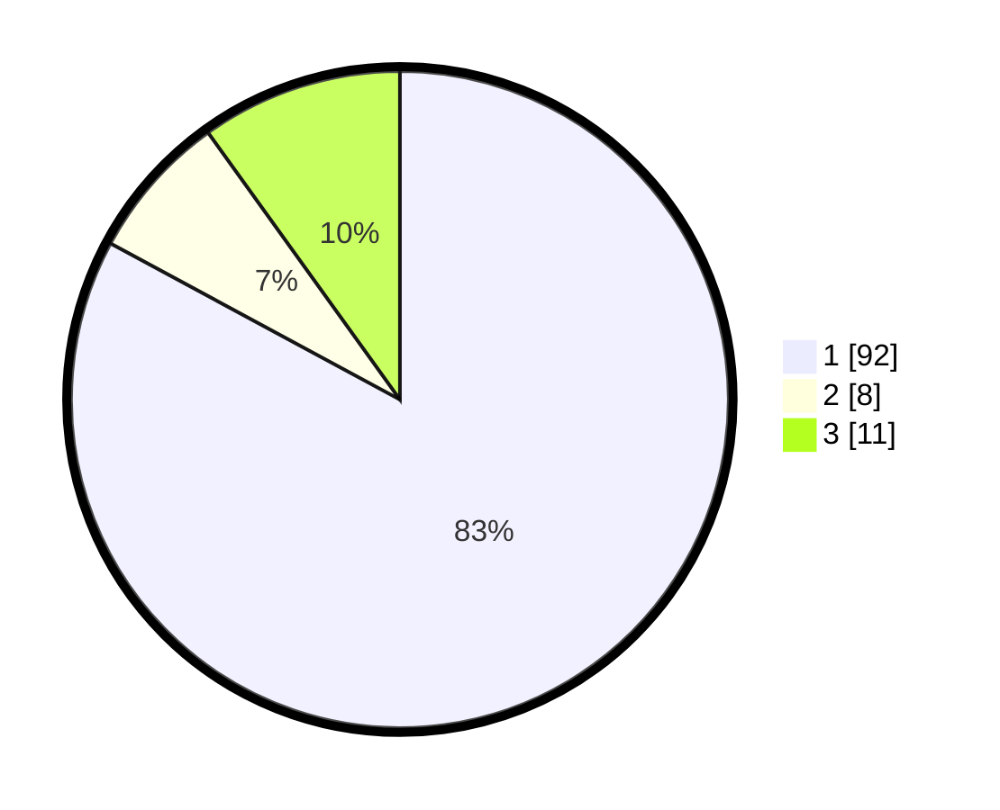

# Hasil

## Grafik

## Tabel

| No. | Nama Paslon    | Suara | Suara (raw) | Persentase |
|:--- |:-------------- | -----:| -----------:| ----------:|
| 1   | ANIES MUHAIMIN | 92    | [92][p-1]   | 82,88      |
| 2   | PRABOWO GIBRAN | 8     | [8][p-2]    | 7,21       |
| 3   | GANJAR MAHFUD  | 11    | [11][p-3]   | 9,91       |

[p-1]: https://github.com/gigit-pemilu/pemilu-2024/blob/main/pilpres/hitung-suara/sub/16-sumatera-selatan/sub/71-kota-palembang/sub/04-ilir-barat-satu/sub/1004-siringagung/sub/023-tps/sub/paslon-1.txt
[p-2]: https://github.com/gigit-pemilu/pemilu-2024/blob/main/pilpres/hitung-suara/sub/16-sumatera-selatan/sub/71-kota-palembang/sub/04-ilir-barat-satu/sub/1004-siringagung/sub/023-tps/sub/paslon-2.txt
[p-3]: https://github.com/gigit-pemilu/pemilu-2024/blob/main/pilpres/hitung-suara/sub/16-sumatera-selatan/sub/71-kota-palembang/sub/04-ilir-barat-satu/sub/1004-siringagung/sub/023-tps/sub/paslon-3.txt

## Foto C Plano

https://sirekap-obj-formc.kpu.go.id/b654/pemilu/ppwp/16/71/04/10/04/1671041004023-20240221-151255--76985543-907a-45a8-9e40-6123520b2200.jpg

https://sirekap-obj-formc.kpu.go.id/b654/pemilu/ppwp/16/71/04/10/04/1671041004023-20240221-151657--71c44f32-df1f-4675-bc45-07e8b976e3d5.jpg

https://sirekap-obj-formc.kpu.go.id/b654/pemilu/ppwp/16/71/04/10/04/1671041004023-20240221-151617--f1c6008f-4515-4169-8796-01fa533fcc88.jpg

## Metadata

| Key        | Value               |
| ---------- | ------------------- |
| Time Stamp | 2024-02-21 16:00:00 |

## DATA PEMILIH TETAP

Jumlah pemilih dalam DPT: **0**.
 * L: **0**.
 * P: **0**.

## DATA PENGGUNA HAK PILIH

Jumlah pengguna hak pilih dalam DPT: **4**.
 * L: **50**.
 * P: **0**.

Jumlah pengguna hak pilih dalam DPTb: **698**.
 * L: **322**.
 * P: **145**.

Jumlah pengguna hak pilih dalam DPK: **83**.
 * L: **204**.
 * P: **4**.

Jumlah pengguna hak pilih: **244**.
 * L: **80**.
 * P: **60**.

## JUMLAH SUARA SAH DAN TIDAK SAH

JUMLAH SELURUH SUARA SAH: **211**.

JUMLAH SUARA TIDAK SAH: **4**.

JUMLAH SELURUH SUARA SAH DAN SUARA TIDAK SAH: **215**.

