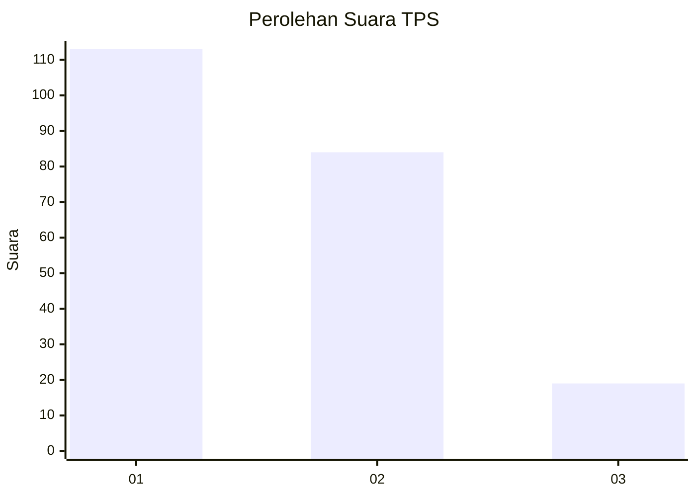
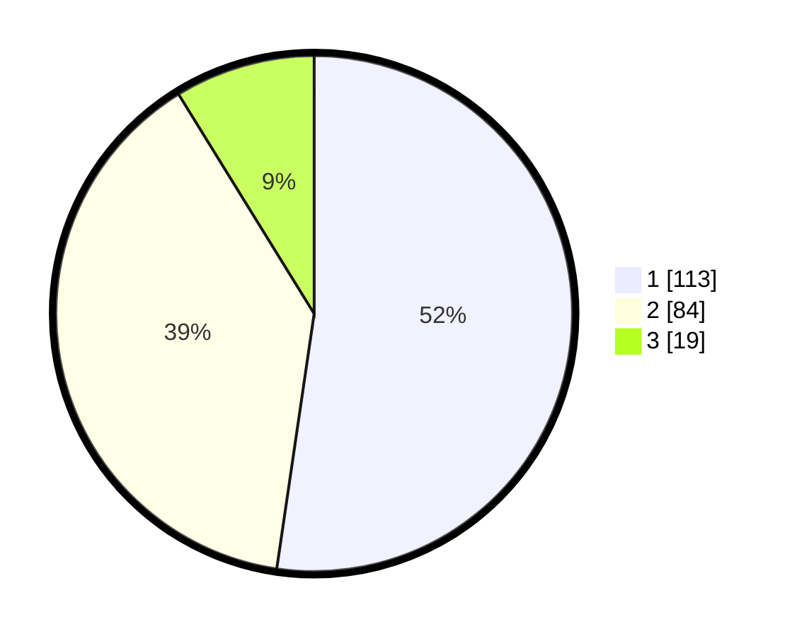

# Hasil

## Grafik

## Tabel

| No. | Nama Paslon    | Suara | Suara (raw) | Persentase |
|:--- |:-------------- | -----:| -----------:| ----------:|
| 1   | ANIES MUHAIMIN | 113   | [113][p-1]  | 52,31      |
| 2   | PRABOWO GIBRAN | 84    | [84][p-2]   | 38,89      |
| 3   | GANJAR MAHFUD  | 19    | [19][p-3]   | 8,80       |

[p-1]: https://github.com/gigit-pemilu/pemilu-2024-16-sumatera-selatan/blob/main/pilpres/hitung-suara/sub/16-sumatera-selatan/sub/71-kota-palembang/sub/04-ilir-barat-satu/sub/1004-siringagung/sub/027-tps/sub/paslon-1.txt
[p-2]: https://github.com/gigit-pemilu/pemilu-2024-16-sumatera-selatan/blob/main/pilpres/hitung-suara/sub/16-sumatera-selatan/sub/71-kota-palembang/sub/04-ilir-barat-satu/sub/1004-siringagung/sub/027-tps/sub/paslon-2.txt
[p-3]: https://github.com/gigit-pemilu/pemilu-2024-16-sumatera-selatan/blob/main/pilpres/hitung-suara/sub/16-sumatera-selatan/sub/71-kota-palembang/sub/04-ilir-barat-satu/sub/1004-siringagung/sub/027-tps/sub/paslon-3.txt

## Foto C Plano

https://sirekap-obj-formc.kpu.go.id/0df0/pemilu/ppwp/16/71/04/10/04/1671041004027-20240221-174518--b66aa358-d15d-42a1-abfd-f45efa3433b8.jpg

https://sirekap-obj-formc.kpu.go.id/0df0/pemilu/ppwp/16/71/04/10/04/1671041004027-20240221-174633--35cff4c1-49c0-4c95-9c20-5fbec38fc663.jpg

https://sirekap-obj-formc.kpu.go.id/0df0/pemilu/ppwp/16/71/04/10/04/1671041004027-20240221-174755--efdc9bf2-12c8-401e-b265-b979156a8939.jpg

## Metadata

| Key        | Value               |
| ---------- | ------------------- |
| Time Stamp | 2024-02-25 19:00:00 |

