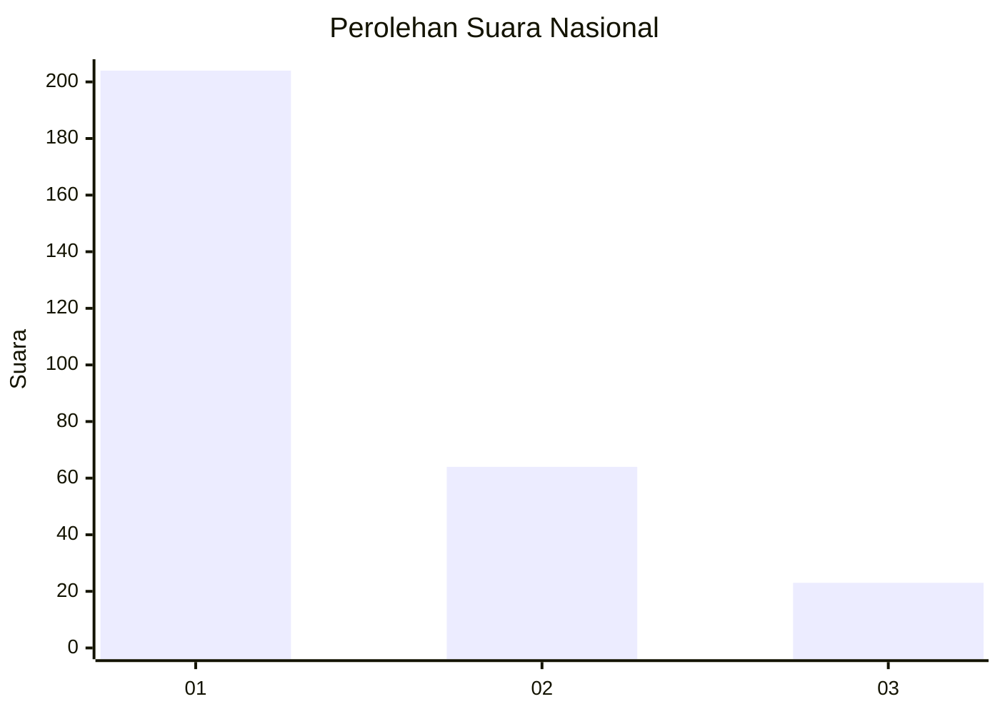
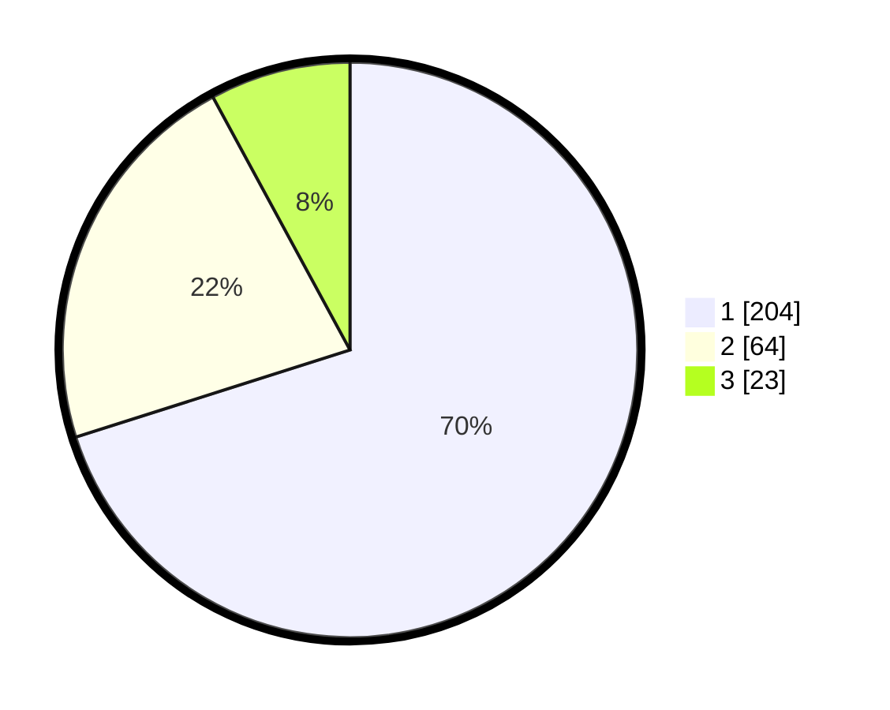

# Hasil

## Grafik

## Tabel

| No. | Nama Paslon    | Suara | Suara (raw) | Persentase |
|:--- |:-------------- | -----:| -----------:| ----------:|
| 1   | ANIES MUHAIMIN | 204   | [204][p-1]  | 70,10      |
| 2   | PRABOWO GIBRAN | 64    | [64][p-2]   | 21,99      |
| 3   | GANJAR MAHFUD  | 23    | [23][p-3]   | 7,90       |

[p-1]: https://github.com/gigit-pemilu/pemilu-2024/blob/main/pilpres/hitung-suara/sub/16-sumatera-selatan/sub/71-kota-palembang/sub/04-ilir-barat-satu/sub/1004-siringagung/sub/028-tps/sub/paslon-1.txt
[p-2]: https://github.com/gigit-pemilu/pemilu-2024/blob/main/pilpres/hitung-suara/sub/16-sumatera-selatan/sub/71-kota-palembang/sub/04-ilir-barat-satu/sub/1004-siringagung/sub/028-tps/sub/paslon-2.txt
[p-3]: https://github.com/gigit-pemilu/pemilu-2024/blob/main/pilpres/hitung-suara/sub/16-sumatera-selatan/sub/71-kota-palembang/sub/04-ilir-barat-satu/sub/1004-siringagung/sub/028-tps/sub/paslon-3.txt

## Foto C Plano

https://sirekap-obj-formc.kpu.go.id/05dd/pemilu/ppwp/16/71/04/10/04/1671041004028-20240221-172925--06e6d876-405f-4303-a965-4e7f7041752d.jpg

https://sirekap-obj-formc.kpu.go.id/05dd/pemilu/ppwp/16/71/04/10/04/1671041004028-20240221-173022--7f8cca11-dcba-4e5e-9576-332fd6efccc1.jpg

https://sirekap-obj-formc.kpu.go.id/05dd/pemilu/ppwp/16/71/04/10/04/1671041004028-20240221-173119--b0c2f40d-96a9-46c2-b048-636b0e0d155a.jpg

## Metadata

| Key        | Value               |
| ---------- | ------------------- |
| Time Stamp | 2024-02-21 18:00:00 |

## DATA PEMILIH TETAP

Jumlah pemilih dalam DPT: **284**.
 * L: **134**.
 * P: **150**.

## DATA PENGGUNA HAK PILIH

Jumlah pengguna hak pilih dalam DPT: **279**.
 * L: **502**.
 * P: **417**.

Jumlah pengguna hak pilih dalam DPTb: **53**.
 * L: **7**.
 * P: **2**.

Jumlah pengguna hak pilih dalam DPK: **0**.
 * L: **0**.
 * P: **0**.

Jumlah pengguna hak pilih: **222**.
 * L: **103**.
 * P: **119**.

## JUMLAH SUARA SAH DAN TIDAK SAH

JUMLAH SELURUH SUARA SAH: **444**.

JUMLAH SUARA TIDAK SAH: **444**.

JUMLAH SELURUH SUARA SAH DAN SUARA TIDAK SAH: **224**.

