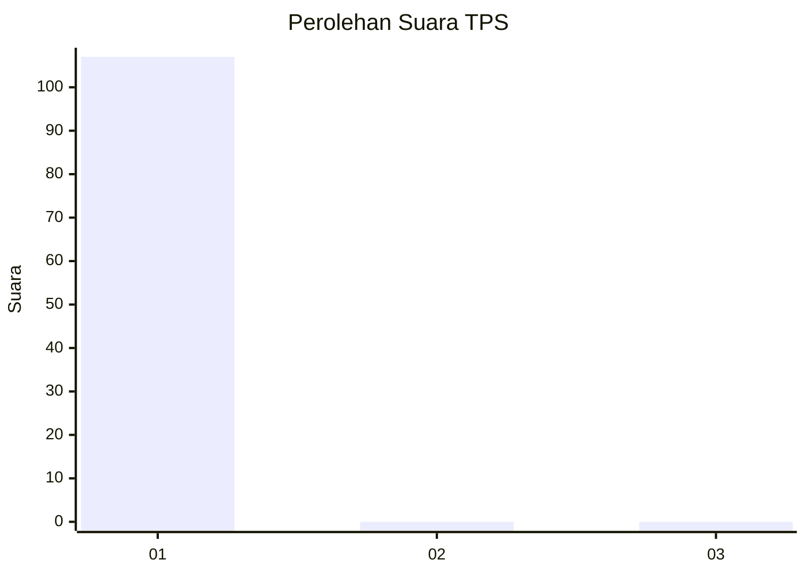
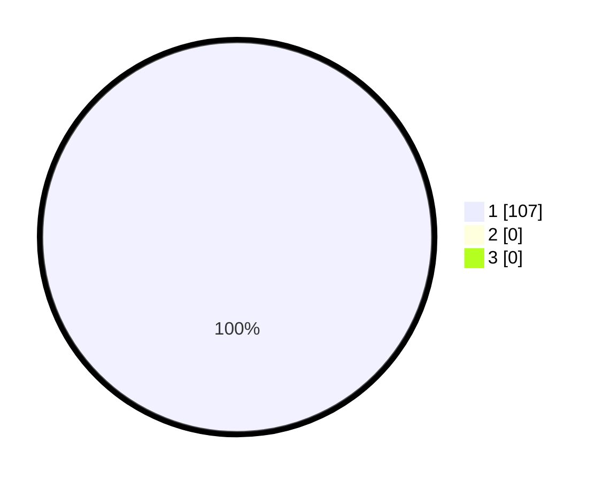

# Hasil

## Grafik

## Tabel

| No. | Nama Paslon    | Suara | Suara (raw) | Persentase |
|:--- |:-------------- | -----:| -----------:| ----------:|
| 1   | ANIES MUHAIMIN | 107   | [107][p-1]  | 100,00     |
| 2   | PRABOWO GIBRAN | 0     | [0][p-2]    | 0,00       |
| 3   | GANJAR MAHFUD  | 0     | [0][p-3]    | 0,00       |

[p-1]: https://github.com/gigit-pemilu/pemilu-2024-16-sumatera-selatan/blob/main/pilpres/hitung-suara/sub/16-sumatera-selatan/sub/71-kota-palembang/sub/04-ilir-barat-satu/sub/1004-siringagung/sub/029-tps/sub/paslon-1.txt
[p-2]: https://github.com/gigit-pemilu/pemilu-2024-16-sumatera-selatan/blob/main/pilpres/hitung-suara/sub/16-sumatera-selatan/sub/71-kota-palembang/sub/04-ilir-barat-satu/sub/1004-siringagung/sub/029-tps/sub/paslon-2.txt
[p-3]: https://github.com/gigit-pemilu/pemilu-2024-16-sumatera-selatan/blob/main/pilpres/hitung-suara/sub/16-sumatera-selatan/sub/71-kota-palembang/sub/04-ilir-barat-satu/sub/1004-siringagung/sub/029-tps/sub/paslon-3.txt

## Foto C Plano

https://sirekap-obj-formc.kpu.go.id/ccaa/pemilu/ppwp/16/71/04/10/04/1671041004029-20240221-173244--ac13c8c3-68e7-4f8a-9513-1f11f5264085.jpg

https://sirekap-obj-formc.kpu.go.id/ccaa/pemilu/ppwp/16/71/04/10/04/1671041004029-20240221-173409--b6bb6158-a171-4061-8ea2-4a8e1f58e48a.jpg

https://sirekap-obj-formc.kpu.go.id/ccaa/pemilu/ppwp/16/71/04/10/04/1671041004029-20240221-173503--18f612de-ef66-42ba-90da-2046081f43b2.jpg

## Metadata

| Key        | Value               |
| ---------- | ------------------- |
| Time Stamp | 2024-02-21 18:00:00 |

## DATA PEMILIH TETAP

Jumlah pemilih dalam DPT: **2**.
 * L: **500**.
 * P: **0**.

## DATA PENGGUNA HAK PILIH

Jumlah pengguna hak pilih dalam DPT: **5**.
 * L: **100**.
 * P: **0**.

Jumlah pengguna hak pilih dalam DPTb: **225**.
 * L: **444**.
 * P: **444**.

Jumlah pengguna hak pilih dalam DPK: **100**.
 * L: **444**.
 * P: **444**.

Jumlah pengguna hak pilih: **605**.
 * L: **704**.
 * P: **444**.

## JUMLAH SUARA SAH DAN TIDAK SAH

JUMLAH SELURUH SUARA SAH: **227**.

JUMLAH SUARA TIDAK SAH: **3**.

JUMLAH SELURUH SUARA SAH DAN SUARA TIDAK SAH: **239**.

