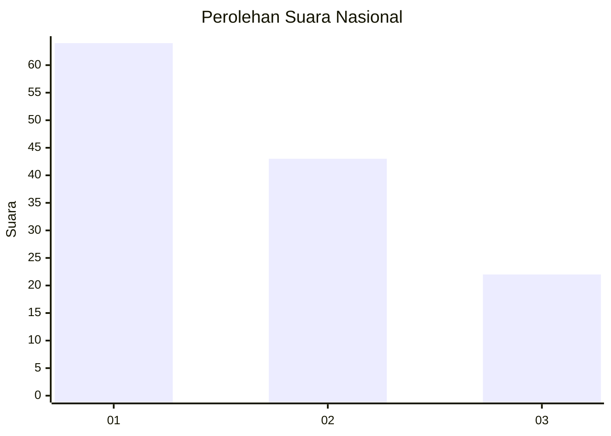
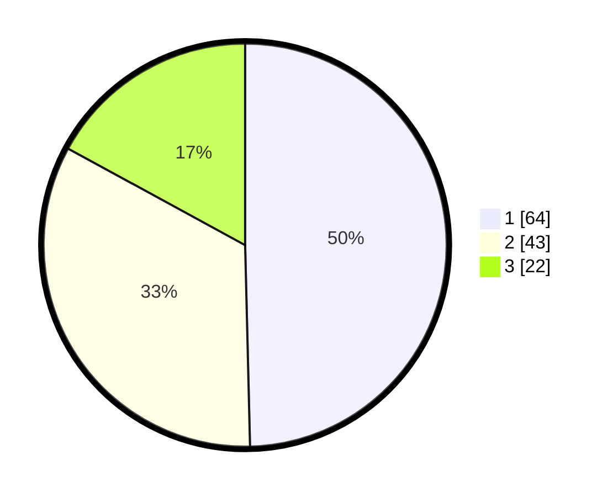

# Hasil

## Grafik

## Tabel

| No. | Nama Paslon    | Suara | Suara (raw) | Persentase |
|:--- |:-------------- | -----:| -----------:| ----------:|
| 1   | ANIES MUHAIMIN | 64    | [64][p-1]   | 49,61      |
| 2   | PRABOWO GIBRAN | 43    | [43][p-2]   | 33,33      |
| 3   | GANJAR MAHFUD  | 22    | [22][p-3]   | 17,05      |

[p-1]: https://github.com/gigit-pemilu/pemilu-2024/blob/main/pilpres/hitung-suara/sub/16-sumatera-selatan/sub/71-kota-palembang/sub/04-ilir-barat-satu/sub/1004-siringagung/sub/035-tps/sub/paslon-1.txt
[p-2]: https://github.com/gigit-pemilu/pemilu-2024/blob/main/pilpres/hitung-suara/sub/16-sumatera-selatan/sub/71-kota-palembang/sub/04-ilir-barat-satu/sub/1004-siringagung/sub/035-tps/sub/paslon-2.txt
[p-3]: https://github.com/gigit-pemilu/pemilu-2024/blob/main/pilpres/hitung-suara/sub/16-sumatera-selatan/sub/71-kota-palembang/sub/04-ilir-barat-satu/sub/1004-siringagung/sub/035-tps/sub/paslon-3.txt

## Foto C Plano

https://sirekap-obj-formc.kpu.go.id/fb73/pemilu/ppwp/16/71/04/10/04/1671041004035-20240221-193943--324d424d-90d3-4e06-b574-1363b09a1f9a.jpg

https://sirekap-obj-formc.kpu.go.id/fb73/pemilu/ppwp/16/71/04/10/04/1671041004035-20240221-194013--a6cf7c52-8160-4de2-9f99-5cf80e112c49.jpg

https://sirekap-obj-formc.kpu.go.id/fb73/pemilu/ppwp/16/71/04/10/04/1671041004035-20240221-194034--04c1a43d-f6ee-4d76-9341-788f7f684e25.jpg

## Metadata

| Key        | Value               |
| ---------- | ------------------- |
| Time Stamp | 2024-02-21 20:00:00 |

## DATA PEMILIH TETAP

Jumlah pemilih dalam DPT: **80**.
 * L: **903**.
 * P: **27**.

## DATA PENGGUNA HAK PILIH

Jumlah pengguna hak pilih dalam DPT: **78**.
 * L: **25**.
 * P: **30**.

Jumlah pengguna hak pilih dalam DPTb: **533**.
 * L: **332**.
 * P: **332**.

Jumlah pengguna hak pilih dalam DPK: **880**.
 * L: **88**.
 * P: **4**.

Jumlah pengguna hak pilih: **792**.
 * L: **30**.
 * P: **590**.

## JUMLAH SUARA SAH DAN TIDAK SAH

JUMLAH SELURUH SUARA SAH: **157**.

JUMLAH SUARA TIDAK SAH: **5**.

JUMLAH SELURUH SUARA SAH DAN SUARA TIDAK SAH: **174**.

