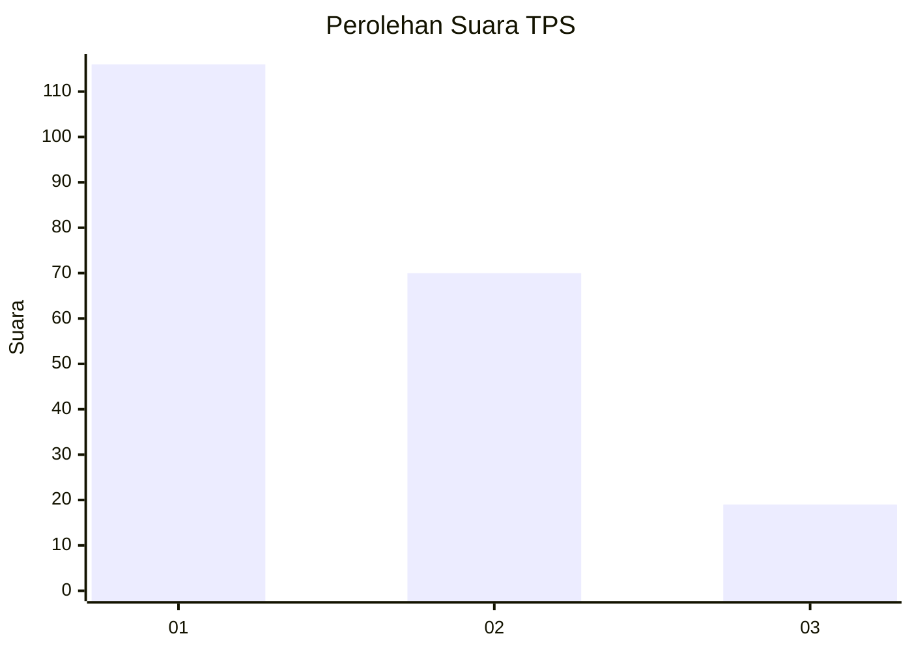
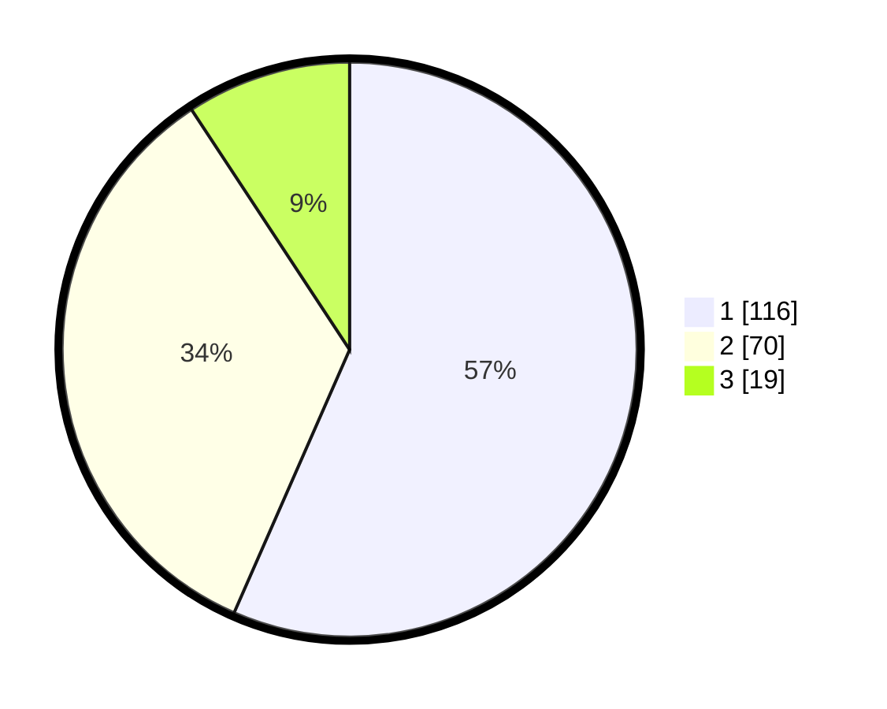

# Hasil

## Grafik

## Tabel

| No. | Nama Paslon    | Suara | Suara (raw) | Persentase |
|:--- |:-------------- | -----:| -----------:| ----------:|
| 1   | ANIES MUHAIMIN | 116   | [116][p-1]  | 56,59      |
| 2   | PRABOWO GIBRAN | 70    | [70][p-2]   | 34,15      |
| 3   | GANJAR MAHFUD  | 19    | [19][p-3]   | 9,27       |

[p-1]: https://github.com/gigit-pemilu/pemilu-2024-16-sumatera-selatan/blob/main/pilpres/hitung-suara/sub/16-sumatera-selatan/sub/71-kota-palembang/sub/04-ilir-barat-satu/sub/1004-siringagung/sub/039-tps/sub/paslon-1.txt
[p-2]: https://github.com/gigit-pemilu/pemilu-2024-16-sumatera-selatan/blob/main/pilpres/hitung-suara/sub/16-sumatera-selatan/sub/71-kota-palembang/sub/04-ilir-barat-satu/sub/1004-siringagung/sub/039-tps/sub/paslon-2.txt
[p-3]: https://github.com/gigit-pemilu/pemilu-2024-16-sumatera-selatan/blob/main/pilpres/hitung-suara/sub/16-sumatera-selatan/sub/71-kota-palembang/sub/04-ilir-barat-satu/sub/1004-siringagung/sub/039-tps/sub/paslon-3.txt

## Foto C Plano

https://sirekap-obj-formc.kpu.go.id/6bf4/pemilu/ppwp/16/71/04/10/04/1671041004039-20240215-092608--96389688-dc68-4d65-8c26-4e45bd9a5f1d.jpg

https://sirekap-obj-formc.kpu.go.id/6bf4/pemilu/ppwp/16/71/04/10/04/1671041004039-20240215-092615--ed52734c-6d73-4391-b811-6e9d3945c0fc.jpg

https://sirekap-obj-formc.kpu.go.id/6bf4/pemilu/ppwp/16/71/04/10/04/1671041004039-20240215-092623--4e78ded4-c394-4e73-9b3a-0d601161ea26.jpg

## Metadata

| Key        | Value               |
| ---------- | ------------------- |
| Time Stamp | 2024-02-25 16:00:00 |

