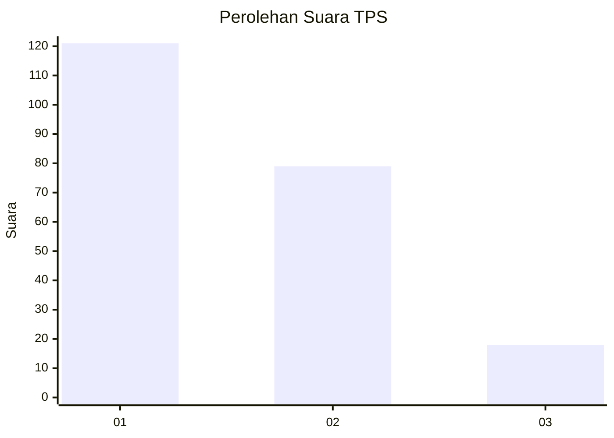
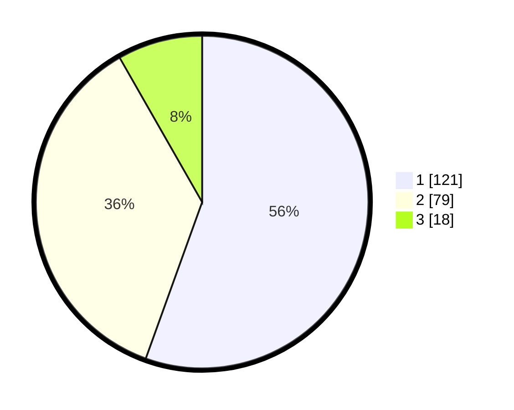

# Hasil

## Grafik

## Tabel

| No. | Nama Paslon    | Suara | Suara (raw) | Persentase |
|:--- |:-------------- | -----:| -----------:| ----------:|
| 1   | ANIES MUHAIMIN | 121   | [121][p-1]  | 55,50      |
| 2   | PRABOWO GIBRAN | 79    | [79][p-2]   | 36,24      |
| 3   | GANJAR MAHFUD  | 18    | [18][p-3]   | 8,26       |

[p-1]: https://github.com/gigit-pemilu/pemilu-2024-16-sumatera-selatan/blob/main/pilpres/hitung-suara/sub/16-sumatera-selatan/sub/71-kota-palembang/sub/04-ilir-barat-satu/sub/1004-siringagung/sub/042-tps/sub/paslon-1.txt
[p-2]: https://github.com/gigit-pemilu/pemilu-2024-16-sumatera-selatan/blob/main/pilpres/hitung-suara/sub/16-sumatera-selatan/sub/71-kota-palembang/sub/04-ilir-barat-satu/sub/1004-siringagung/sub/042-tps/sub/paslon-2.txt
[p-3]: https://github.com/gigit-pemilu/pemilu-2024-16-sumatera-selatan/blob/main/pilpres/hitung-suara/sub/16-sumatera-selatan/sub/71-kota-palembang/sub/04-ilir-barat-satu/sub/1004-siringagung/sub/042-tps/sub/paslon-3.txt

## Foto C Plano

https://sirekap-obj-formc.kpu.go.id/9c5f/pemilu/ppwp/16/71/04/10/04/1671041004042-20240221-203536--3a6c27f9-ed4d-41db-b535-c9c7afe8a3d3.jpg

https://sirekap-obj-formc.kpu.go.id/9c5f/pemilu/ppwp/16/71/04/10/04/1671041004042-20240221-203600--2004cfbb-7fbb-463a-8135-9f0a05d2c995.jpg

https://sirekap-obj-formc.kpu.go.id/9c5f/pemilu/ppwp/16/71/04/10/04/1671041004042-20240221-203634--dd8bde42-2af9-4ea6-abaf-4a9f2ca868d3.jpg

## Metadata

| Key        | Value               |
| ---------- | ------------------- |
| Time Stamp | 2024-02-21 21:00:04 |

