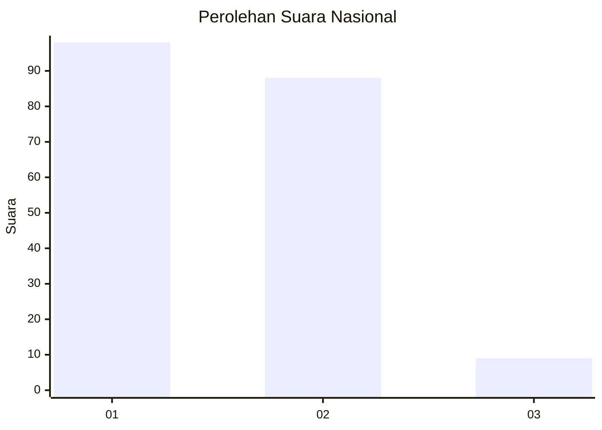
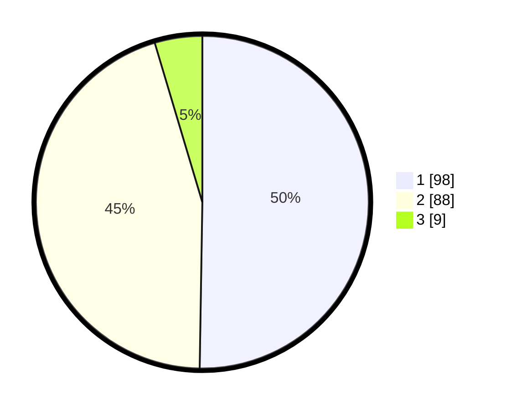

# Hasil

## Grafik

## Tabel

| No. | Nama Paslon    | Suara | Suara (raw) | Persentase |
|:--- |:-------------- | -----:| -----------:| ----------:|
| 1   | ANIES MUHAIMIN | 98    | [98][p-1]   | 50,26      |
| 2   | PRABOWO GIBRAN | 88    | [88][p-2]   | 45,13      |
| 3   | GANJAR MAHFUD  | 9     | [9][p-3]    | 4,62       |

[p-1]: https://github.com/gigit-pemilu/pemilu-2024/blob/main/pilpres/hitung-suara/sub/16-sumatera-selatan/sub/71-kota-palembang/sub/04-ilir-barat-satu/sub/1004-siringagung/sub/045-tps/sub/paslon-1.txt
[p-2]: https://github.com/gigit-pemilu/pemilu-2024/blob/main/pilpres/hitung-suara/sub/16-sumatera-selatan/sub/71-kota-palembang/sub/04-ilir-barat-satu/sub/1004-siringagung/sub/045-tps/sub/paslon-2.txt
[p-3]: https://github.com/gigit-pemilu/pemilu-2024/blob/main/pilpres/hitung-suara/sub/16-sumatera-selatan/sub/71-kota-palembang/sub/04-ilir-barat-satu/sub/1004-siringagung/sub/045-tps/sub/paslon-3.txt

## Foto C Plano

https://sirekap-obj-formc.kpu.go.id/5f6c/pemilu/ppwp/16/71/04/10/04/1671041004045-20240221-203903--309b66dd-d13f-4bd1-9ca9-6587e4702ad0.jpg

https://sirekap-obj-formc.kpu.go.id/5f6c/pemilu/ppwp/16/71/04/10/04/1671041004045-20240221-204140--8a6b8f37-1e8e-4f0c-9d72-a9a64819085a.jpg

https://sirekap-obj-formc.kpu.go.id/5f6c/pemilu/ppwp/16/71/04/10/04/1671041004045-20240221-204218--d971de85-1b11-47ac-adc4-506a5c91935a.jpg

## Metadata

| Key        | Value               |
| ---------- | ------------------- |
| Time Stamp | 2024-02-21 21:00:04 |

## DATA PEMILIH TETAP

Jumlah pemilih dalam DPT: **238**.
 * L: **118**.
 * P: **120**.

## DATA PENGGUNA HAK PILIH

Jumlah pengguna hak pilih dalam DPT: **494**.
 * L: **93**.
 * P: **98**.

Jumlah pengguna hak pilih dalam DPTb: **24**.
 * L: **80**.
 * P: **84**.

Jumlah pengguna hak pilih dalam DPK: **1**.
 * L: **0**.
 * P: **1**.

Jumlah pengguna hak pilih: **227**.
 * L: **93**.
 * P: **103**.

## JUMLAH SUARA SAH DAN TIDAK SAH

JUMLAH SELURUH SUARA SAH: **193**.

JUMLAH SUARA TIDAK SAH: **882**.

JUMLAH SELURUH SUARA SAH DAN SUARA TIDAK SAH: **195**.

