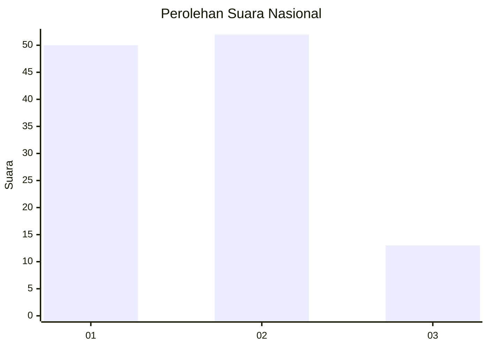
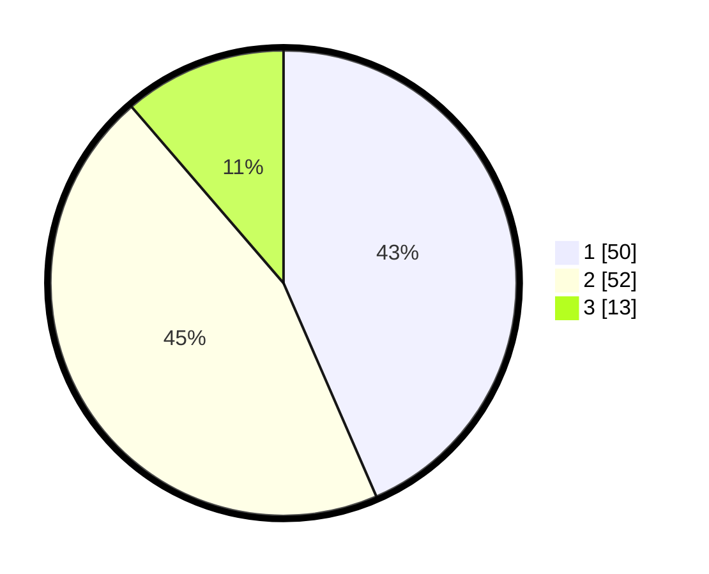

# Hasil

## Grafik

## Tabel

| No. | Nama Paslon    | Suara | Suara (raw) | Persentase |
|:--- |:-------------- | -----:| -----------:| ----------:|
| 1   | ANIES MUHAIMIN | 50    | [50][p-1]   | 43,48      |
| 2   | PRABOWO GIBRAN | 52    | [52][p-2]   | 45,22      |
| 3   | GANJAR MAHFUD  | 13    | [13][p-3]   | 11,30      |

[p-1]: https://github.com/gigit-pemilu/pemilu-2024/blob/main/pilpres/hitung-suara/sub/16-sumatera-selatan/sub/71-kota-palembang/sub/04-ilir-barat-satu/sub/1004-siringagung/sub/047-tps/sub/paslon-1.txt
[p-2]: https://github.com/gigit-pemilu/pemilu-2024/blob/main/pilpres/hitung-suara/sub/16-sumatera-selatan/sub/71-kota-palembang/sub/04-ilir-barat-satu/sub/1004-siringagung/sub/047-tps/sub/paslon-2.txt
[p-3]: https://github.com/gigit-pemilu/pemilu-2024/blob/main/pilpres/hitung-suara/sub/16-sumatera-selatan/sub/71-kota-palembang/sub/04-ilir-barat-satu/sub/1004-siringagung/sub/047-tps/sub/paslon-3.txt

## Foto C Plano

https://sirekap-obj-formc.kpu.go.id/e882/pemilu/ppwp/16/71/04/10/04/1671041004047-20240217-113053--4442337f-dc24-4c11-b6bb-4d0c9f235f11.jpg

https://sirekap-obj-formc.kpu.go.id/e882/pemilu/ppwp/16/71/04/10/04/1671041004047-20240217-113113--7b49aefc-ea95-4f6e-b6d4-d09520d72168.jpg

https://sirekap-obj-formc.kpu.go.id/e882/pemilu/ppwp/16/71/04/10/04/1671041004047-20240217-113126--2a02c4bb-64c2-487c-a895-ce84e62b774a.jpg

## Metadata

| Key        | Value               |
| ---------- | ------------------- |
| Time Stamp | 2024-02-25 01:00:00 |

