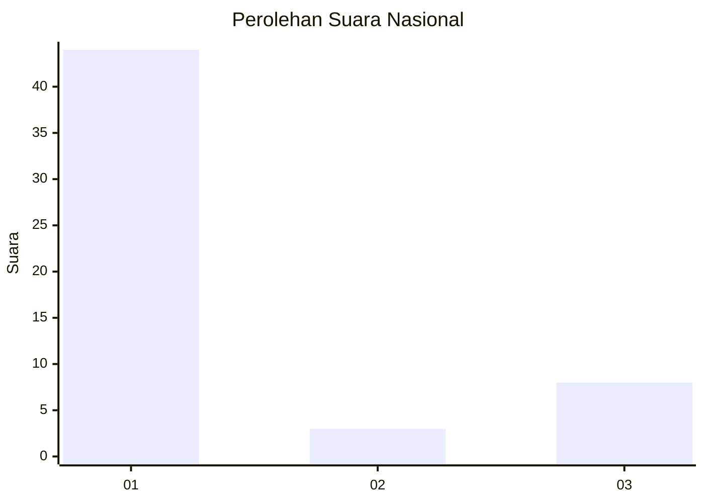
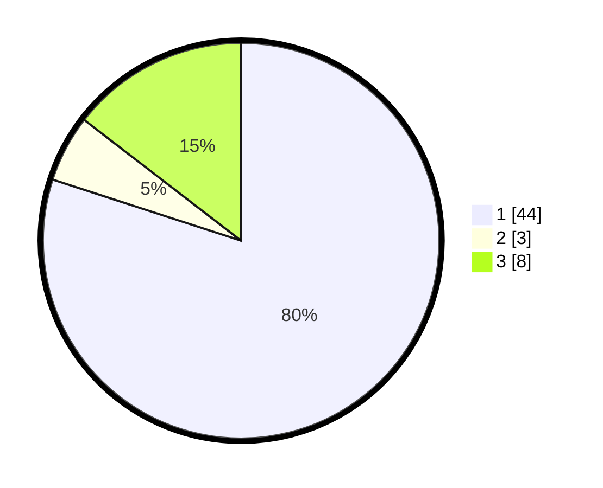

# Hasil

## Grafik

## Tabel

| No. | Nama Paslon    | Suara | Suara (raw) | Persentase |
|:--- |:-------------- | -----:| -----------:| ----------:|
| 1   | ANIES MUHAIMIN | 44    | [44][p-1]   | 80,00      |
| 2   | PRABOWO GIBRAN | 3     | [3][p-2]    | 5,45       |
| 3   | GANJAR MAHFUD  | 8     | [8][p-3]    | 14,55      |

[p-1]: https://github.com/gigit-pemilu/pemilu-2024/blob/main/pilpres/hitung-suara/sub/16-sumatera-selatan/sub/71-kota-palembang/sub/04-ilir-barat-satu/sub/1004-siringagung/sub/048-tps/sub/paslon-1.txt
[p-2]: https://github.com/gigit-pemilu/pemilu-2024/blob/main/pilpres/hitung-suara/sub/16-sumatera-selatan/sub/71-kota-palembang/sub/04-ilir-barat-satu/sub/1004-siringagung/sub/048-tps/sub/paslon-2.txt
[p-3]: https://github.com/gigit-pemilu/pemilu-2024/blob/main/pilpres/hitung-suara/sub/16-sumatera-selatan/sub/71-kota-palembang/sub/04-ilir-barat-satu/sub/1004-siringagung/sub/048-tps/sub/paslon-3.txt

## Foto C Plano

https://sirekap-obj-formc.kpu.go.id/0115/pemilu/ppwp/16/71/04/10/04/1671041004048-20240221-204406--f251bcc0-3692-4c12-963e-aecce5221171.jpg

https://sirekap-obj-formc.kpu.go.id/0115/pemilu/ppwp/16/71/04/10/04/1671041004048-20240221-204550--6dbe256c-b967-4a9e-a225-6f5ad9a908de.jpg

https://sirekap-obj-formc.kpu.go.id/0115/pemilu/ppwp/16/71/04/10/04/1671041004048-20240221-204706--d0560eb0-a25c-44bc-84f7-2e6a5ef0ebaa.jpg

## Metadata

| Key        | Value               |
| ---------- | ------------------- |
| Time Stamp | 2024-02-21 21:00:04 |

