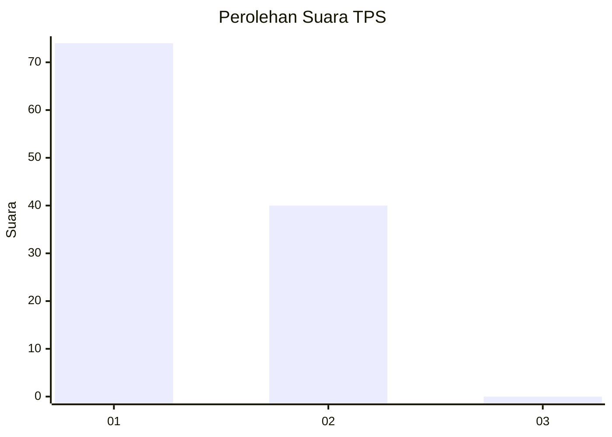
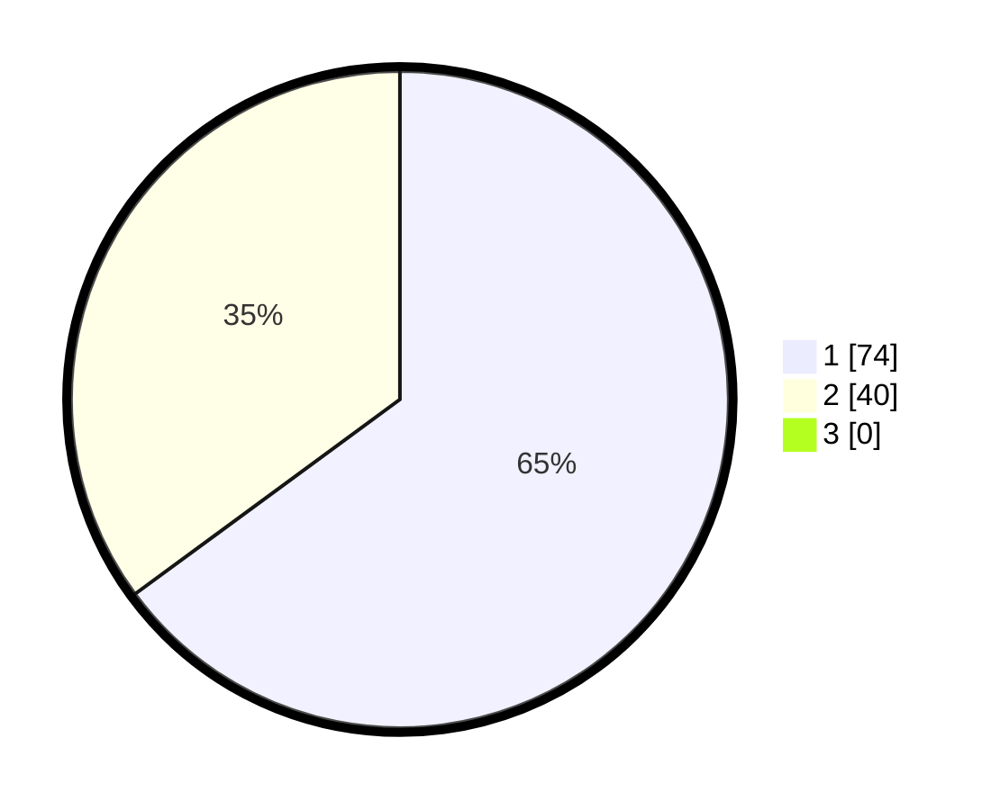

# Hasil

## Grafik

## Tabel

| No. | Nama Paslon    | Suara | Suara (raw) | Persentase |
|:--- |:-------------- | -----:| -----------:| ----------:|
| 1   | ANIES MUHAIMIN | 74    | [74][p-1]   | 64,91      |
| 2   | PRABOWO GIBRAN | 40    | [40][p-2]   | 35,09      |
| 3   | GANJAR MAHFUD  | 0     | [0][p-3]    | 0,00       |

[p-1]: https://github.com/gigit-pemilu/pemilu-2024-16-sumatera-selatan/blob/main/pilpres/hitung-suara/sub/16-sumatera-selatan/sub/71-kota-palembang/sub/04-ilir-barat-satu/sub/1004-siringagung/sub/049-tps/sub/paslon-1.txt
[p-2]: https://github.com/gigit-pemilu/pemilu-2024-16-sumatera-selatan/blob/main/pilpres/hitung-suara/sub/16-sumatera-selatan/sub/71-kota-palembang/sub/04-ilir-barat-satu/sub/1004-siringagung/sub/049-tps/sub/paslon-2.txt
[p-3]: https://github.com/gigit-pemilu/pemilu-2024-16-sumatera-selatan/blob/main/pilpres/hitung-suara/sub/16-sumatera-selatan/sub/71-kota-palembang/sub/04-ilir-barat-satu/sub/1004-siringagung/sub/049-tps/sub/paslon-3.txt

## Foto C Plano

https://sirekap-obj-formc.kpu.go.id/79e0/pemilu/ppwp/16/71/04/10/04/1671041004049-20240221-204459--fcce5029-b945-41e9-98ca-dc73ae1cd3c3.jpg

https://sirekap-obj-formc.kpu.go.id/79e0/pemilu/ppwp/16/71/04/10/04/1671041004049-20240221-204538--14f2d630-0196-4ea4-97fd-c12d1e0dad7d.jpg

https://sirekap-obj-formc.kpu.go.id/79e0/pemilu/ppwp/16/71/04/10/04/1671041004049-20240221-204610--fa5522ee-f7d3-40e9-8642-572697424434.jpg

## Metadata

| Key        | Value               |
| ---------- | ------------------- |
| Time Stamp | 2024-02-21 21:00:04 |

