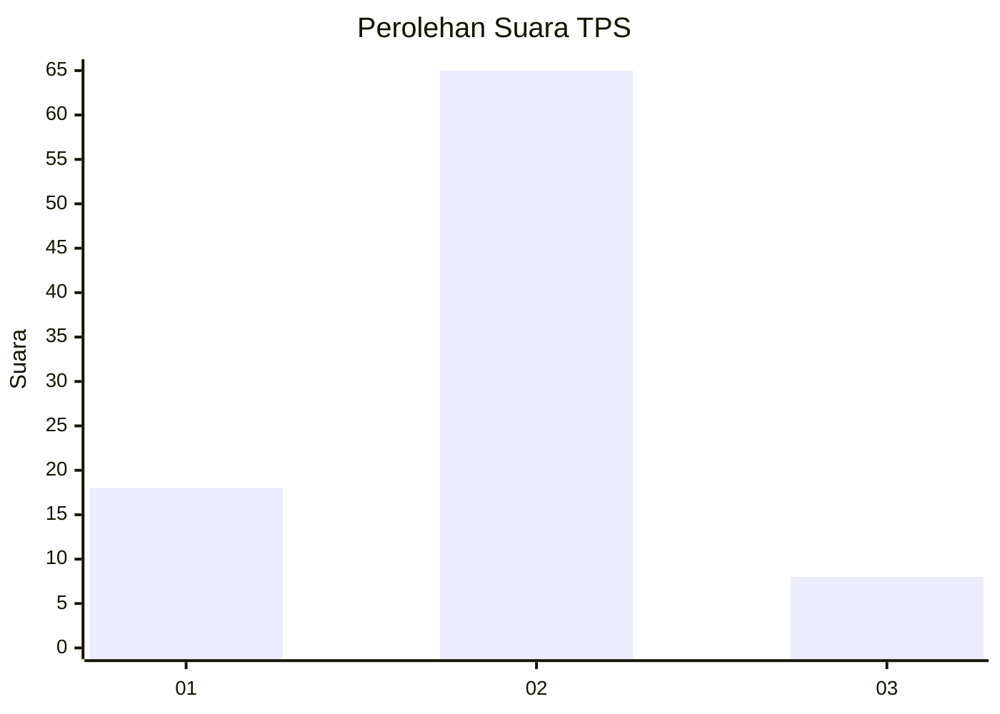
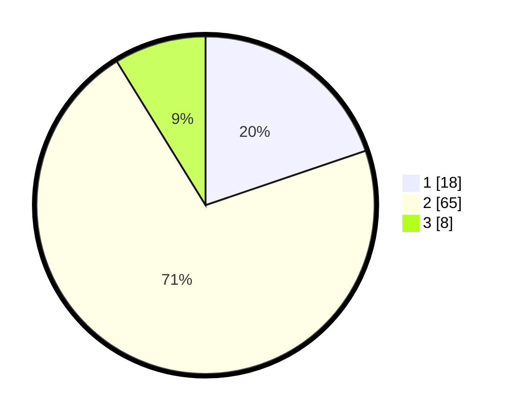

# Hasil

## Grafik

## Tabel

| No. | Nama Paslon    | Suara | Suara (raw) | Persentase |
|:--- |:-------------- | -----:| -----------:| ----------:|
| 1   | ANIES MUHAIMIN | 18    | [18][p-1]   | 19,78      |
| 2   | PRABOWO GIBRAN | 65    | [65][p-2]   | 71,43      |
| 3   | GANJAR MAHFUD  | 8     | [8][p-3]    | 8,79       |

[p-1]: https://github.com/gigit-pemilu/pemilu-2024-16-sumatera-selatan/blob/main/pilpres/hitung-suara/sub/16-sumatera-selatan/sub/71-kota-palembang/sub/04-ilir-barat-satu/sub/1004-siringagung/sub/052-tps/sub/paslon-1.txt
[p-2]: https://github.com/gigit-pemilu/pemilu-2024-16-sumatera-selatan/blob/main/pilpres/hitung-suara/sub/16-sumatera-selatan/sub/71-kota-palembang/sub/04-ilir-barat-satu/sub/1004-siringagung/sub/052-tps/sub/paslon-2.txt
[p-3]: https://github.com/gigit-pemilu/pemilu-2024-16-sumatera-selatan/blob/main/pilpres/hitung-suara/sub/16-sumatera-selatan/sub/71-kota-palembang/sub/04-ilir-barat-satu/sub/1004-siringagung/sub/052-tps/sub/paslon-3.txt

## Foto C Plano

https://sirekap-obj-formc.kpu.go.id/d3a3/pemilu/ppwp/16/71/04/10/04/1671041004052-20240221-213335--8717ea5b-20c8-4b82-86d2-eab663162c9a.jpg

https://sirekap-obj-formc.kpu.go.id/d3a3/pemilu/ppwp/16/71/04/10/04/1671041004052-20240221-213503--9a899db5-2213-4c83-a8c5-fcaa00f55667.jpg

https://sirekap-obj-formc.kpu.go.id/d3a3/pemilu/ppwp/16/71/04/10/04/1671041004052-20240221-213628--c5b46e9e-077b-49bc-9247-2f7fa32aa3df.jpg

## Metadata

| Key        | Value               |
| ---------- | ------------------- |
| Time Stamp | 2024-02-21 22:00:00 |

