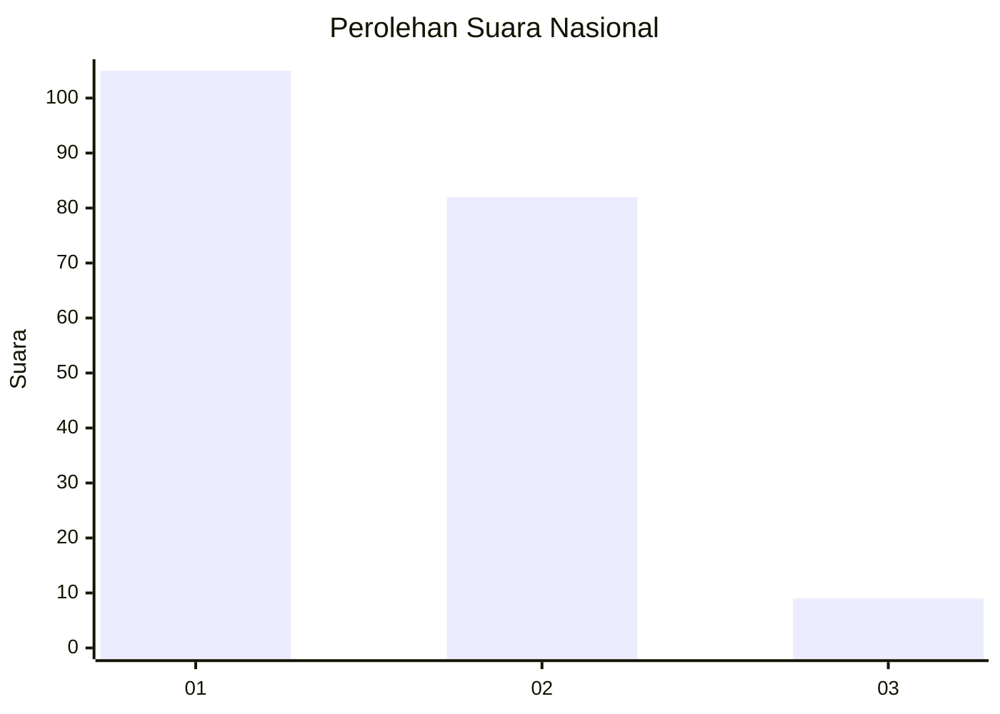
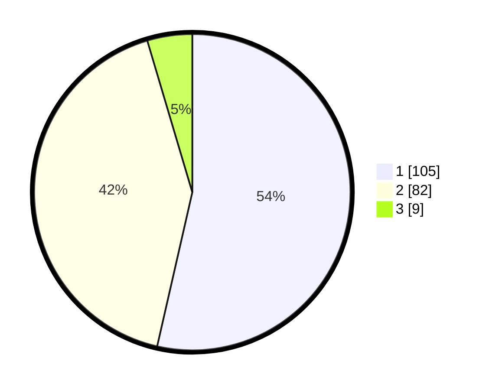

# Hasil

## Grafik

## Tabel

| No. | Nama Paslon    | Suara | Suara (raw) | Persentase |
|:--- |:-------------- | -----:| -----------:| ----------:|
| 1   | ANIES MUHAIMIN | 105   | [105][p-1]  | 53,57      |
| 2   | PRABOWO GIBRAN | 82    | [82][p-2]   | 41,84      |
| 3   | GANJAR MAHFUD  | 9     | [9][p-3]    | 4,59       |

[p-1]: https://github.com/gigit-pemilu/pemilu-2024/blob/main/pilpres/hitung-suara/sub/16-sumatera-selatan/sub/71-kota-palembang/sub/04-ilir-barat-satu/sub/1004-siringagung/sub/058-tps/sub/paslon-1.txt
[p-2]: https://github.com/gigit-pemilu/pemilu-2024/blob/main/pilpres/hitung-suara/sub/16-sumatera-selatan/sub/71-kota-palembang/sub/04-ilir-barat-satu/sub/1004-siringagung/sub/058-tps/sub/paslon-2.txt
[p-3]: https://github.com/gigit-pemilu/pemilu-2024/blob/main/pilpres/hitung-suara/sub/16-sumatera-selatan/sub/71-kota-palembang/sub/04-ilir-barat-satu/sub/1004-siringagung/sub/058-tps/sub/paslon-3.txt

## Foto C Plano

https://sirekap-obj-formc.kpu.go.id/26db/pemilu/ppwp/16/71/04/10/04/1671041004058-20240214-155809--3590fbe2-e81c-4cbd-b465-bbca9a0edfa9.jpg

https://sirekap-obj-formc.kpu.go.id/26db/pemilu/ppwp/16/71/04/10/04/1671041004058-20240214-160133--d446fa46-6837-4e34-a3a3-a43b94baa54c.jpg

https://sirekap-obj-formc.kpu.go.id/26db/pemilu/ppwp/16/71/04/10/04/1671041004058-20240214-215158--c6c56663-957d-4db4-90c3-b5057d809e2b.jpg

## Metadata

| Key        | Value               |
| ---------- | ------------------- |
| Time Stamp | 2024-02-25 21:00:00 |

