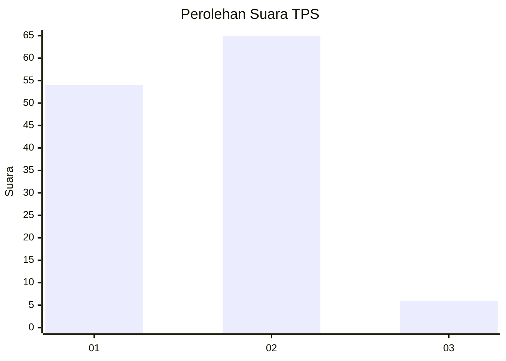
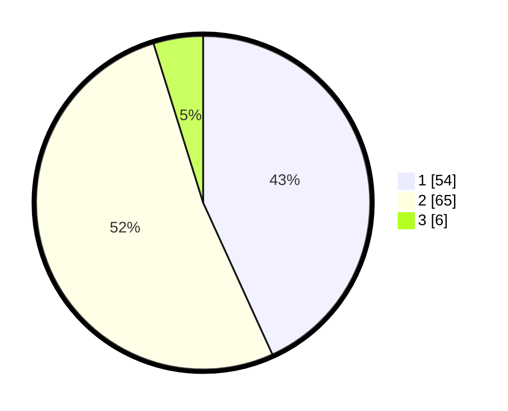

# Hasil

## Grafik

## Tabel

| No. | Nama Paslon    | Suara | Suara (raw) | Persentase |
|:--- |:-------------- | -----:| -----------:| ----------:|
| 1   | ANIES MUHAIMIN | 54    | [54][p-1]   | 43,20      |
| 2   | PRABOWO GIBRAN | 65    | [65][p-2]   | 52,00      |
| 3   | GANJAR MAHFUD  | 6     | [6][p-3]    | 4,80       |

[p-1]: https://github.com/gigit-pemilu/pemilu-2024-16-sumatera-selatan/blob/main/pilpres/hitung-suara/sub/16-sumatera-selatan/sub/71-kota-palembang/sub/04-ilir-barat-satu/sub/1004-siringagung/sub/901-tps/sub/paslon-1.txt
[p-2]: https://github.com/gigit-pemilu/pemilu-2024-16-sumatera-selatan/blob/main/pilpres/hitung-suara/sub/16-sumatera-selatan/sub/71-kota-palembang/sub/04-ilir-barat-satu/sub/1004-siringagung/sub/901-tps/sub/paslon-2.txt
[p-3]: https://github.com/gigit-pemilu/pemilu-2024-16-sumatera-selatan/blob/main/pilpres/hitung-suara/sub/16-sumatera-selatan/sub/71-kota-palembang/sub/04-ilir-barat-satu/sub/1004-siringagung/sub/901-tps/sub/paslon-3.txt

## Foto C Plano

https://sirekap-obj-formc.kpu.go.id/2b52/pemilu/ppwp/16/71/04/10/04/1671041004901-20240214-230832--53665e1a-85d6-4ff9-8185-12df2e80a1e1.jpg

https://sirekap-obj-formc.kpu.go.id/2b52/pemilu/ppwp/16/71/04/10/04/1671041004901-20240214-230910--99a80dfd-1761-4e5a-81c9-616db45f4d89.jpg

https://sirekap-obj-formc.kpu.go.id/2b52/pemilu/ppwp/16/71/04/10/04/1671041004901-20240214-230919--781cc205-b1ff-4f96-b50e-567772da3ef1.jpg

## Metadata

| Key        | Value               |
| ---------- | ------------------- |
| Time Stamp | 2024-02-25 14:00:00 |

## DATA PEMILIH TETAP

Jumlah pemilih dalam DPT: **52**.
 * L: **52**.
 * P: **0**.

## DATA PENGGUNA HAK PILIH

Jumlah pengguna hak pilih dalam DPT: **52**.
 * L: **52**.
 * P: **0**.

Jumlah pengguna hak pilih dalam DPTb: **69**.
 * L: **66**.
 * P: **3**.

Jumlah pengguna hak pilih dalam DPK: **7**.
 * L: **5**.
 * P: **2**.

Jumlah pengguna hak pilih: **128**.
 * L: **123**.
 * P: **5**.

## JUMLAH SUARA SAH DAN TIDAK SAH

JUMLAH SELURUH SUARA SAH: **125**.

JUMLAH SUARA TIDAK SAH: **3**.

JUMLAH SELURUH SUARA SAH DAN SUARA TIDAK SAH: **128**.

