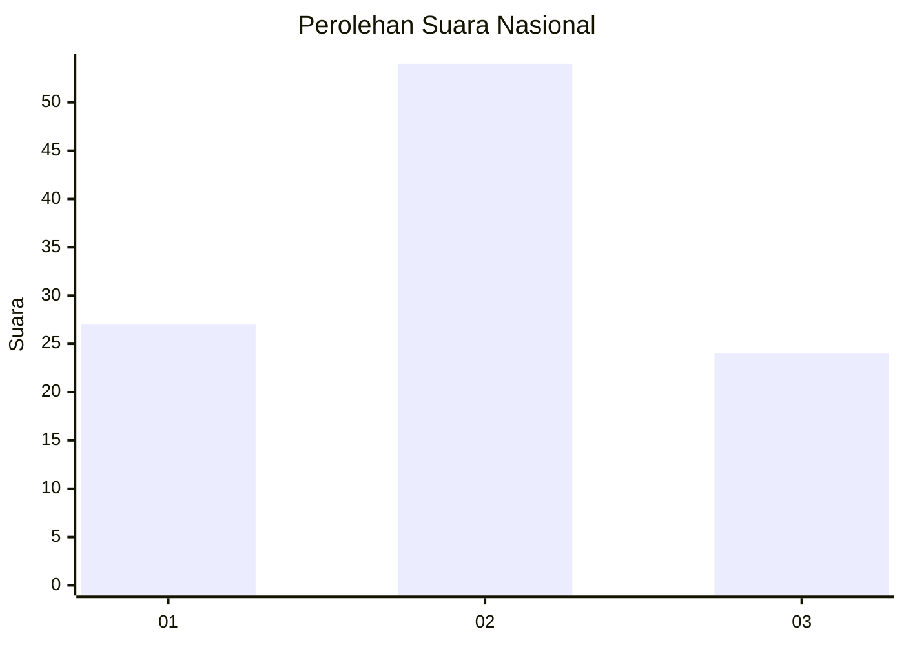
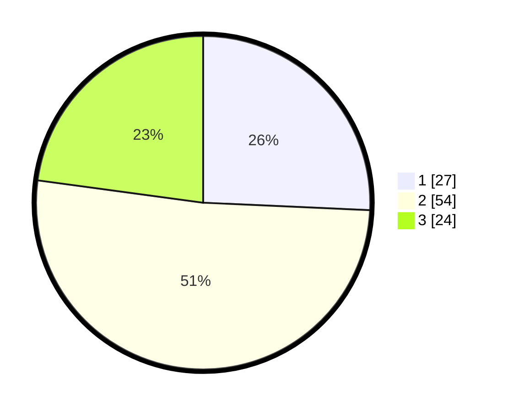

# Hasil

## Grafik

## Tabel

| No. | Nama Paslon    | Suara | Suara (raw) | Persentase |
|:--- |:-------------- | -----:| -----------:| ----------:|
| 1   | ANIES MUHAIMIN | 27    | [27][p-1]   | 25,71      |
| 2   | PRABOWO GIBRAN | 54    | [54][p-2]   | 51,43      |
| 3   | GANJAR MAHFUD  | 24    | [24][p-3]   | 22,86      |

[p-1]: https://github.com/gigit-pemilu/pemilu-2024/blob/main/pilpres/hitung-suara/sub/16-sumatera-selatan/sub/71-kota-palembang/sub/04-ilir-barat-satu/sub/1004-siringagung/sub/904-tps/sub/paslon-1.txt
[p-2]: https://github.com/gigit-pemilu/pemilu-2024/blob/main/pilpres/hitung-suara/sub/16-sumatera-selatan/sub/71-kota-palembang/sub/04-ilir-barat-satu/sub/1004-siringagung/sub/904-tps/sub/paslon-2.txt
[p-3]: https://github.com/gigit-pemilu/pemilu-2024/blob/main/pilpres/hitung-suara/sub/16-sumatera-selatan/sub/71-kota-palembang/sub/04-ilir-barat-satu/sub/1004-siringagung/sub/904-tps/sub/paslon-3.txt

## Foto C Plano

https://sirekap-obj-formc.kpu.go.id/08d1/pemilu/ppwp/16/71/04/10/04/1671041004904-20240221-220008--ad8e1f23-5426-4d36-8b71-f09689511199.jpg

https://sirekap-obj-formc.kpu.go.id/08d1/pemilu/ppwp/16/71/04/10/04/1671041004904-20240221-220040--3c5cf601-3e0e-4a7b-8c09-f7f6ec4dd487.jpg

https://sirekap-obj-formc.kpu.go.id/08d1/pemilu/ppwp/16/71/04/10/04/1671041004904-20240221-220100--02d0ec05-ecdc-4369-84a6-79a1957ffd89.jpg

## Metadata

| Key        | Value               |
| ---------- | ------------------- |
| Time Stamp | 2024-02-21 23:00:00 |

