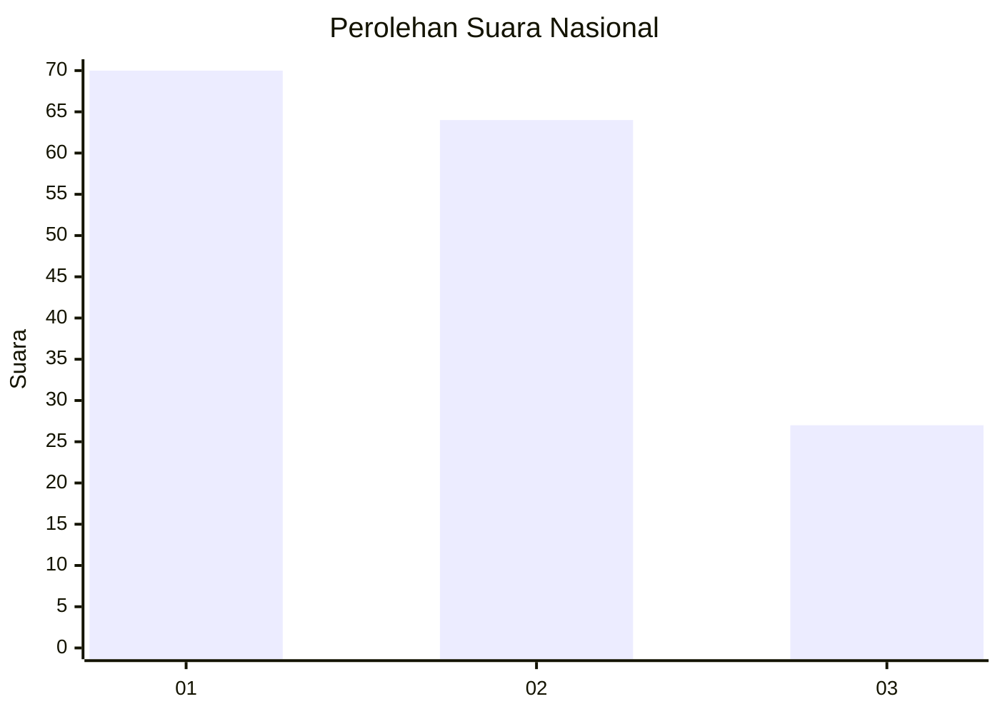
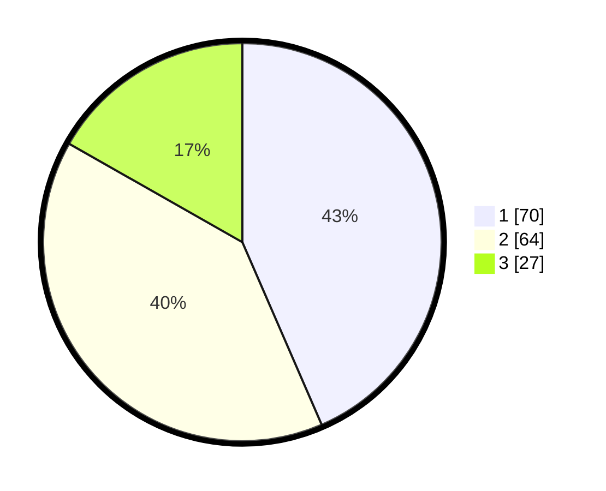

# Hasil

## Grafik

## Tabel

| No. | Nama Paslon    | Suara | Suara (raw) | Persentase |
|:--- |:-------------- | -----:| -----------:| ----------:|
| 1   | ANIES MUHAIMIN | 70    | [70][p-1]   | 43,48      |
| 2   | PRABOWO GIBRAN | 64    | [64][p-2]   | 39,75      |
| 3   | GANJAR MAHFUD  | 27    | [27][p-3]   | 16,77      |

[p-1]: https://github.com/gigit-pemilu/pemilu-2024/blob/main/pilpres/hitung-suara/sub/16-sumatera-selatan/sub/71-kota-palembang/sub/04-ilir-barat-satu/sub/1005-demang-lebardaun/sub/013-tps/sub/paslon-1.txt
[p-2]: https://github.com/gigit-pemilu/pemilu-2024/blob/main/pilpres/hitung-suara/sub/16-sumatera-selatan/sub/71-kota-palembang/sub/04-ilir-barat-satu/sub/1005-demang-lebardaun/sub/013-tps/sub/paslon-2.txt
[p-3]: https://github.com/gigit-pemilu/pemilu-2024/blob/main/pilpres/hitung-suara/sub/16-sumatera-selatan/sub/71-kota-palembang/sub/04-ilir-barat-satu/sub/1005-demang-lebardaun/sub/013-tps/sub/paslon-3.txt

## Foto C Plano

https://sirekap-obj-formc.kpu.go.id/de74/pemilu/ppwp/16/71/04/10/05/1671041005013-20240220-153928--74519492-f6a6-4aa2-8434-d2f0a0fe3535.jpg

https://sirekap-obj-formc.kpu.go.id/de74/pemilu/ppwp/16/71/04/10/05/1671041005013-20240220-153701--ed3aeb12-48ea-4162-9c5b-4edd864fc13b.jpg

https://sirekap-obj-formc.kpu.go.id/de74/pemilu/ppwp/16/71/04/10/05/1671041005013-20240220-153819--24775e22-1e7f-4118-933e-0f707699e59c.jpg

## Metadata

| Key        | Value               |
| ---------- | ------------------- |
| Time Stamp | 2024-02-25 23:00:00 |

