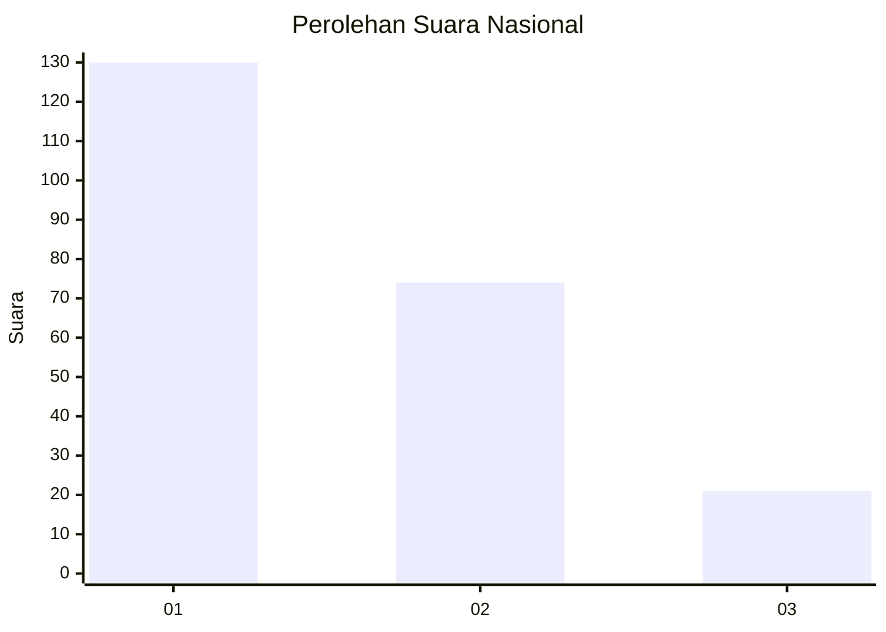
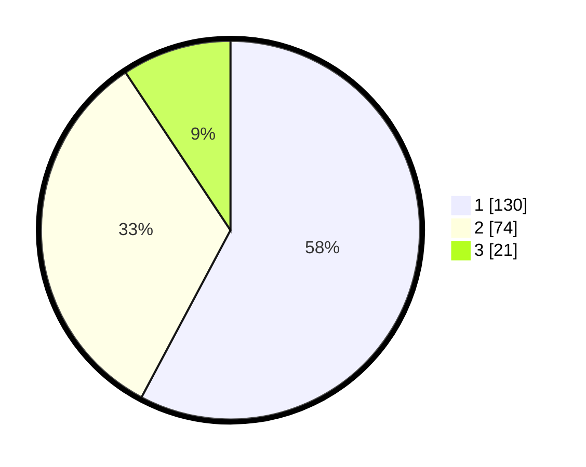

# Hasil

## Grafik

## Tabel

| No. | Nama Paslon    | Suara | Suara (raw) | Persentase |
|:--- |:-------------- | -----:| -----------:| ----------:|
| 1   | ANIES MUHAIMIN | 130   | [130][p-1]  | 57,78      |
| 2   | PRABOWO GIBRAN | 74    | [74][p-2]   | 32,89      |
| 3   | GANJAR MAHFUD  | 21    | [21][p-3]   | 9,33       |

[p-1]: https://github.com/gigit-pemilu/pemilu-2024/blob/main/pilpres/hitung-suara/sub/16-sumatera-selatan/sub/71-kota-palembang/sub/04-ilir-barat-satu/sub/1005-demang-lebardaun/sub/019-tps/sub/paslon-1.txt
[p-2]: https://github.com/gigit-pemilu/pemilu-2024/blob/main/pilpres/hitung-suara/sub/16-sumatera-selatan/sub/71-kota-palembang/sub/04-ilir-barat-satu/sub/1005-demang-lebardaun/sub/019-tps/sub/paslon-2.txt
[p-3]: https://github.com/gigit-pemilu/pemilu-2024/blob/main/pilpres/hitung-suara/sub/16-sumatera-selatan/sub/71-kota-palembang/sub/04-ilir-barat-satu/sub/1005-demang-lebardaun/sub/019-tps/sub/paslon-3.txt

## Foto C Plano

https://sirekap-obj-formc.kpu.go.id/0a9e/pemilu/ppwp/16/71/04/10/05/1671041005019-20240220-154938--2ccf9345-3252-48a1-93e1-77212956e8ae.jpg

https://sirekap-obj-formc.kpu.go.id/0a9e/pemilu/ppwp/16/71/04/10/05/1671041005019-20240220-155140--94f9e83b-58dc-4671-ae5b-b30b3b5fdadd.jpg

https://sirekap-obj-formc.kpu.go.id/0a9e/pemilu/ppwp/16/71/04/10/05/1671041005019-20240220-155254--968f6563-fad5-4e05-95ed-a3c68938fba3.jpg

## Metadata

| Key        | Value               |
| ---------- | ------------------- |
| Time Stamp | 2024-02-25 20:00:00 |

