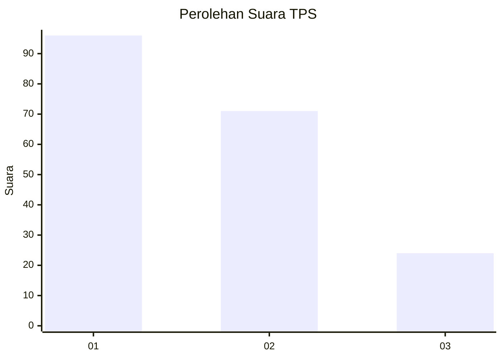
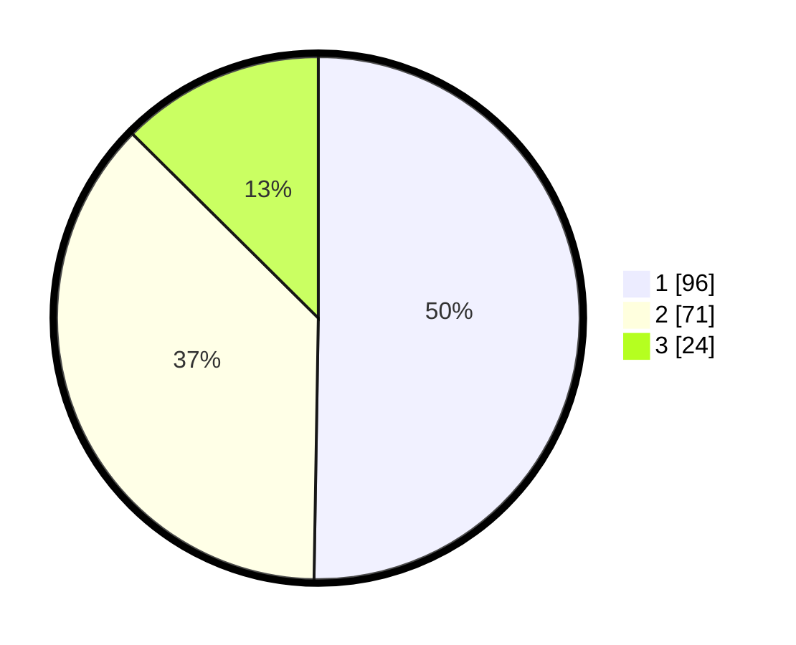

# Hasil

## Grafik

## Tabel

| No. | Nama Paslon    | Suara | Suara (raw) | Persentase |
|:--- |:-------------- | -----:| -----------:| ----------:|
| 1   | ANIES MUHAIMIN | 96    | [96][p-1]   | 50,26      |
| 2   | PRABOWO GIBRAN | 71    | [71][p-2]   | 37,17      |
| 3   | GANJAR MAHFUD  | 24    | [24][p-3]   | 12,57      |

[p-1]: https://github.com/gigit-pemilu/pemilu-2024-16-sumatera-selatan/blob/main/pilpres/hitung-suara/sub/16-sumatera-selatan/sub/71-kota-palembang/sub/04-ilir-barat-satu/sub/1005-demang-lebardaun/sub/037-tps/sub/paslon-1.txt
[p-2]: https://github.com/gigit-pemilu/pemilu-2024-16-sumatera-selatan/blob/main/pilpres/hitung-suara/sub/16-sumatera-selatan/sub/71-kota-palembang/sub/04-ilir-barat-satu/sub/1005-demang-lebardaun/sub/037-tps/sub/paslon-2.txt
[p-3]: https://github.com/gigit-pemilu/pemilu-2024-16-sumatera-selatan/blob/main/pilpres/hitung-suara/sub/16-sumatera-selatan/sub/71-kota-palembang/sub/04-ilir-barat-satu/sub/1005-demang-lebardaun/sub/037-tps/sub/paslon-3.txt

## Foto C Plano

https://sirekap-obj-formc.kpu.go.id/d5c0/pemilu/ppwp/16/71/04/10/05/1671041005037-20240220-194636--803e37f5-b287-419e-bd6d-6375dda3972e.jpg

https://sirekap-obj-formc.kpu.go.id/d5c0/pemilu/ppwp/16/71/04/10/05/1671041005037-20240220-194904--59e0fe8b-d903-48ba-b94d-b967da71ab40.jpg

https://sirekap-obj-formc.kpu.go.id/d5c0/pemilu/ppwp/16/71/04/10/05/1671041005037-20240220-195046--207732ae-058c-4490-a4b6-1ea871d81195.jpg

## Metadata

| Key        | Value               |
| ---------- | ------------------- |
| Time Stamp | 2024-02-25 21:00:00 |

