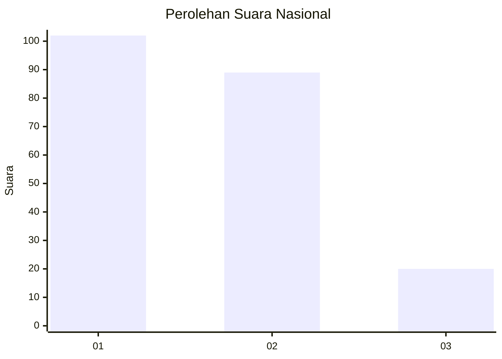
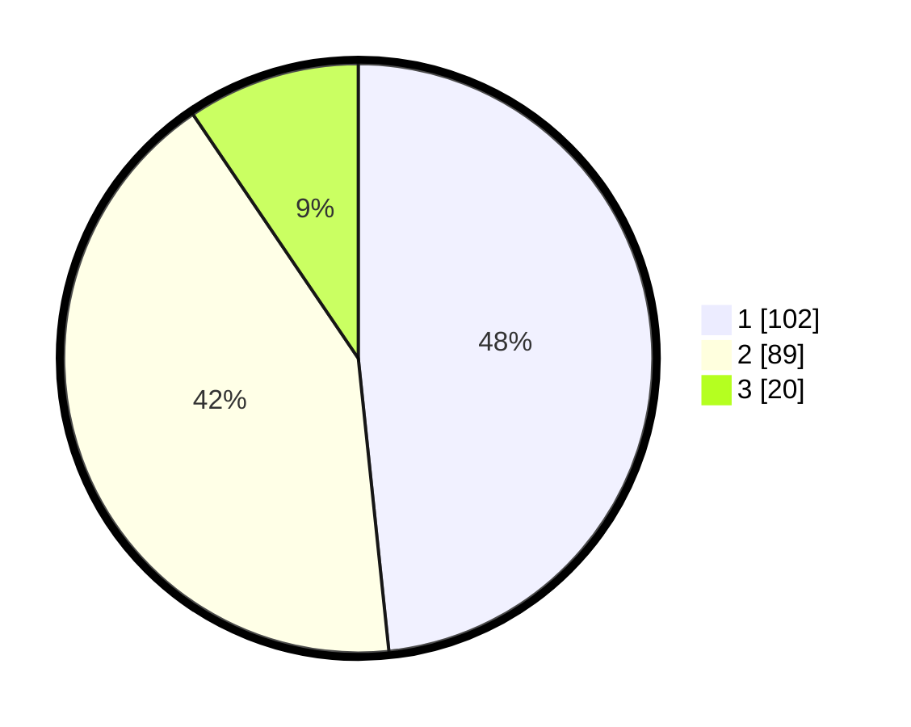

# Hasil

## Grafik

## Tabel

| No. | Nama Paslon    | Suara | Suara (raw) | Persentase |
|:--- |:-------------- | -----:| -----------:| ----------:|
| 1   | ANIES MUHAIMIN | 102   | [102][p-1]  | 48,34      |
| 2   | PRABOWO GIBRAN | 89    | [89][p-2]   | 42,18      |
| 3   | GANJAR MAHFUD  | 20    | [20][p-3]   | 9,48       |

[p-1]: https://github.com/gigit-pemilu/pemilu-2024/blob/main/pilpres/hitung-suara/sub/16-sumatera-selatan/sub/71-kota-palembang/sub/04-ilir-barat-satu/sub/1005-demang-lebardaun/sub/038-tps/sub/paslon-1.txt
[p-2]: https://github.com/gigit-pemilu/pemilu-2024/blob/main/pilpres/hitung-suara/sub/16-sumatera-selatan/sub/71-kota-palembang/sub/04-ilir-barat-satu/sub/1005-demang-lebardaun/sub/038-tps/sub/paslon-2.txt
[p-3]: https://github.com/gigit-pemilu/pemilu-2024/blob/main/pilpres/hitung-suara/sub/16-sumatera-selatan/sub/71-kota-palembang/sub/04-ilir-barat-satu/sub/1005-demang-lebardaun/sub/038-tps/sub/paslon-3.txt

## Foto C Plano

https://sirekap-obj-formc.kpu.go.id/11b3/pemilu/ppwp/16/71/04/10/05/1671041005038-20240220-205701--389ca355-017d-4f88-8ee6-9579573964db.jpg

https://sirekap-obj-formc.kpu.go.id/11b3/pemilu/ppwp/16/71/04/10/05/1671041005038-20240220-200452--6c58c36a-04d6-484a-ab56-a687b03b2956.jpg

https://sirekap-obj-formc.kpu.go.id/11b3/pemilu/ppwp/16/71/04/10/05/1671041005038-20240220-200933--e5ffa923-3357-42a2-b7d2-a887f1bb8a35.jpg

## Metadata

| Key        | Value               |
| ---------- | ------------------- |
| Time Stamp | 2024-02-25 11:00:00 |

