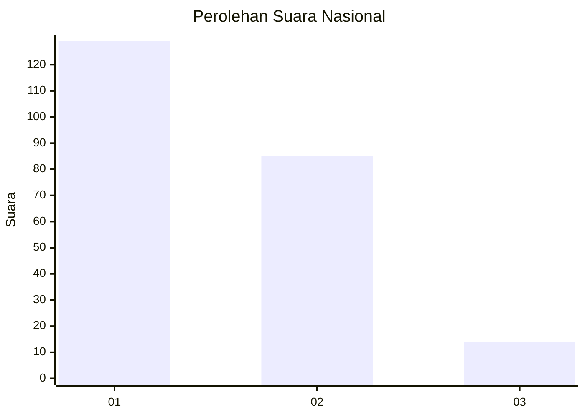
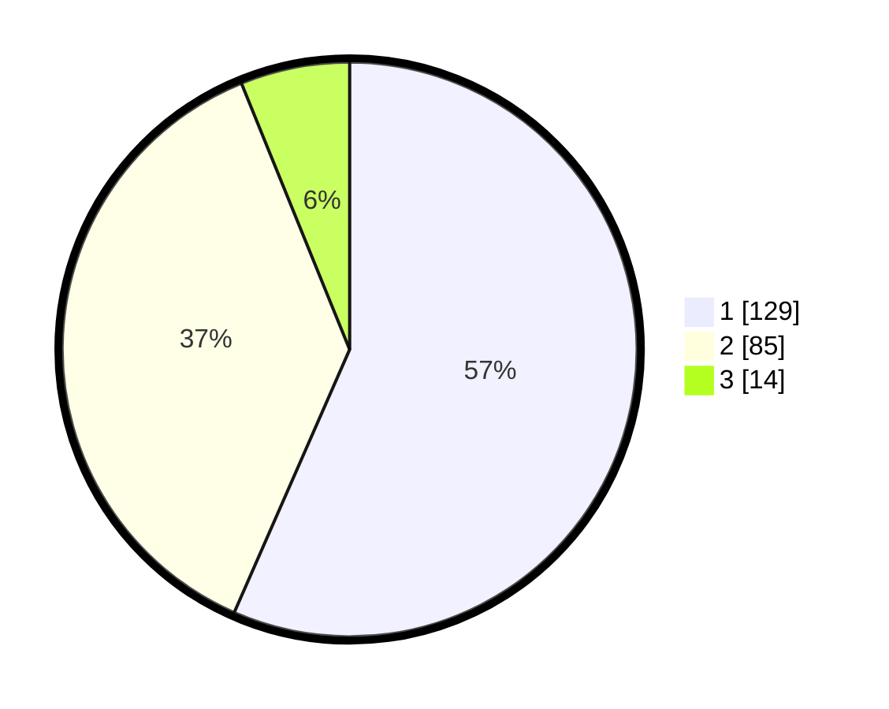

# Hasil

## Grafik

## Tabel

| No. | Nama Paslon    | Suara | Suara (raw) | Persentase |
|:--- |:-------------- | -----:| -----------:| ----------:|
| 1   | ANIES MUHAIMIN | 129   | [129][p-1]  | 56,58      |
| 2   | PRABOWO GIBRAN | 85    | [85][p-2]   | 37,28      |
| 3   | GANJAR MAHFUD  | 14    | [14][p-3]   | 6,14       |

[p-1]: https://github.com/gigit-pemilu/pemilu-2024/blob/main/pilpres/hitung-suara/sub/16-sumatera-selatan/sub/71-kota-palembang/sub/04-ilir-barat-satu/sub/1005-demang-lebardaun/sub/047-tps/sub/paslon-1.txt
[p-2]: https://github.com/gigit-pemilu/pemilu-2024/blob/main/pilpres/hitung-suara/sub/16-sumatera-selatan/sub/71-kota-palembang/sub/04-ilir-barat-satu/sub/1005-demang-lebardaun/sub/047-tps/sub/paslon-2.txt
[p-3]: https://github.com/gigit-pemilu/pemilu-2024/blob/main/pilpres/hitung-suara/sub/16-sumatera-selatan/sub/71-kota-palembang/sub/04-ilir-barat-satu/sub/1005-demang-lebardaun/sub/047-tps/sub/paslon-3.txt

## Foto C Plano

https://sirekap-obj-formc.kpu.go.id/6a5a/pemilu/ppwp/16/71/04/10/05/1671041005047-20240214-192438--0326c5fa-ce77-40ec-93b8-2f2798965a56.jpg

https://sirekap-obj-formc.kpu.go.id/6a5a/pemilu/ppwp/16/71/04/10/05/1671041005047-20240214-192445--2778e3f3-1a30-46e8-bfd9-33e3ca61d41b.jpg

https://sirekap-obj-formc.kpu.go.id/6a5a/pemilu/ppwp/16/71/04/10/05/1671041005047-20240214-234350--240c2e50-d226-4f90-b7f7-2fdc9449b641.jpg

## Metadata

| Key        | Value               |
| ---------- | ------------------- |
| Time Stamp | 2024-02-15 00:41:44 |

