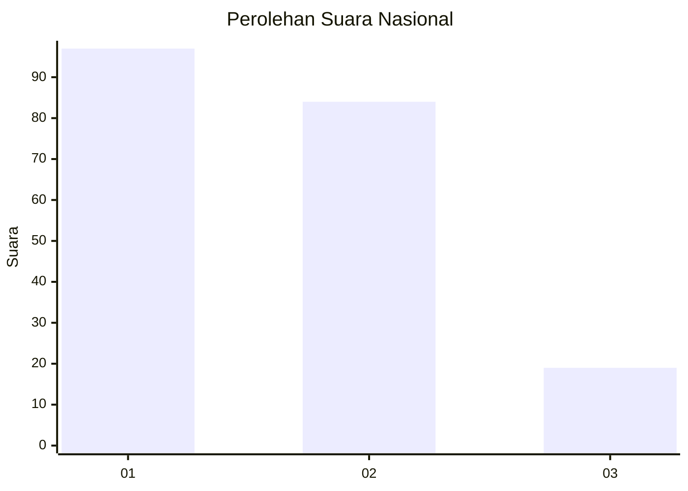
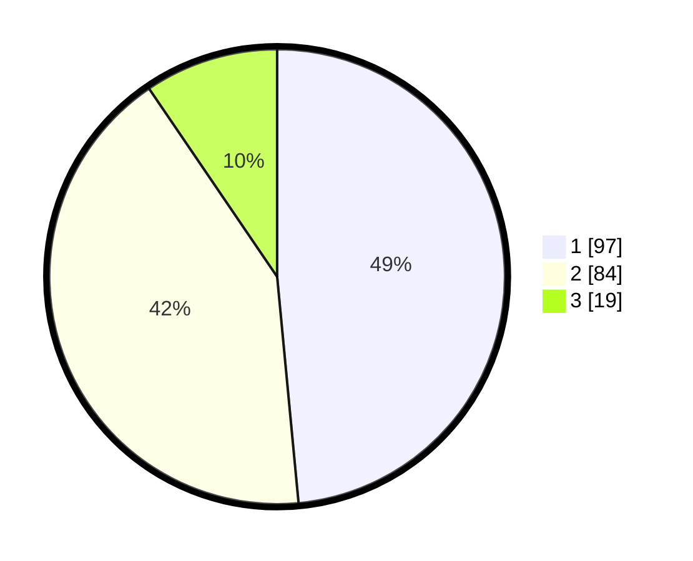

# Hasil

## Grafik

## Tabel

| No. | Nama Paslon    | Suara | Suara (raw) | Persentase |
|:--- |:-------------- | -----:| -----------:| ----------:|
| 1   | ANIES MUHAIMIN | 97    | [97][p-1]   | 48,50      |
| 2   | PRABOWO GIBRAN | 84    | [84][p-2]   | 42,00      |
| 3   | GANJAR MAHFUD  | 19    | [19][p-3]   | 9,50       |

[p-1]: https://github.com/gigit-pemilu/pemilu-2024/blob/main/pilpres/hitung-suara/sub/16-sumatera-selatan/sub/71-kota-palembang/sub/04-ilir-barat-satu/sub/1005-demang-lebardaun/sub/049-tps/sub/paslon-1.txt
[p-2]: https://github.com/gigit-pemilu/pemilu-2024/blob/main/pilpres/hitung-suara/sub/16-sumatera-selatan/sub/71-kota-palembang/sub/04-ilir-barat-satu/sub/1005-demang-lebardaun/sub/049-tps/sub/paslon-2.txt
[p-3]: https://github.com/gigit-pemilu/pemilu-2024/blob/main/pilpres/hitung-suara/sub/16-sumatera-selatan/sub/71-kota-palembang/sub/04-ilir-barat-satu/sub/1005-demang-lebardaun/sub/049-tps/sub/paslon-3.txt

## Foto C Plano

https://sirekap-obj-formc.kpu.go.id/0733/pemilu/ppwp/16/71/04/10/05/1671041005049-20240220-215338--20d28fc9-1717-4067-84e7-05443d008dec.jpg

https://sirekap-obj-formc.kpu.go.id/0733/pemilu/ppwp/16/71/04/10/05/1671041005049-20240220-215928--bd4dfedb-5651-4da9-99ea-aa5746072bfb.jpg

https://sirekap-obj-formc.kpu.go.id/0733/pemilu/ppwp/16/71/04/10/05/1671041005049-20240220-220135--51af2cf9-a101-4226-8f82-e2f62e4907c5.jpg

## Metadata

| Key        | Value               |
| ---------- | ------------------- |
| Time Stamp | 2024-02-25 18:00:00 |

