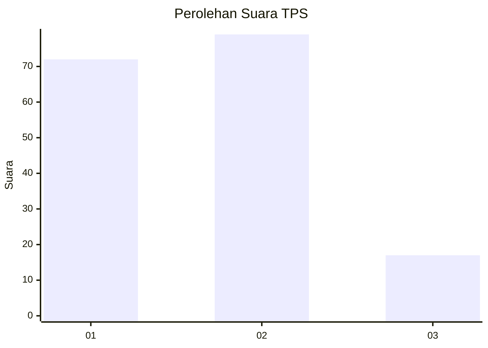
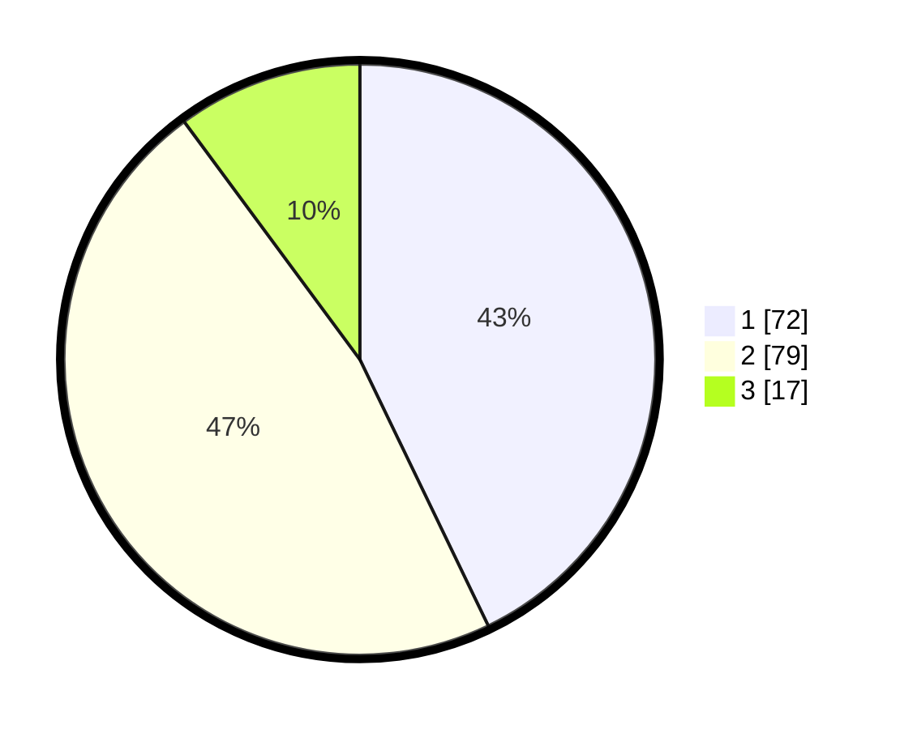

# Hasil

## Grafik

## Tabel

| No. | Nama Paslon    | Suara | Suara (raw) | Persentase |
|:--- |:-------------- | -----:| -----------:| ----------:|
| 1   | ANIES MUHAIMIN | 72    | [72][p-1]   | 42,86      |
| 2   | PRABOWO GIBRAN | 79    | [79][p-2]   | 47,02      |
| 3   | GANJAR MAHFUD  | 17    | [17][p-3]   | 10,12      |

[p-1]: https://github.com/gigit-pemilu/pemilu-2024-16-sumatera-selatan/blob/main/pilpres/hitung-suara/sub/16-sumatera-selatan/sub/71-kota-palembang/sub/04-ilir-barat-satu/sub/1005-demang-lebardaun/sub/054-tps/sub/paslon-1.txt
[p-2]: https://github.com/gigit-pemilu/pemilu-2024-16-sumatera-selatan/blob/main/pilpres/hitung-suara/sub/16-sumatera-selatan/sub/71-kota-palembang/sub/04-ilir-barat-satu/sub/1005-demang-lebardaun/sub/054-tps/sub/paslon-2.txt
[p-3]: https://github.com/gigit-pemilu/pemilu-2024-16-sumatera-selatan/blob/main/pilpres/hitung-suara/sub/16-sumatera-selatan/sub/71-kota-palembang/sub/04-ilir-barat-satu/sub/1005-demang-lebardaun/sub/054-tps/sub/paslon-3.txt

## Foto C Plano

https://sirekap-obj-formc.kpu.go.id/6ebc/pemilu/ppwp/16/71/04/10/05/1671041005054-20240215-001527--b16dbcf4-4838-4a74-b9cc-9a7853d3f735.jpg

https://sirekap-obj-formc.kpu.go.id/6ebc/pemilu/ppwp/16/71/04/10/05/1671041005054-20240215-001557--61072d64-350e-4622-8ec5-efad704cd2ff.jpg

https://sirekap-obj-formc.kpu.go.id/6ebc/pemilu/ppwp/16/71/04/10/05/1671041005054-20240215-001547--81490601-d2e6-4f80-b6cb-578b6ed81521.jpg

## Metadata

| Key        | Value               |
| ---------- | ------------------- |
| Time Stamp | 2024-02-25 00:00:00 |

