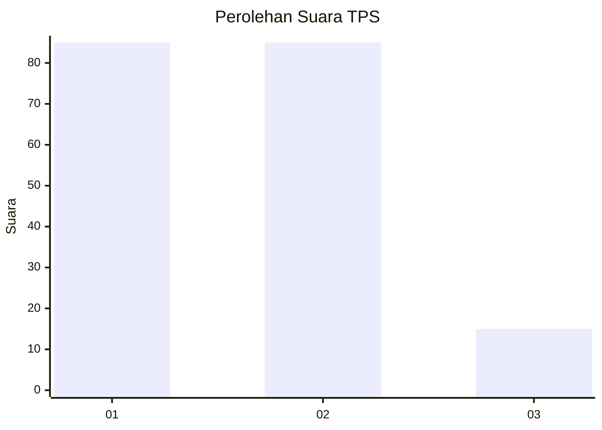
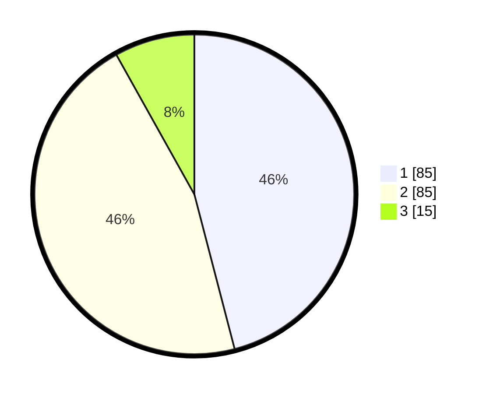

# Hasil

## Grafik

## Tabel

| No. | Nama Paslon    | Suara | Suara (raw) | Persentase |
|:--- |:-------------- | -----:| -----------:| ----------:|
| 1   | ANIES MUHAIMIN | 85    | [85][p-1]   | 45,95      |
| 2   | PRABOWO GIBRAN | 85    | [85][p-2]   | 45,95      |
| 3   | GANJAR MAHFUD  | 15    | [15][p-3]   | 8,11       |

[p-1]: https://github.com/gigit-pemilu/pemilu-2024-16-sumatera-selatan/blob/main/pilpres/hitung-suara/sub/16-sumatera-selatan/sub/71-kota-palembang/sub/04-ilir-barat-satu/sub/1005-demang-lebardaun/sub/064-tps/sub/paslon-1.txt
[p-2]: https://github.com/gigit-pemilu/pemilu-2024-16-sumatera-selatan/blob/main/pilpres/hitung-suara/sub/16-sumatera-selatan/sub/71-kota-palembang/sub/04-ilir-barat-satu/sub/1005-demang-lebardaun/sub/064-tps/sub/paslon-2.txt
[p-3]: https://github.com/gigit-pemilu/pemilu-2024-16-sumatera-selatan/blob/main/pilpres/hitung-suara/sub/16-sumatera-selatan/sub/71-kota-palembang/sub/04-ilir-barat-satu/sub/1005-demang-lebardaun/sub/064-tps/sub/paslon-3.txt

## Foto C Plano

https://sirekap-obj-formc.kpu.go.id/0706/pemilu/ppwp/16/71/04/10/05/1671041005064-20240220-231109--c8dc8216-2f86-490f-9cf5-386667440e9c.jpg

https://sirekap-obj-formc.kpu.go.id/0706/pemilu/ppwp/16/71/04/10/05/1671041005064-20240220-231220--d28fd755-dff8-4a4c-8aeb-71cd05bdfec3.jpg

https://sirekap-obj-formc.kpu.go.id/0706/pemilu/ppwp/16/71/04/10/05/1671041005064-20240220-231320--063e2623-9fcb-4986-850a-6173b3bf4800.jpg

## Metadata

| Key        | Value               |
| ---------- | ------------------- |
| Time Stamp | 2024-02-25 15:00:00 |

