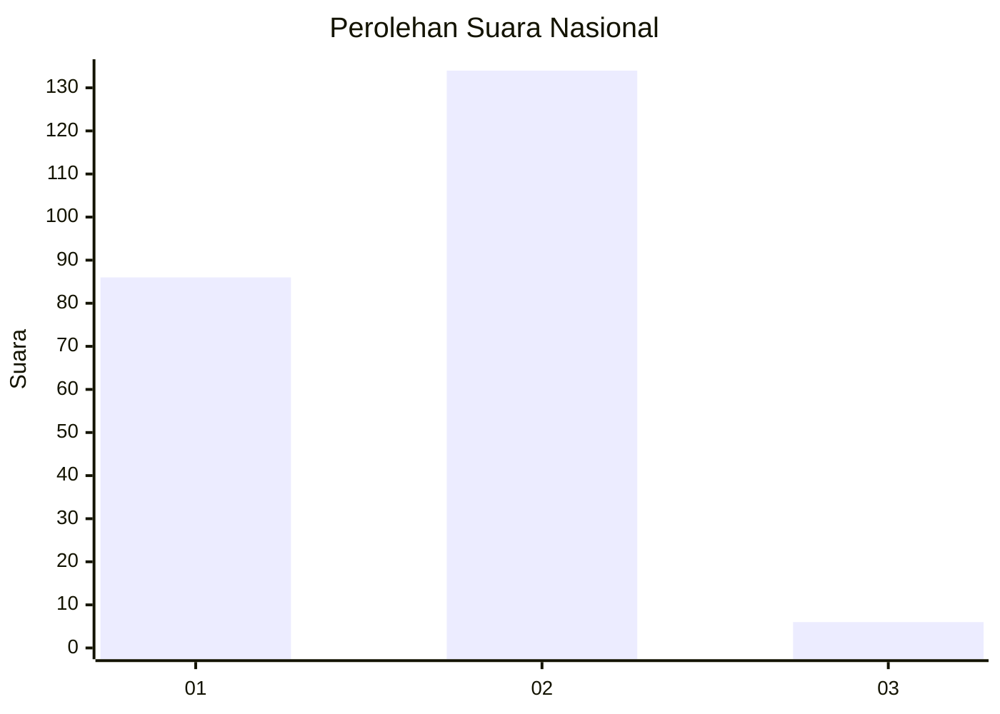
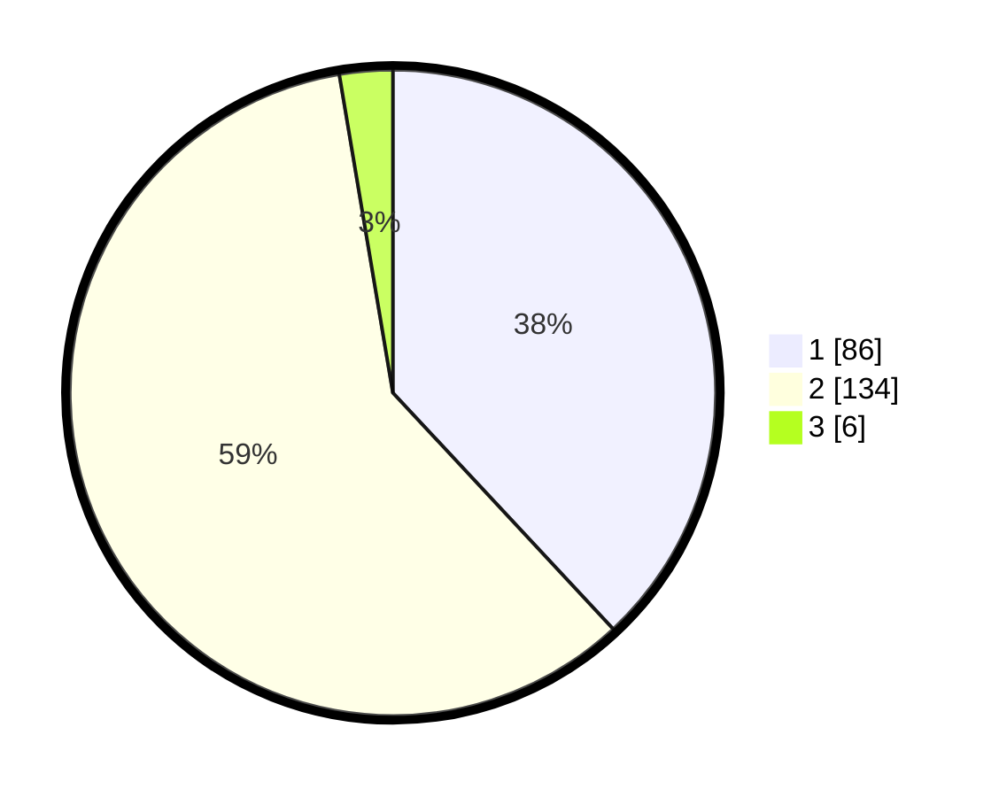

# Hasil

## Grafik

## Tabel

| No. | Nama Paslon    | Suara | Suara (raw) | Persentase |
|:--- |:-------------- | -----:| -----------:| ----------:|
| 1   | ANIES MUHAIMIN | 86    | [86][p-1]   | 38,05      |
| 2   | PRABOWO GIBRAN | 134   | [134][p-2]  | 59,29      |
| 3   | GANJAR MAHFUD  | 6     | [6][p-3]    | 2,65       |

[p-1]: https://github.com/gigit-pemilu/pemilu-2024/blob/main/pilpres/hitung-suara/sub/16-sumatera-selatan/sub/71-kota-palembang/sub/04-ilir-barat-satu/sub/1006-bukitbaru/sub/032-tps/sub/paslon-1.txt
[p-2]: https://github.com/gigit-pemilu/pemilu-2024/blob/main/pilpres/hitung-suara/sub/16-sumatera-selatan/sub/71-kota-palembang/sub/04-ilir-barat-satu/sub/1006-bukitbaru/sub/032-tps/sub/paslon-2.txt
[p-3]: https://github.com/gigit-pemilu/pemilu-2024/blob/main/pilpres/hitung-suara/sub/16-sumatera-selatan/sub/71-kota-palembang/sub/04-ilir-barat-satu/sub/1006-bukitbaru/sub/032-tps/sub/paslon-3.txt

## Foto C Plano

https://sirekap-obj-formc.kpu.go.id/ab83/pemilu/ppwp/16/71/04/10/06/1671041006032-20240219-095843--4d141342-2403-470c-b771-377fb21c7111.jpg

https://sirekap-obj-formc.kpu.go.id/ab83/pemilu/ppwp/16/71/04/10/06/1671041006032-20240219-095916--a70e387a-4448-4ab1-b8f5-5fbf1ecea059.jpg

https://sirekap-obj-formc.kpu.go.id/ab83/pemilu/ppwp/16/71/04/10/06/1671041006032-20240219-095945--6dce8212-bb98-4215-a027-fef6a1f96da1.jpg

## Metadata

| Key        | Value               |
| ---------- | ------------------- |
| Time Stamp | 2024-02-19 11:00:00 |

## DATA PEMILIH TETAP

Jumlah pemilih dalam DPT: **285**.
 * L: **179**.
 * P: **746**.

## DATA PENGGUNA HAK PILIH

Jumlah pengguna hak pilih dalam DPT: **222**.
 * L: **202**.
 * P: **320**.

Jumlah pengguna hak pilih dalam DPTb: **35**.
 * L: **555**.
 * P: **0**.

Jumlah pengguna hak pilih dalam DPK: **2**.
 * L: **942**.
 * P: **47**.

Jumlah pengguna hak pilih: **234**.
 * L: **112**.
 * P: **238**.

## JUMLAH SUARA SAH DAN TIDAK SAH

JUMLAH SELURUH SUARA SAH: **225**.

JUMLAH SUARA TIDAK SAH: **74**.

JUMLAH SELURUH SUARA SAH DAN SUARA TIDAK SAH: **270**.

