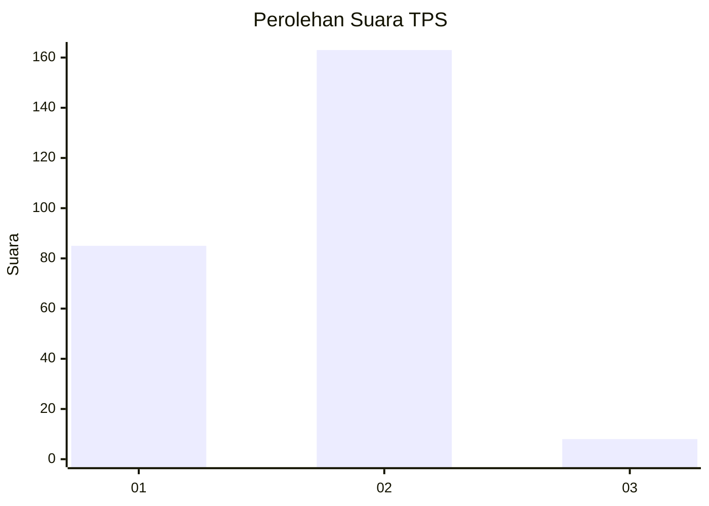
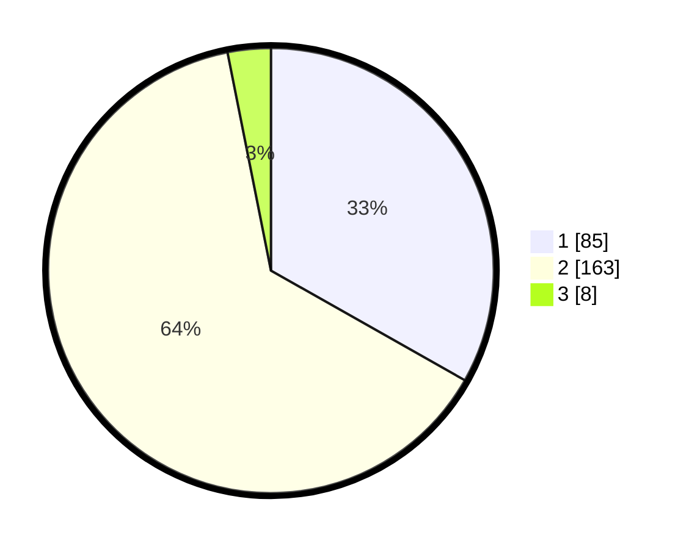

# Hasil

## Grafik

## Tabel

| No. | Nama Paslon    | Suara | Suara (raw) | Persentase |
|:--- |:-------------- | -----:| -----------:| ----------:|
| 1   | ANIES MUHAIMIN | 85    | [85][p-1]   | 33,20      |
| 2   | PRABOWO GIBRAN | 163   | [163][p-2]  | 63,67      |
| 3   | GANJAR MAHFUD  | 8     | [8][p-3]    | 3,13       |

[p-1]: https://github.com/gigit-pemilu/pemilu-2024-16-sumatera-selatan/blob/main/pilpres/hitung-suara/sub/16-sumatera-selatan/sub/71-kota-palembang/sub/04-ilir-barat-satu/sub/1006-bukitbaru/sub/033-tps/sub/paslon-1.txt
[p-2]: https://github.com/gigit-pemilu/pemilu-2024-16-sumatera-selatan/blob/main/pilpres/hitung-suara/sub/16-sumatera-selatan/sub/71-kota-palembang/sub/04-ilir-barat-satu/sub/1006-bukitbaru/sub/033-tps/sub/paslon-2.txt
[p-3]: https://github.com/gigit-pemilu/pemilu-2024-16-sumatera-selatan/blob/main/pilpres/hitung-suara/sub/16-sumatera-selatan/sub/71-kota-palembang/sub/04-ilir-barat-satu/sub/1006-bukitbaru/sub/033-tps/sub/paslon-3.txt

## Foto C Plano

https://sirekap-obj-formc.kpu.go.id/2979/pemilu/ppwp/16/71/04/10/06/1671041006033-20240219-101003--5edd64b1-7f69-451c-a62c-c606a603f631.jpg

https://sirekap-obj-formc.kpu.go.id/2979/pemilu/ppwp/16/71/04/10/06/1671041006033-20240219-100857--93cd7f80-a3e1-4b35-85c6-3c9ae68803e0.jpg

https://sirekap-obj-formc.kpu.go.id/2979/pemilu/ppwp/16/71/04/10/06/1671041006033-20240219-100825--5e7e8025-e1c3-4841-bacb-ea42e998d12a.jpg

## Metadata

| Key        | Value               |
| ---------- | ------------------- |
| Time Stamp | 2024-02-20 12:00:00 |

## DATA PEMILIH TETAP

Jumlah pemilih dalam DPT: **217**.
 * L: **494**.
 * P: **117**.

## DATA PENGGUNA HAK PILIH

Jumlah pengguna hak pilih dalam DPT: **212**.
 * L: **77**.
 * P: **117**.

Jumlah pengguna hak pilih dalam DPTb: **6**.
 * L: **7**.
 * P: **47**.

Jumlah pengguna hak pilih dalam DPK: **438**.
 * L: **19**.
 * P: **417**.

Jumlah pengguna hak pilih: **255**.
 * L: **121**.
 * P: **174**.

## JUMLAH SUARA SAH DAN TIDAK SAH

JUMLAH SELURUH SUARA SAH: **256**.

JUMLAH SUARA TIDAK SAH: **1**.

JUMLAH SELURUH SUARA SAH DAN SUARA TIDAK SAH: **257**.

