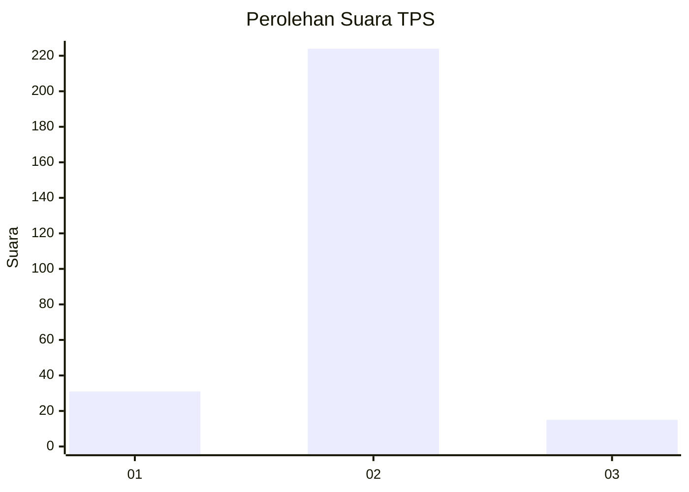
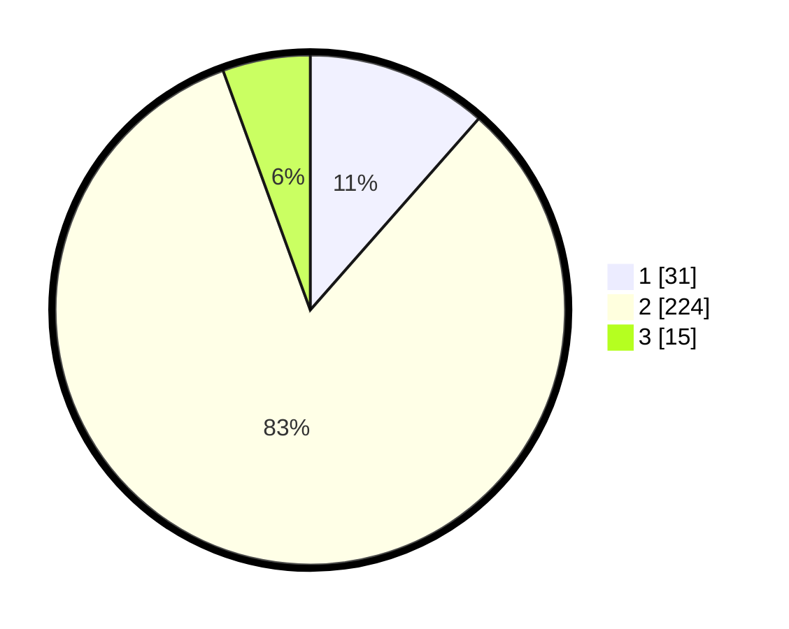

# Hasil

## Grafik

## Tabel

| No. | Nama Paslon    | Suara | Suara (raw) | Persentase |
|:--- |:-------------- | -----:| -----------:| ----------:|
| 1   | ANIES MUHAIMIN | 31    | [31][p-1]   | 11,48      |
| 2   | PRABOWO GIBRAN | 224   | [224][p-2]  | 82,96      |
| 3   | GANJAR MAHFUD  | 15    | [15][p-3]   | 5,56       |

[p-1]: https://github.com/gigit-pemilu/pemilu-2024-16-sumatera-selatan/blob/main/pilpres/hitung-suara/sub/16-sumatera-selatan/sub/71-kota-palembang/sub/04-ilir-barat-satu/sub/1006-bukitbaru/sub/042-tps/sub/paslon-1.txt
[p-2]: https://github.com/gigit-pemilu/pemilu-2024-16-sumatera-selatan/blob/main/pilpres/hitung-suara/sub/16-sumatera-selatan/sub/71-kota-palembang/sub/04-ilir-barat-satu/sub/1006-bukitbaru/sub/042-tps/sub/paslon-2.txt
[p-3]: https://github.com/gigit-pemilu/pemilu-2024-16-sumatera-selatan/blob/main/pilpres/hitung-suara/sub/16-sumatera-selatan/sub/71-kota-palembang/sub/04-ilir-barat-satu/sub/1006-bukitbaru/sub/042-tps/sub/paslon-3.txt

## Foto C Plano

https://sirekap-obj-formc.kpu.go.id/023e/pemilu/ppwp/16/71/04/10/06/1671041006042-20240214-190111--e691e0a8-405a-485d-bf03-5da5b1a9f2f6.jpg

https://sirekap-obj-formc.kpu.go.id/023e/pemilu/ppwp/16/71/04/10/06/1671041006042-20240217-234426--9163adf7-db3e-4aa5-80bd-1d6fdfed5bb6.jpg

https://sirekap-obj-formc.kpu.go.id/023e/pemilu/ppwp/16/71/04/10/06/1671041006042-20240214-190135--8a5bfc32-9469-4fcc-9939-6e70bf3f69ee.jpg

## Metadata

| Key        | Value               |
| ---------- | ------------------- |
| Time Stamp | 2024-02-19 06:16:00 |

