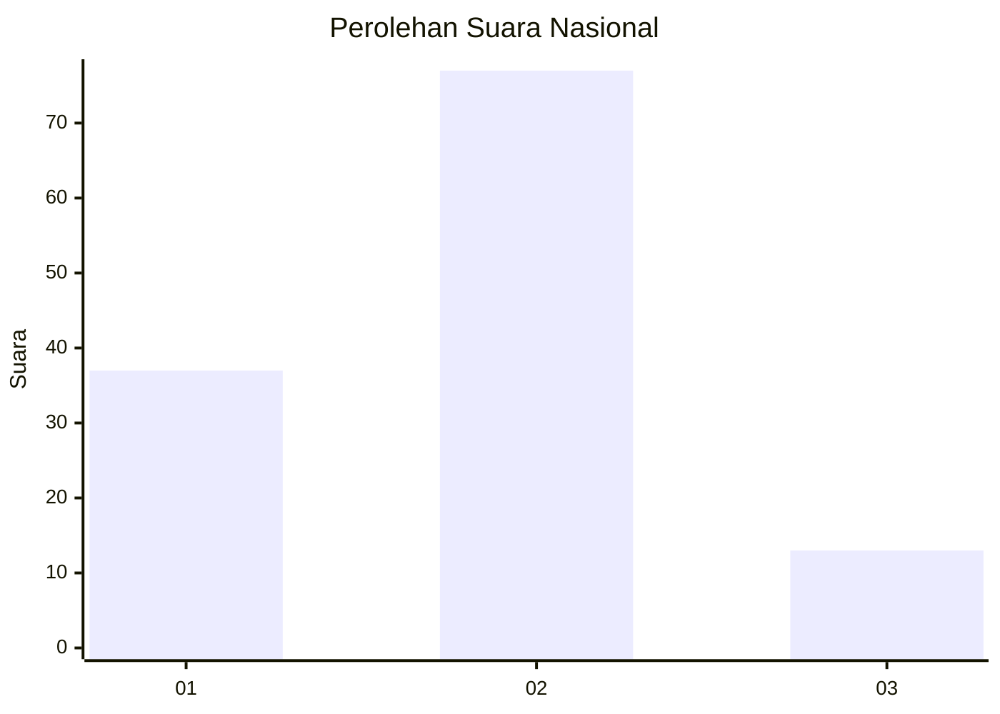
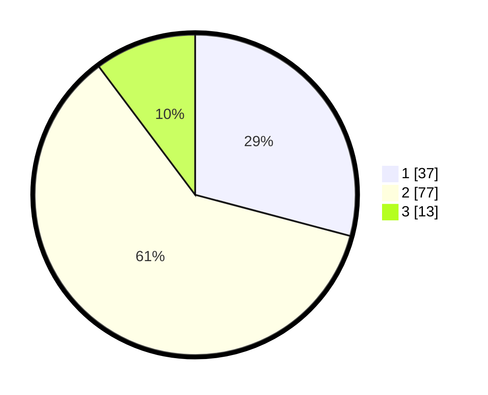

# Hasil

## Grafik

## Tabel

| No. | Nama Paslon    | Suara | Suara (raw) | Persentase |
|:--- |:-------------- | -----:| -----------:| ----------:|
| 1   | ANIES MUHAIMIN | 37    | [37][p-1]   | 29,13      |
| 2   | PRABOWO GIBRAN | 77    | [77][p-2]   | 60,63      |
| 3   | GANJAR MAHFUD  | 13    | [13][p-3]   | 10,24      |

[p-1]: https://github.com/gigit-pemilu/pemilu-2024/blob/main/pilpres/hitung-suara/sub/16-sumatera-selatan/sub/71-kota-palembang/sub/04-ilir-barat-satu/sub/1006-bukitbaru/sub/048-tps/sub/paslon-1.txt
[p-2]: https://github.com/gigit-pemilu/pemilu-2024/blob/main/pilpres/hitung-suara/sub/16-sumatera-selatan/sub/71-kota-palembang/sub/04-ilir-barat-satu/sub/1006-bukitbaru/sub/048-tps/sub/paslon-2.txt
[p-3]: https://github.com/gigit-pemilu/pemilu-2024/blob/main/pilpres/hitung-suara/sub/16-sumatera-selatan/sub/71-kota-palembang/sub/04-ilir-barat-satu/sub/1006-bukitbaru/sub/048-tps/sub/paslon-3.txt

## Foto C Plano

https://sirekap-obj-formc.kpu.go.id/a112/pemilu/ppwp/16/71/04/10/06/1671041006048-20240214-201959--53d56d66-07d9-4f66-b9a6-defda8f4f549.jpg

https://sirekap-obj-formc.kpu.go.id/a112/pemilu/ppwp/16/71/04/10/06/1671041006048-20240214-204946--59db5d52-2167-4682-a5eb-fd8f115ed8c7.jpg

https://sirekap-obj-formc.kpu.go.id/a112/pemilu/ppwp/16/71/04/10/06/1671041006048-20240214-202032--f1db7ea3-a415-4c86-82c5-7230523bf237.jpg

## Metadata

| Key        | Value               |
| ---------- | ------------------- |
| Time Stamp | 2024-02-25 15:00:00 |

