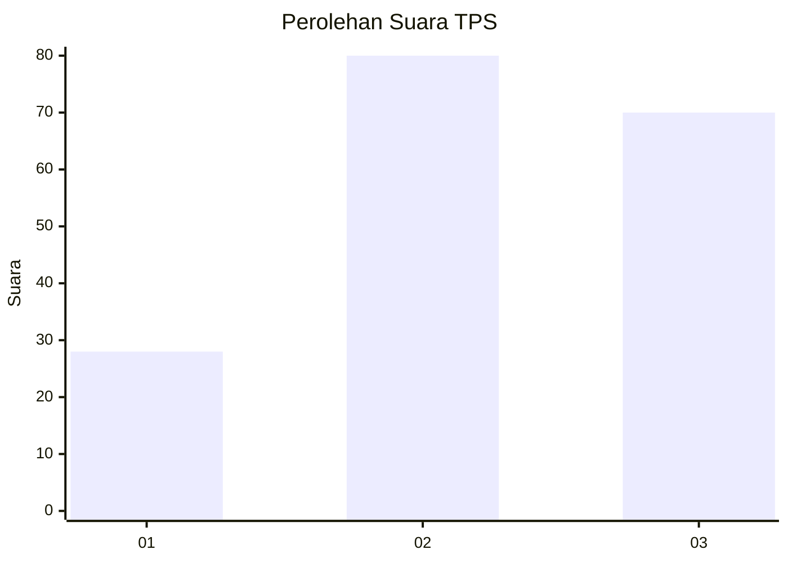
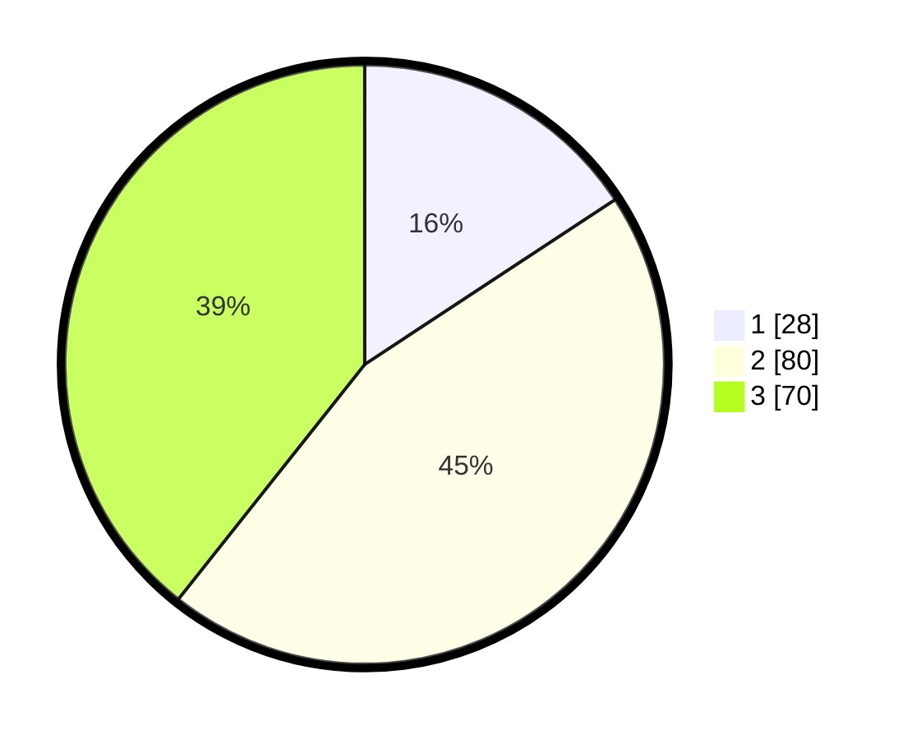

# Hasil

## Grafik

## Tabel

| No. | Nama Paslon    | Suara | Suara (raw) | Persentase |
|:--- |:-------------- | -----:| -----------:| ----------:|
| 1   | ANIES MUHAIMIN | 28    | [28][p-1]   | 15,73      |
| 2   | PRABOWO GIBRAN | 80    | [80][p-2]   | 44,94      |
| 3   | GANJAR MAHFUD  | 70    | [70][p-3]   | 39,33      |

[p-1]: https://github.com/gigit-pemilu/pemilu-2024-16-sumatera-selatan/blob/main/pilpres/hitung-suara/sub/16-sumatera-selatan/sub/71-kota-palembang/sub/05-ilir-timur-satu/sub/1001-delapan-belas-ilir/sub/001-tps/sub/paslon-1.txt
[p-2]: https://github.com/gigit-pemilu/pemilu-2024-16-sumatera-selatan/blob/main/pilpres/hitung-suara/sub/16-sumatera-selatan/sub/71-kota-palembang/sub/05-ilir-timur-satu/sub/1001-delapan-belas-ilir/sub/001-tps/sub/paslon-2.txt
[p-3]: https://github.com/gigit-pemilu/pemilu-2024-16-sumatera-selatan/blob/main/pilpres/hitung-suara/sub/16-sumatera-selatan/sub/71-kota-palembang/sub/05-ilir-timur-satu/sub/1001-delapan-belas-ilir/sub/001-tps/sub/paslon-3.txt

## Foto C Plano

https://sirekap-obj-formc.kpu.go.id/bb39/pemilu/ppwp/16/71/05/10/01/1671051001001-20240214-234407--3358a586-c964-43ef-8ca8-0983df9f1700.jpg

https://sirekap-obj-formc.kpu.go.id/bb39/pemilu/ppwp/16/71/05/10/01/1671051001001-20240214-234525--9d160ed3-2391-4116-a4a1-6f871d4a9655.jpg

https://sirekap-obj-formc.kpu.go.id/bb39/pemilu/ppwp/16/71/05/10/01/1671051001001-20240214-234716--b01c7276-3fe7-4ba0-b8c6-086e83edad39.jpg

## Metadata

| Key        | Value               |
| ---------- | ------------------- |
| Time Stamp | 2024-02-21 02:00:00 |

