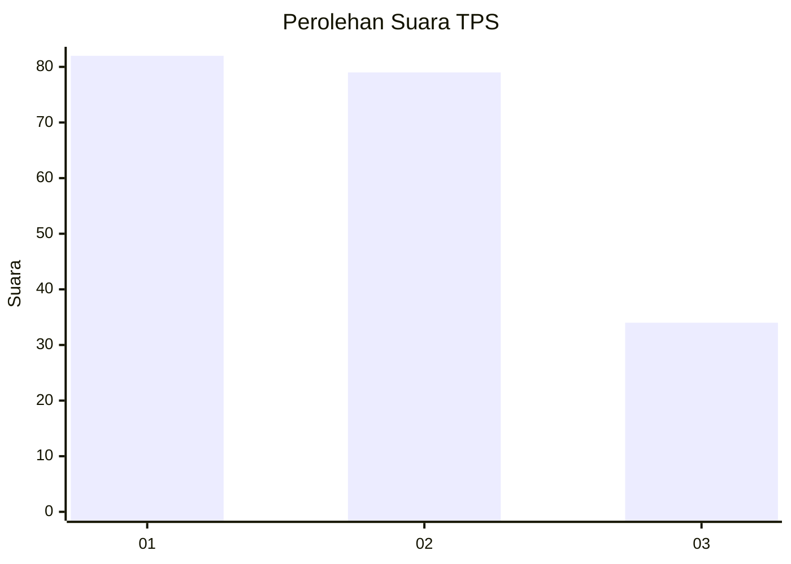
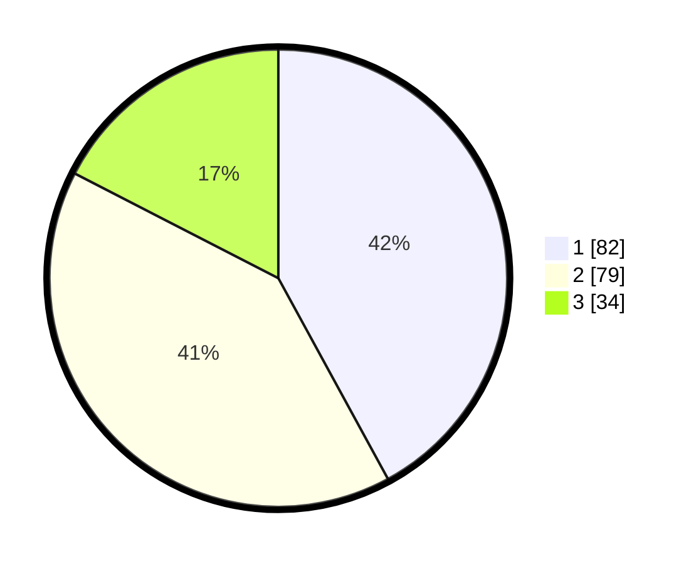

# Hasil

## Grafik

## Tabel

| No. | Nama Paslon    | Suara | Suara (raw) | Persentase |
|:--- |:-------------- | -----:| -----------:| ----------:|
| 1   | ANIES MUHAIMIN | 82    | [82][p-1]   | 42,05      |
| 2   | PRABOWO GIBRAN | 79    | [79][p-2]   | 40,51      |
| 3   | GANJAR MAHFUD  | 34    | [34][p-3]   | 17,44      |

[p-1]: https://github.com/gigit-pemilu/pemilu-2024-16-sumatera-selatan/blob/main/pilpres/hitung-suara/sub/16-sumatera-selatan/sub/71-kota-palembang/sub/05-ilir-timur-satu/sub/1003-tiga-belas-ilir/sub/004-tps/sub/paslon-1.txt
[p-2]: https://github.com/gigit-pemilu/pemilu-2024-16-sumatera-selatan/blob/main/pilpres/hitung-suara/sub/16-sumatera-selatan/sub/71-kota-palembang/sub/05-ilir-timur-satu/sub/1003-tiga-belas-ilir/sub/004-tps/sub/paslon-2.txt
[p-3]: https://github.com/gigit-pemilu/pemilu-2024-16-sumatera-selatan/blob/main/pilpres/hitung-suara/sub/16-sumatera-selatan/sub/71-kota-palembang/sub/05-ilir-timur-satu/sub/1003-tiga-belas-ilir/sub/004-tps/sub/paslon-3.txt

## Foto C Plano

https://sirekap-obj-formc.kpu.go.id/cadf/pemilu/ppwp/16/71/05/10/03/1671051003004-20240218-142128--1801f89f-c4a4-4019-a275-9efe1c7ac94f.jpg

https://sirekap-obj-formc.kpu.go.id/cadf/pemilu/ppwp/16/71/05/10/03/1671051003004-20240218-142216--06e0752a-afe6-4c31-a62f-9124d8ae809b.jpg

https://sirekap-obj-formc.kpu.go.id/cadf/pemilu/ppwp/16/71/05/10/03/1671051003004-20240218-142310--21ae5cc2-75a0-41af-ae25-4162efbeb5a7.jpg

## Metadata

| Key        | Value               |
| ---------- | ------------------- |
| Time Stamp | 2024-02-19 06:16:00 |

