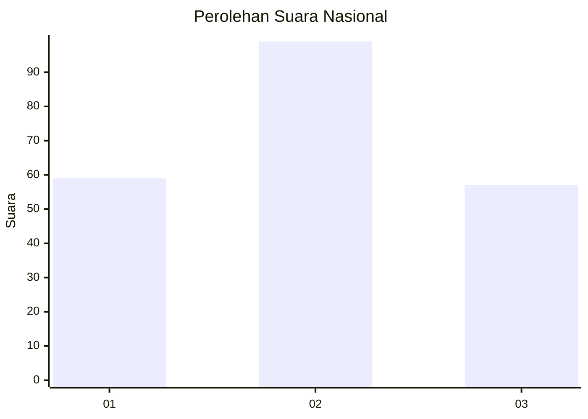
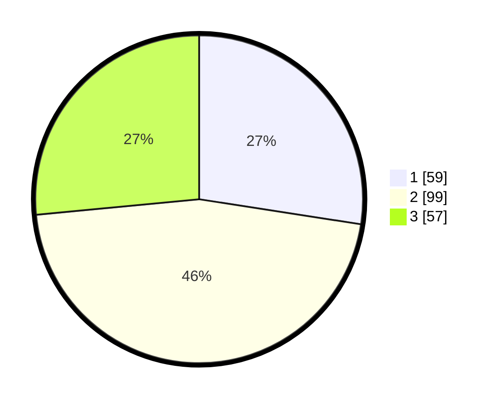

# Hasil

## Grafik

## Tabel

| No. | Nama Paslon    | Suara | Suara (raw) | Persentase |
|:--- |:-------------- | -----:| -----------:| ----------:|
| 1   | ANIES MUHAIMIN | 59    | [59][p-1]   | 27,44      |
| 2   | PRABOWO GIBRAN | 99    | [99][p-2]   | 46,05      |
| 3   | GANJAR MAHFUD  | 57    | [57][p-3]   | 26,51      |

[p-1]: https://github.com/gigit-pemilu/pemilu-2024/blob/main/pilpres/hitung-suara/sub/16-sumatera-selatan/sub/71-kota-palembang/sub/05-ilir-timur-satu/sub/1004-empat-belas-ilir/sub/002-tps/sub/paslon-1.txt
[p-2]: https://github.com/gigit-pemilu/pemilu-2024/blob/main/pilpres/hitung-suara/sub/16-sumatera-selatan/sub/71-kota-palembang/sub/05-ilir-timur-satu/sub/1004-empat-belas-ilir/sub/002-tps/sub/paslon-2.txt
[p-3]: https://github.com/gigit-pemilu/pemilu-2024/blob/main/pilpres/hitung-suara/sub/16-sumatera-selatan/sub/71-kota-palembang/sub/05-ilir-timur-satu/sub/1004-empat-belas-ilir/sub/002-tps/sub/paslon-3.txt

## Foto C Plano

https://sirekap-obj-formc.kpu.go.id/2054/pemilu/ppwp/16/71/05/10/04/1671051004002-20240215-101120--5e9441ca-2abc-4d8d-91b0-c5fab026967d.jpg

https://sirekap-obj-formc.kpu.go.id/2054/pemilu/ppwp/16/71/05/10/04/1671051004002-20240215-101202--e9d5e6bf-c790-44f5-842a-8efb12b13d02.jpg

https://sirekap-obj-formc.kpu.go.id/2054/pemilu/ppwp/16/71/05/10/04/1671051004002-20240215-101257--a62e4c1d-3736-4abf-b58c-a53ec01e5f99.jpg

## Metadata

| Key        | Value               |
| ---------- | ------------------- |
| Time Stamp | 2024-02-27 13:00:00 |

