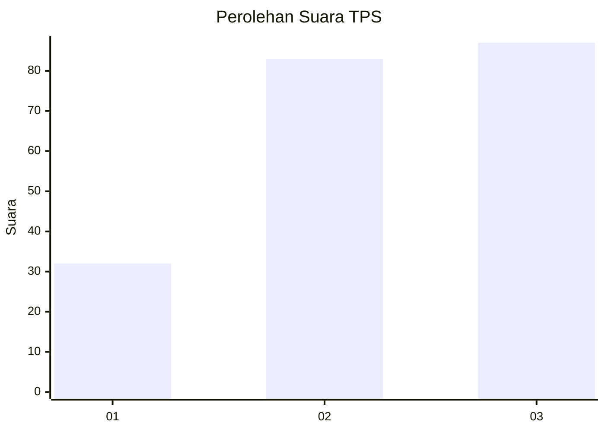
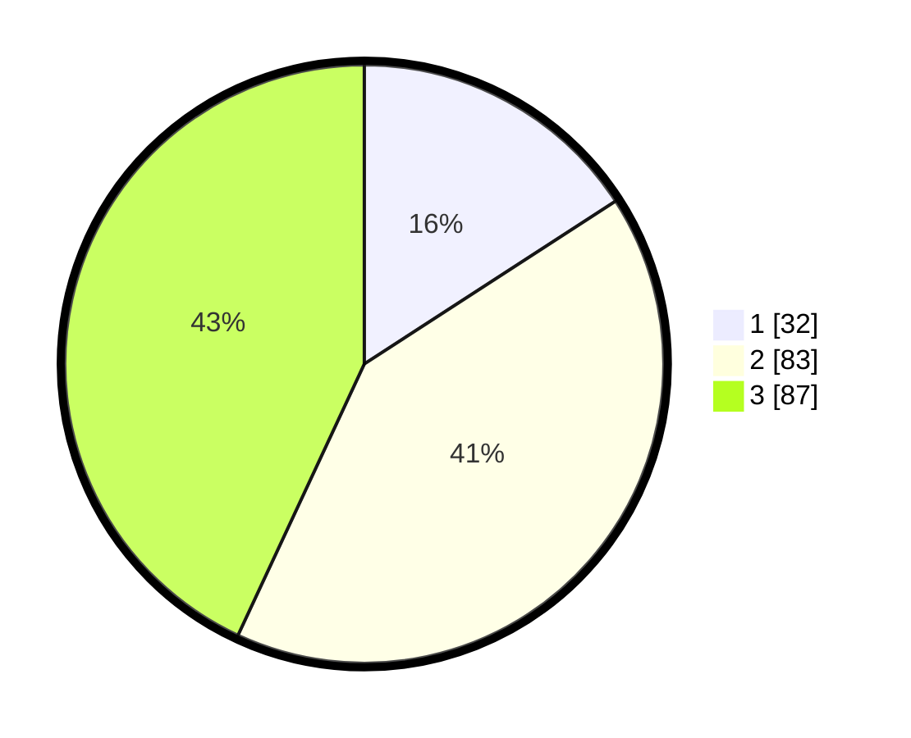

# Hasil

## Grafik

## Tabel

| No. | Nama Paslon    | Suara | Suara (raw) | Persentase |
|:--- |:-------------- | -----:| -----------:| ----------:|
| 1   | ANIES MUHAIMIN | 32    | [32][p-1]   | 15,84      |
| 2   | PRABOWO GIBRAN | 83    | [83][p-2]   | 41,09      |
| 3   | GANJAR MAHFUD  | 87    | [87][p-3]   | 43,07      |

[p-1]: https://github.com/gigit-pemilu/pemilu-2024-16-sumatera-selatan/blob/main/pilpres/hitung-suara/sub/16-sumatera-selatan/sub/71-kota-palembang/sub/05-ilir-timur-satu/sub/1004-empat-belas-ilir/sub/005-tps/sub/paslon-1.txt
[p-2]: https://github.com/gigit-pemilu/pemilu-2024-16-sumatera-selatan/blob/main/pilpres/hitung-suara/sub/16-sumatera-selatan/sub/71-kota-palembang/sub/05-ilir-timur-satu/sub/1004-empat-belas-ilir/sub/005-tps/sub/paslon-2.txt
[p-3]: https://github.com/gigit-pemilu/pemilu-2024-16-sumatera-selatan/blob/main/pilpres/hitung-suara/sub/16-sumatera-selatan/sub/71-kota-palembang/sub/05-ilir-timur-satu/sub/1004-empat-belas-ilir/sub/005-tps/sub/paslon-3.txt

## Foto C Plano

https://sirekap-obj-formc.kpu.go.id/f098/pemilu/ppwp/16/71/05/10/04/1671051004005-20240214-232301--88e05fab-263b-483c-8fc5-0eb9b6063803.jpg

https://sirekap-obj-formc.kpu.go.id/f098/pemilu/ppwp/16/71/05/10/04/1671051004005-20240214-232254--d6f0bbe6-e531-4eca-a31c-7df74ff6f9f4.jpg

https://sirekap-obj-formc.kpu.go.id/f098/pemilu/ppwp/16/71/05/10/04/1671051004005-20240214-232012--3d741c9b-416f-4e37-a910-52c4e8ca977d.jpg

## Metadata

| Key        | Value               |
| ---------- | ------------------- |
| Time Stamp | 2024-02-24 22:31:28 |

