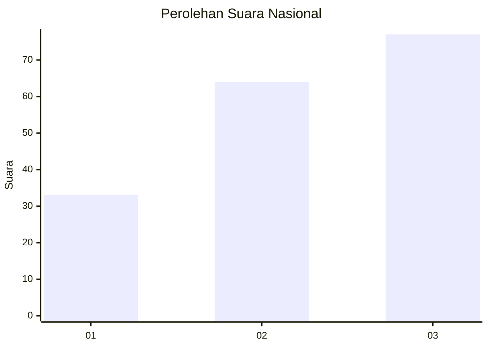
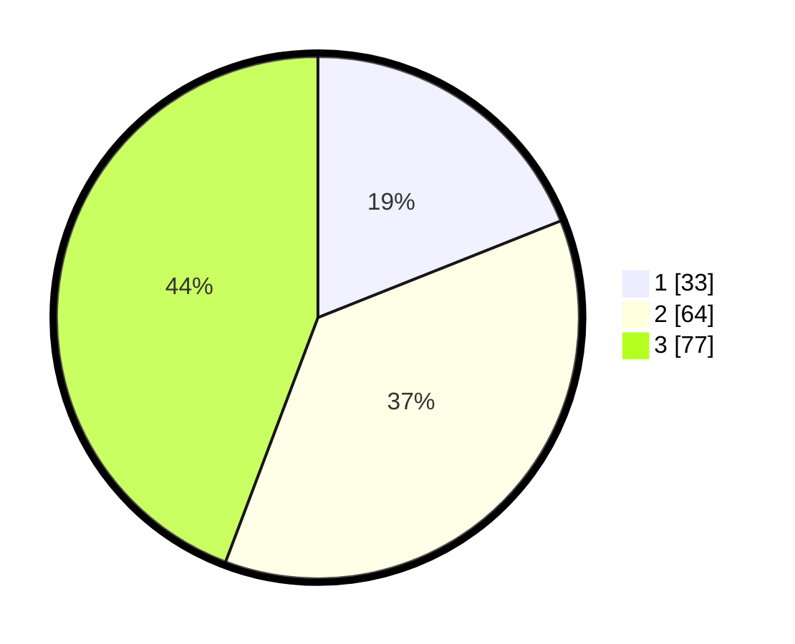

# Hasil

## Grafik

## Tabel

| No. | Nama Paslon    | Suara | Suara (raw) | Persentase |
|:--- |:-------------- | -----:| -----------:| ----------:|
| 1   | ANIES MUHAIMIN | 33    | [33][p-1]   | 18,97      |
| 2   | PRABOWO GIBRAN | 64    | [64][p-2]   | 36,78      |
| 3   | GANJAR MAHFUD  | 77    | [77][p-3]   | 44,25      |

[p-1]: https://github.com/gigit-pemilu/pemilu-2024/blob/main/pilpres/hitung-suara/sub/16-sumatera-selatan/sub/71-kota-palembang/sub/05-ilir-timur-satu/sub/1006-tujuh-belas-ilir/sub/001-tps/sub/paslon-1.txt
[p-2]: https://github.com/gigit-pemilu/pemilu-2024/blob/main/pilpres/hitung-suara/sub/16-sumatera-selatan/sub/71-kota-palembang/sub/05-ilir-timur-satu/sub/1006-tujuh-belas-ilir/sub/001-tps/sub/paslon-2.txt
[p-3]: https://github.com/gigit-pemilu/pemilu-2024/blob/main/pilpres/hitung-suara/sub/16-sumatera-selatan/sub/71-kota-palembang/sub/05-ilir-timur-satu/sub/1006-tujuh-belas-ilir/sub/001-tps/sub/paslon-3.txt

## Foto C Plano

https://sirekap-obj-formc.kpu.go.id/281c/pemilu/ppwp/16/71/05/10/06/1671051006001-20240214-235344--b81cef8c-7d65-497c-9f29-2fe8695ae6d1.jpg

https://sirekap-obj-formc.kpu.go.id/281c/pemilu/ppwp/16/71/05/10/06/1671051006001-20240214-235640--fdec353c-8bc6-40a4-8a86-a070bc1cec38.jpg

https://sirekap-obj-formc.kpu.go.id/281c/pemilu/ppwp/16/71/05/10/06/1671051006001-20240214-235723--7428787b-2bf3-4c18-b808-b33ebd1120e9.jpg

## Metadata

| Key        | Value               |
| ---------- | ------------------- |
| Time Stamp | 2024-02-25 17:00:00 |

