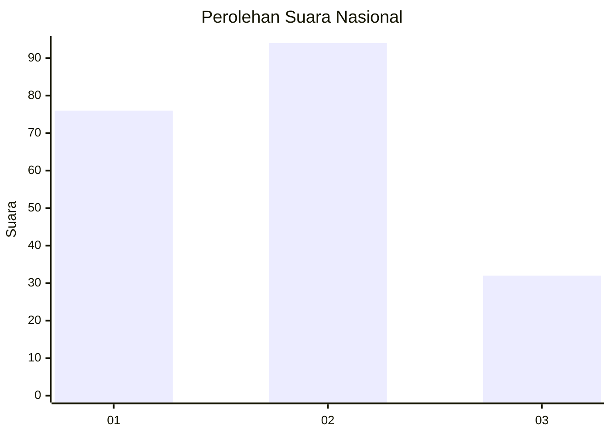
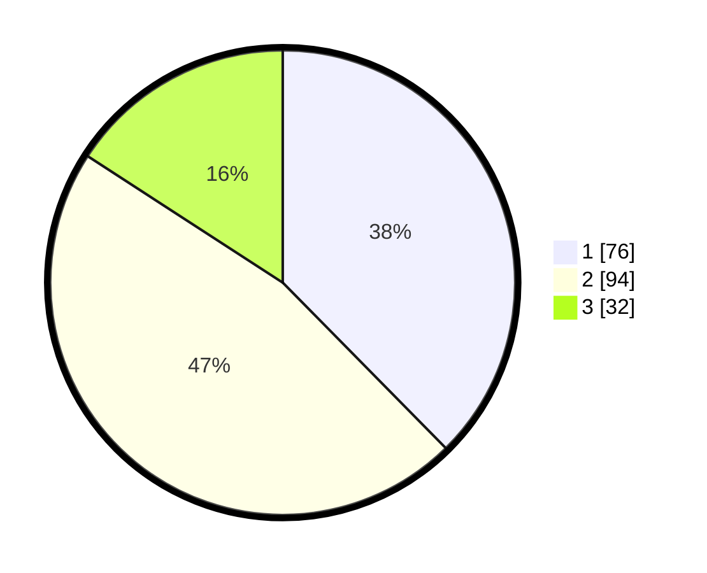

# Hasil

## Grafik

## Tabel

| No. | Nama Paslon    | Suara | Suara (raw) | Persentase |
|:--- |:-------------- | -----:| -----------:| ----------:|
| 1   | ANIES MUHAIMIN | 76    | [76][p-1]   | 37,62      |
| 2   | PRABOWO GIBRAN | 94    | [94][p-2]   | 46,53      |
| 3   | GANJAR MAHFUD  | 32    | [32][p-3]   | 15,84      |

[p-1]: https://github.com/gigit-pemilu/pemilu-2024/blob/main/pilpres/hitung-suara/sub/16-sumatera-selatan/sub/71-kota-palembang/sub/05-ilir-timur-satu/sub/1007-dua-puluh-ilir-tiga/sub/001-tps/sub/paslon-1.txt
[p-2]: https://github.com/gigit-pemilu/pemilu-2024/blob/main/pilpres/hitung-suara/sub/16-sumatera-selatan/sub/71-kota-palembang/sub/05-ilir-timur-satu/sub/1007-dua-puluh-ilir-tiga/sub/001-tps/sub/paslon-2.txt
[p-3]: https://github.com/gigit-pemilu/pemilu-2024/blob/main/pilpres/hitung-suara/sub/16-sumatera-selatan/sub/71-kota-palembang/sub/05-ilir-timur-satu/sub/1007-dua-puluh-ilir-tiga/sub/001-tps/sub/paslon-3.txt

## Foto C Plano

https://sirekap-obj-formc.kpu.go.id/6513/pemilu/ppwp/16/71/05/10/07/1671051007001-20240215-203421--eab9015b-7de3-44a7-b53a-3d82bd0320a4.jpg

https://sirekap-obj-formc.kpu.go.id/6513/pemilu/ppwp/16/71/05/10/07/1671051007001-20240215-000020--5b6a3522-9304-426f-886a-5a7166361b70.jpg

https://sirekap-obj-formc.kpu.go.id/6513/pemilu/ppwp/16/71/05/10/07/1671051007001-20240215-000036--c93c0477-cb32-4916-aef7-a2b41954de73.jpg

## Metadata

| Key        | Value               |
| ---------- | ------------------- |
| Time Stamp | 2024-02-24 22:31:28 |

