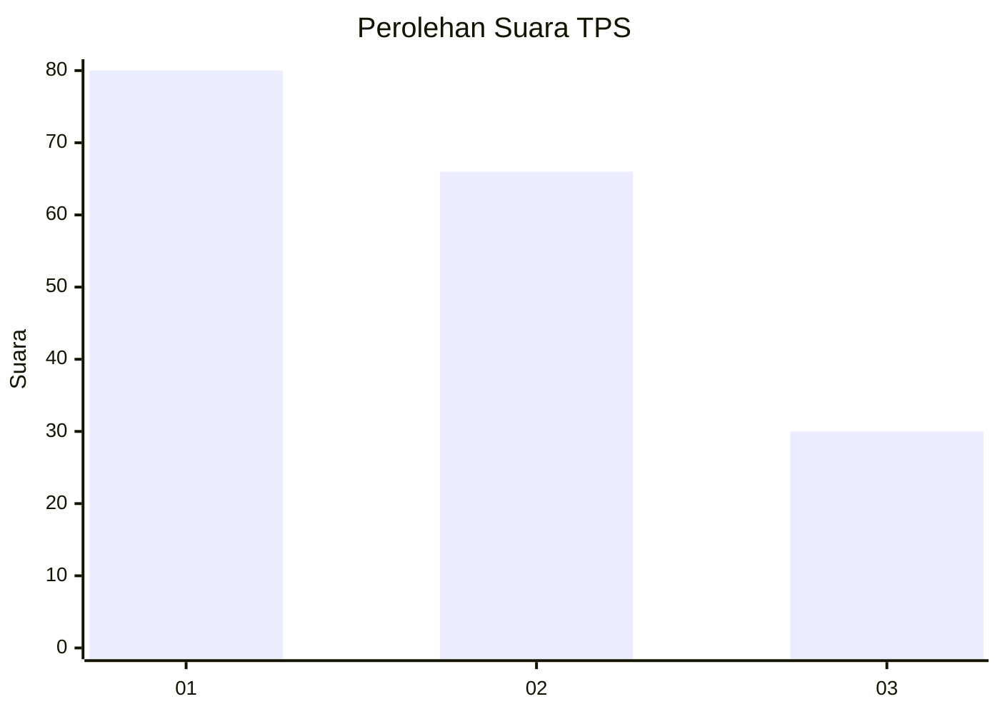
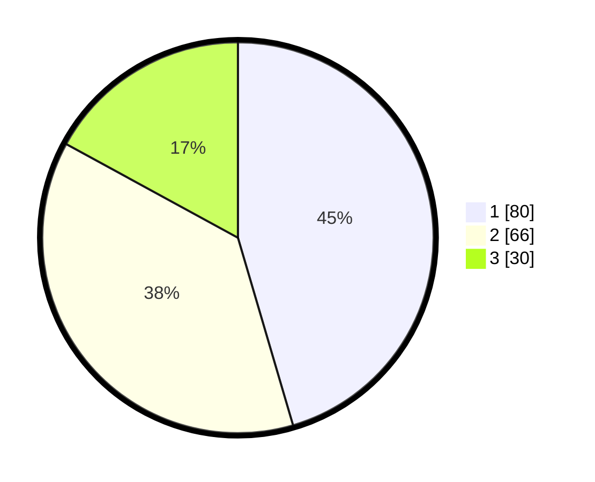

# Hasil

## Grafik

## Tabel

| No. | Nama Paslon    | Suara | Suara (raw) | Persentase |
|:--- |:-------------- | -----:| -----------:| ----------:|
| 1   | ANIES MUHAIMIN | 80    | [80][p-1]   | 45,45      |
| 2   | PRABOWO GIBRAN | 66    | [66][p-2]   | 37,50      |
| 3   | GANJAR MAHFUD  | 30    | [30][p-3]   | 17,05      |

[p-1]: https://github.com/gigit-pemilu/pemilu-2024-16-sumatera-selatan/blob/main/pilpres/hitung-suara/sub/16-sumatera-selatan/sub/71-kota-palembang/sub/05-ilir-timur-satu/sub/1007-dua-puluh-ilir-tiga/sub/004-tps/sub/paslon-1.txt
[p-2]: https://github.com/gigit-pemilu/pemilu-2024-16-sumatera-selatan/blob/main/pilpres/hitung-suara/sub/16-sumatera-selatan/sub/71-kota-palembang/sub/05-ilir-timur-satu/sub/1007-dua-puluh-ilir-tiga/sub/004-tps/sub/paslon-2.txt
[p-3]: https://github.com/gigit-pemilu/pemilu-2024-16-sumatera-selatan/blob/main/pilpres/hitung-suara/sub/16-sumatera-selatan/sub/71-kota-palembang/sub/05-ilir-timur-satu/sub/1007-dua-puluh-ilir-tiga/sub/004-tps/sub/paslon-3.txt

## Foto C Plano

https://sirekap-obj-formc.kpu.go.id/613a/pemilu/ppwp/16/71/05/10/07/1671051007004-20240214-235910--011db489-d344-4845-b8e7-647a07425b7c.jpg

https://sirekap-obj-formc.kpu.go.id/613a/pemilu/ppwp/16/71/05/10/07/1671051007004-20240215-000132--f210b519-cfbf-4cf6-867b-05a77a6b172e.jpg

https://sirekap-obj-formc.kpu.go.id/613a/pemilu/ppwp/16/71/05/10/07/1671051007004-20240215-000851--20e13124-baca-4dae-9304-54c95a0aad91.jpg

## Metadata

| Key        | Value               |
| ---------- | ------------------- |
| Time Stamp | 2024-02-24 22:31:28 |

