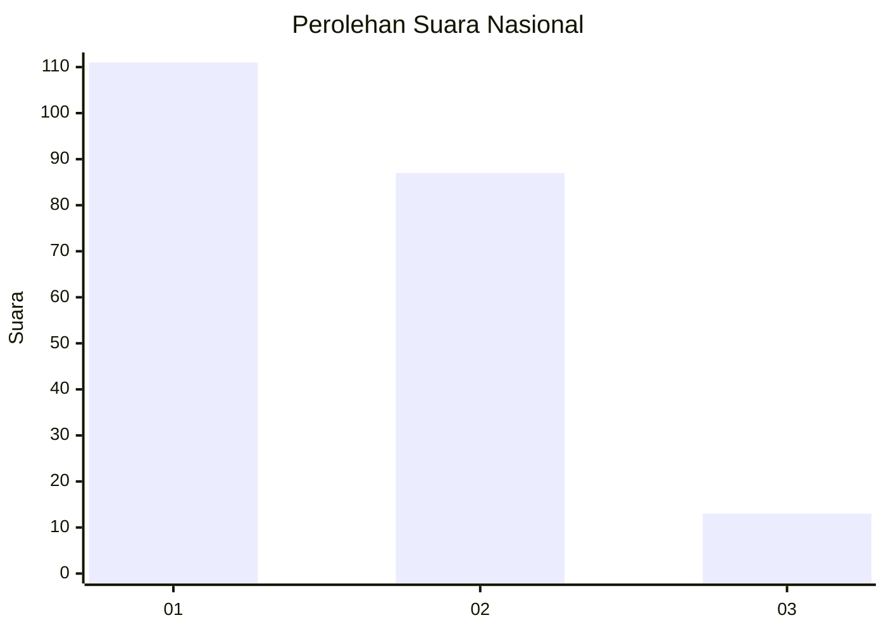
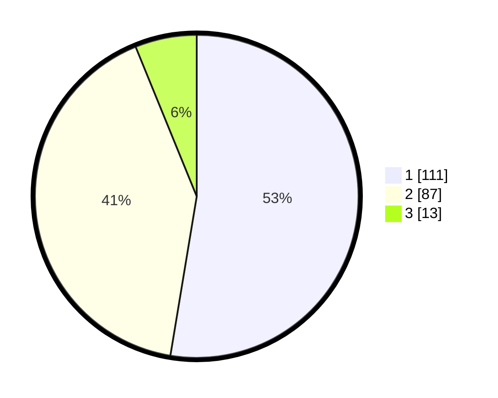

# Hasil

## Grafik

## Tabel

| No. | Nama Paslon    | Suara | Suara (raw) | Persentase |
|:--- |:-------------- | -----:| -----------:| ----------:|
| 1   | ANIES MUHAIMIN | 111   | [111][p-1]  | 52,61      |
| 2   | PRABOWO GIBRAN | 87    | [87][p-2]   | 41,23      |
| 3   | GANJAR MAHFUD  | 13    | [13][p-3]   | 6,16       |

[p-1]: https://github.com/gigit-pemilu/pemilu-2024/blob/main/pilpres/hitung-suara/sub/16-sumatera-selatan/sub/71-kota-palembang/sub/05-ilir-timur-satu/sub/1008-dua-puluh-ilir-empat/sub/001-tps/sub/paslon-1.txt
[p-2]: https://github.com/gigit-pemilu/pemilu-2024/blob/main/pilpres/hitung-suara/sub/16-sumatera-selatan/sub/71-kota-palembang/sub/05-ilir-timur-satu/sub/1008-dua-puluh-ilir-empat/sub/001-tps/sub/paslon-2.txt
[p-3]: https://github.com/gigit-pemilu/pemilu-2024/blob/main/pilpres/hitung-suara/sub/16-sumatera-selatan/sub/71-kota-palembang/sub/05-ilir-timur-satu/sub/1008-dua-puluh-ilir-empat/sub/001-tps/sub/paslon-3.txt

## Foto C Plano

https://sirekap-obj-formc.kpu.go.id/7c0e/pemilu/ppwp/16/71/05/10/08/1671051008001-20240215-195636--c9239214-9d81-4388-9119-141d297ea003.jpg

https://sirekap-obj-formc.kpu.go.id/7c0e/pemilu/ppwp/16/71/05/10/08/1671051008001-20240215-195641--66f9c0bf-bfb9-46a1-914a-93b93b6eb1b4.jpg

https://sirekap-obj-formc.kpu.go.id/7c0e/pemilu/ppwp/16/71/05/10/08/1671051008001-20240215-195645--1a30210d-e480-405e-a625-3c3d2e2c1455.jpg

## Metadata

| Key        | Value               |
| ---------- | ------------------- |
| Time Stamp | 2024-02-15 22:30:27 |

