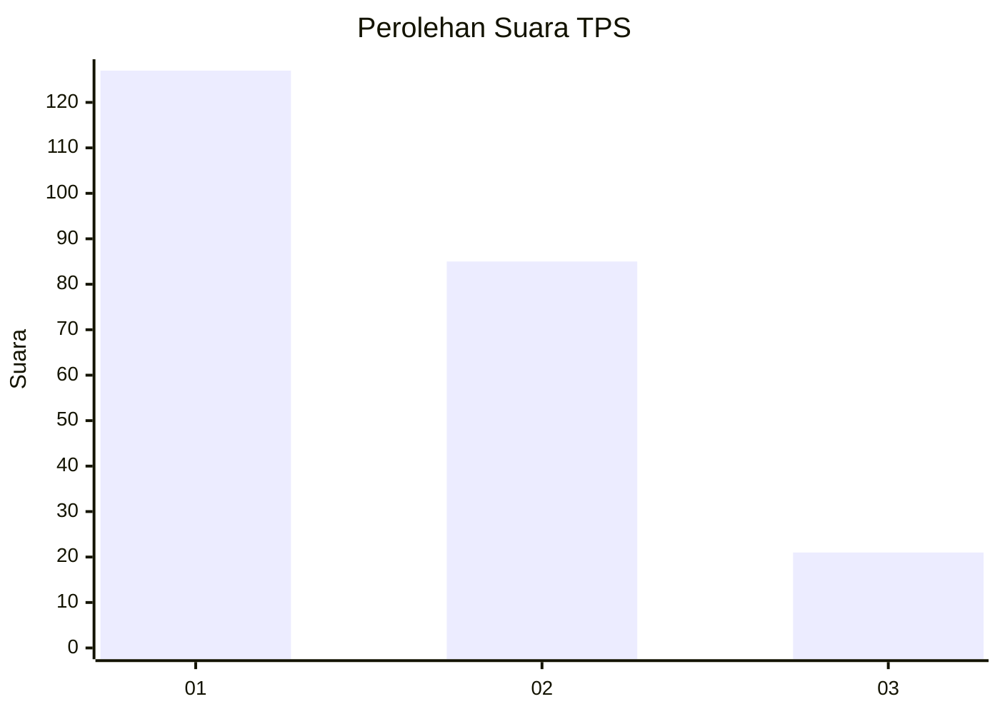
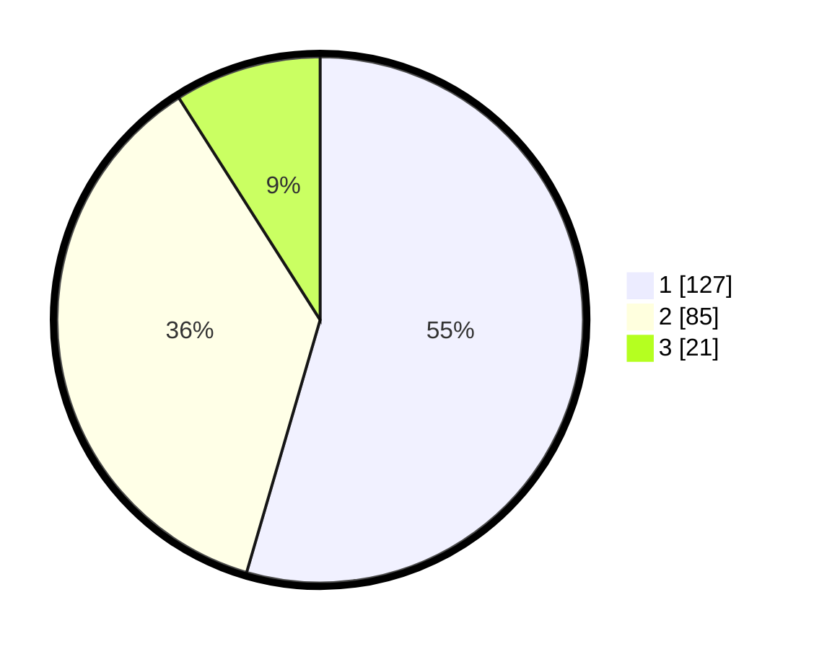

# Hasil

## Grafik

## Tabel

| No. | Nama Paslon    | Suara | Suara (raw) | Persentase |
|:--- |:-------------- | -----:| -----------:| ----------:|
| 1   | ANIES MUHAIMIN | 127   | [127][p-1]  | 54,51      |
| 2   | PRABOWO GIBRAN | 85    | [85][p-2]   | 36,48      |
| 3   | GANJAR MAHFUD  | 21    | [21][p-3]   | 9,01       |

[p-1]: https://github.com/gigit-pemilu/pemilu-2024-16-sumatera-selatan/blob/main/pilpres/hitung-suara/sub/16-sumatera-selatan/sub/71-kota-palembang/sub/05-ilir-timur-satu/sub/1008-dua-puluh-ilir-empat/sub/005-tps/sub/paslon-1.txt
[p-2]: https://github.com/gigit-pemilu/pemilu-2024-16-sumatera-selatan/blob/main/pilpres/hitung-suara/sub/16-sumatera-selatan/sub/71-kota-palembang/sub/05-ilir-timur-satu/sub/1008-dua-puluh-ilir-empat/sub/005-tps/sub/paslon-2.txt
[p-3]: https://github.com/gigit-pemilu/pemilu-2024-16-sumatera-selatan/blob/main/pilpres/hitung-suara/sub/16-sumatera-selatan/sub/71-kota-palembang/sub/05-ilir-timur-satu/sub/1008-dua-puluh-ilir-empat/sub/005-tps/sub/paslon-3.txt

## Foto C Plano

https://sirekap-obj-formc.kpu.go.id/8d82/pemilu/ppwp/16/71/05/10/08/1671051008005-20240215-014557--6916821a-8b04-4239-ad74-fbfd31ab5445.jpg

https://sirekap-obj-formc.kpu.go.id/8d82/pemilu/ppwp/16/71/05/10/08/1671051008005-20240215-014806--e310f1c4-6777-4809-9511-0e3598a98adb.jpg

https://sirekap-obj-formc.kpu.go.id/8d82/pemilu/ppwp/16/71/05/10/08/1671051008005-20240215-014847--b6a71dbf-5cff-474f-a70b-1d5d39b9d1ce.jpg

## Metadata

| Key        | Value               |
| ---------- | ------------------- |
| Time Stamp | 2024-02-25 21:00:00 |

