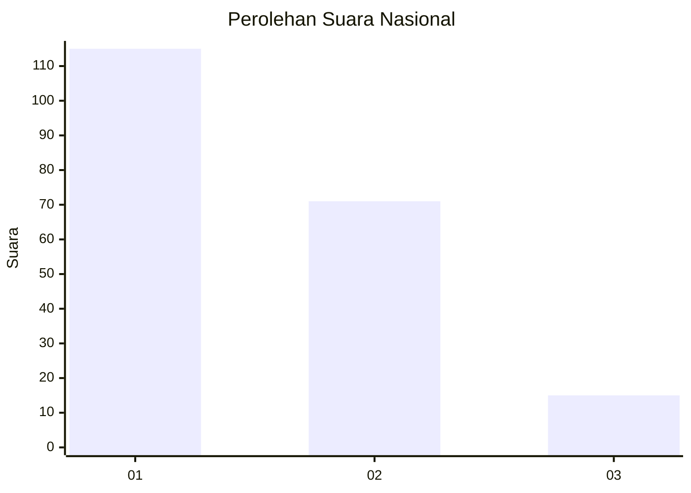
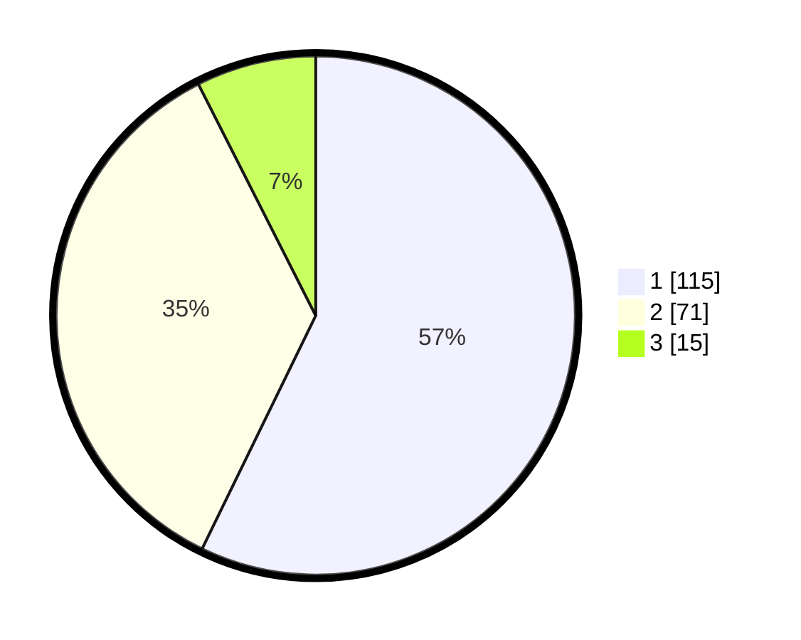

# Hasil

## Grafik

## Tabel

| No. | Nama Paslon    | Suara | Suara (raw) | Persentase |
|:--- |:-------------- | -----:| -----------:| ----------:|
| 1   | ANIES MUHAIMIN | 115   | [115][p-1]  | 57,21      |
| 2   | PRABOWO GIBRAN | 71    | [71][p-2]   | 35,32      |
| 3   | GANJAR MAHFUD  | 15    | [15][p-3]   | 7,46       |

[p-1]: https://github.com/gigit-pemilu/pemilu-2024/blob/main/pilpres/hitung-suara/sub/16-sumatera-selatan/sub/71-kota-palembang/sub/05-ilir-timur-satu/sub/1008-dua-puluh-ilir-empat/sub/022-tps/sub/paslon-1.txt
[p-2]: https://github.com/gigit-pemilu/pemilu-2024/blob/main/pilpres/hitung-suara/sub/16-sumatera-selatan/sub/71-kota-palembang/sub/05-ilir-timur-satu/sub/1008-dua-puluh-ilir-empat/sub/022-tps/sub/paslon-2.txt
[p-3]: https://github.com/gigit-pemilu/pemilu-2024/blob/main/pilpres/hitung-suara/sub/16-sumatera-selatan/sub/71-kota-palembang/sub/05-ilir-timur-satu/sub/1008-dua-puluh-ilir-empat/sub/022-tps/sub/paslon-3.txt

## Foto C Plano

https://sirekap-obj-formc.kpu.go.id/6b2f/pemilu/ppwp/16/71/05/10/08/1671051008022-20240215-010401--5e23d445-2c51-45be-95db-9a9dae6e2e82.jpg

https://sirekap-obj-formc.kpu.go.id/6b2f/pemilu/ppwp/16/71/05/10/08/1671051008022-20240215-010519--7559301b-adc8-4e27-97bd-335dea4cb846.jpg

https://sirekap-obj-formc.kpu.go.id/6b2f/pemilu/ppwp/16/71/05/10/08/1671051008022-20240215-010653--0dcf88fc-47f0-4ea3-a30d-4c63cc1fc2e0.jpg

## Metadata

| Key        | Value               |
| ---------- | ------------------- |
| Time Stamp | 2024-02-17 16:00:02 |

