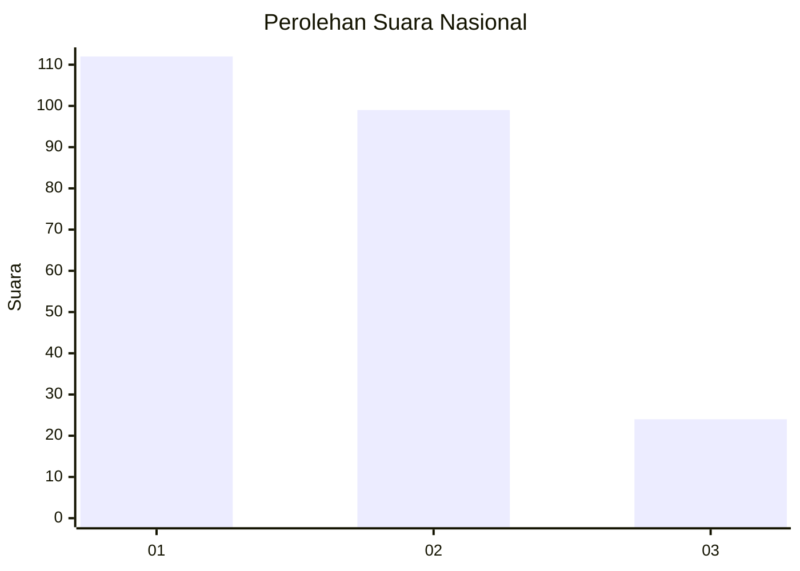
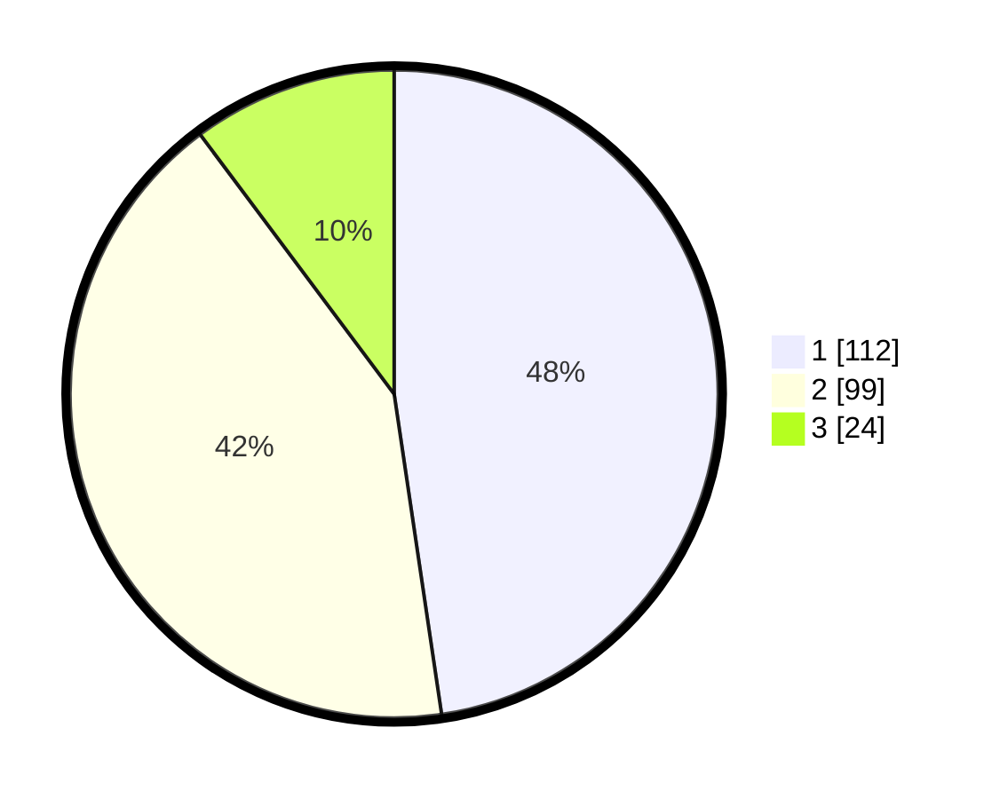

# Hasil

## Grafik

## Tabel

| No. | Nama Paslon    | Suara | Suara (raw) | Persentase |
|:--- |:-------------- | -----:| -----------:| ----------:|
| 1   | ANIES MUHAIMIN | 112   | [112][p-1]  | 47,66      |
| 2   | PRABOWO GIBRAN | 99    | [99][p-2]   | 42,13      |
| 3   | GANJAR MAHFUD  | 24    | [24][p-3]   | 10,21      |

[p-1]: https://github.com/gigit-pemilu/pemilu-2024/blob/main/pilpres/hitung-suara/sub/16-sumatera-selatan/sub/71-kota-palembang/sub/05-ilir-timur-satu/sub/1008-dua-puluh-ilir-empat/sub/032-tps/sub/paslon-1.txt
[p-2]: https://github.com/gigit-pemilu/pemilu-2024/blob/main/pilpres/hitung-suara/sub/16-sumatera-selatan/sub/71-kota-palembang/sub/05-ilir-timur-satu/sub/1008-dua-puluh-ilir-empat/sub/032-tps/sub/paslon-2.txt
[p-3]: https://github.com/gigit-pemilu/pemilu-2024/blob/main/pilpres/hitung-suara/sub/16-sumatera-selatan/sub/71-kota-palembang/sub/05-ilir-timur-satu/sub/1008-dua-puluh-ilir-empat/sub/032-tps/sub/paslon-3.txt

## Foto C Plano

https://sirekap-obj-formc.kpu.go.id/b31f/pemilu/ppwp/16/71/05/10/08/1671051008032-20240214-231719--469677cb-ef9b-4f3b-b582-471d226831cd.jpg

https://sirekap-obj-formc.kpu.go.id/b31f/pemilu/ppwp/16/71/05/10/08/1671051008032-20240214-232051--8e992108-bde0-4a51-9b48-8c60b3586b1a.jpg

https://sirekap-obj-formc.kpu.go.id/b31f/pemilu/ppwp/16/71/05/10/08/1671051008032-20240214-232442--dc08f46d-eb5b-4f6d-8ec1-de11869677dc.jpg

## Metadata

| Key        | Value               |
| ---------- | ------------------- |
| Time Stamp | 2024-02-25 16:00:00 |

