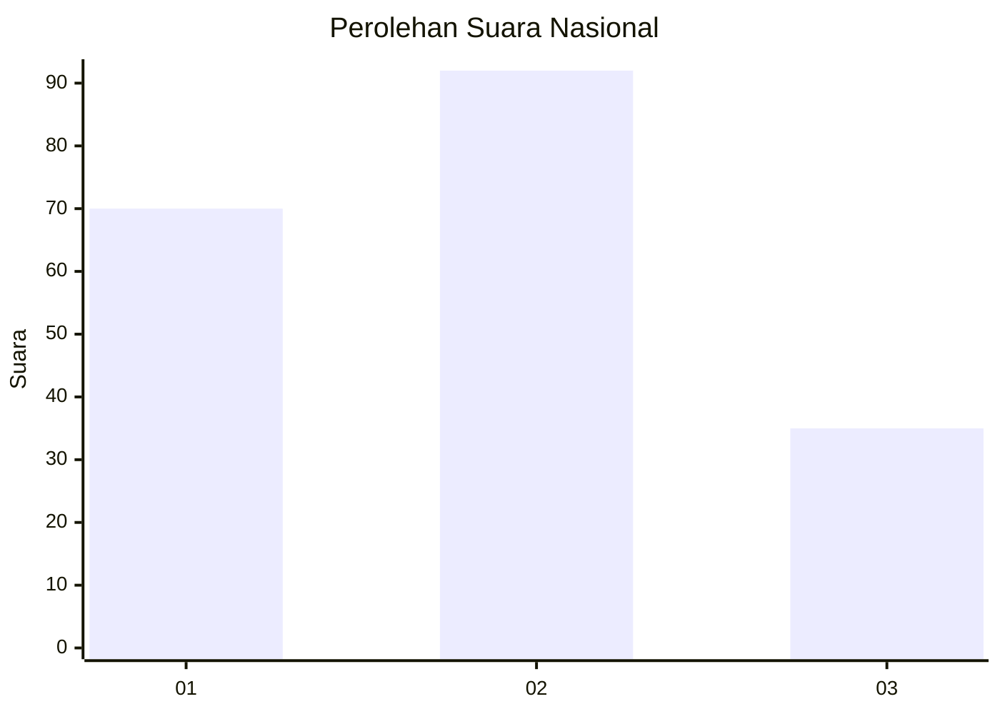
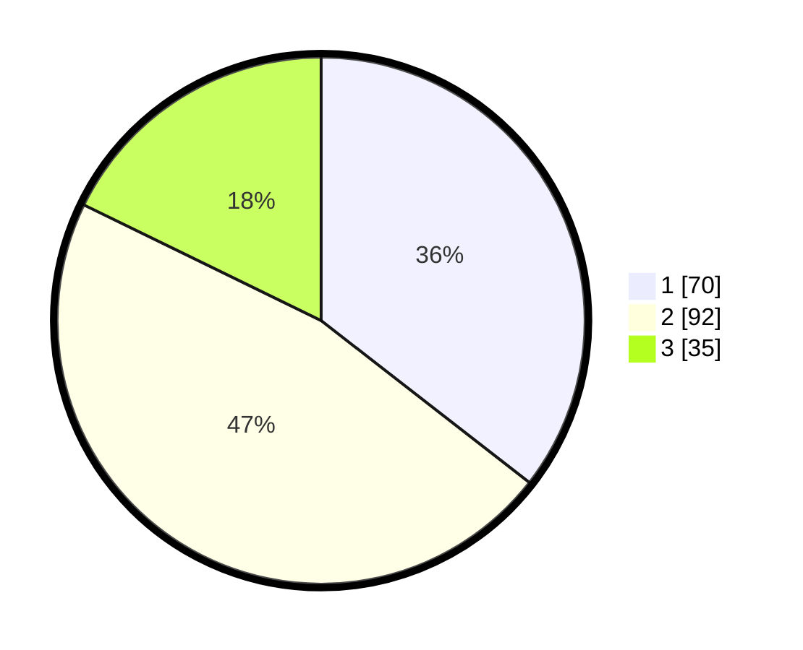

# Hasil

## Grafik

## Tabel

| No. | Nama Paslon    | Suara | Suara (raw) | Persentase |
|:--- |:-------------- | -----:| -----------:| ----------:|
| 1   | ANIES MUHAIMIN | 70    | [70][p-1]   | 35,53      |
| 2   | PRABOWO GIBRAN | 92    | [92][p-2]   | 46,70      |
| 3   | GANJAR MAHFUD  | 35    | [35][p-3]   | 17,77      |

[p-1]: https://github.com/gigit-pemilu/pemilu-2024/blob/main/pilpres/hitung-suara/sub/16-sumatera-selatan/sub/71-kota-palembang/sub/05-ilir-timur-satu/sub/1009-dua-puluh-ilir-satu/sub/001-tps/sub/paslon-1.txt
[p-2]: https://github.com/gigit-pemilu/pemilu-2024/blob/main/pilpres/hitung-suara/sub/16-sumatera-selatan/sub/71-kota-palembang/sub/05-ilir-timur-satu/sub/1009-dua-puluh-ilir-satu/sub/001-tps/sub/paslon-2.txt
[p-3]: https://github.com/gigit-pemilu/pemilu-2024/blob/main/pilpres/hitung-suara/sub/16-sumatera-selatan/sub/71-kota-palembang/sub/05-ilir-timur-satu/sub/1009-dua-puluh-ilir-satu/sub/001-tps/sub/paslon-3.txt

## Foto C Plano

https://sirekap-obj-formc.kpu.go.id/7a0b/pemilu/ppwp/16/71/05/10/09/1671051009001-20240215-060939--48204ed8-31d2-40e8-8aa8-292a289b73d8.jpg

https://sirekap-obj-formc.kpu.go.id/7a0b/pemilu/ppwp/16/71/05/10/09/1671051009001-20240215-061051--d2a59d75-8f30-4ebe-8e4b-0198637e89f9.jpg

https://sirekap-obj-formc.kpu.go.id/7a0b/pemilu/ppwp/16/71/05/10/09/1671051009001-20240215-061132--c51d2381-78c0-4d42-ab61-5b396889e21e.jpg

## Metadata

| Key        | Value               |
| ---------- | ------------------- |
| Time Stamp | 2024-02-24 22:31:28 |

