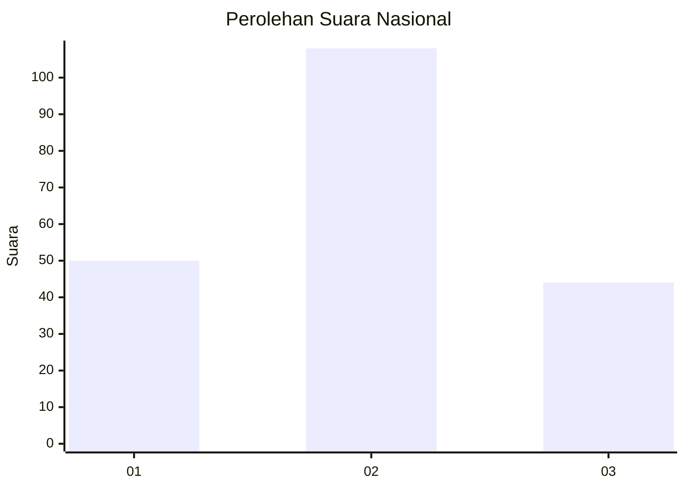
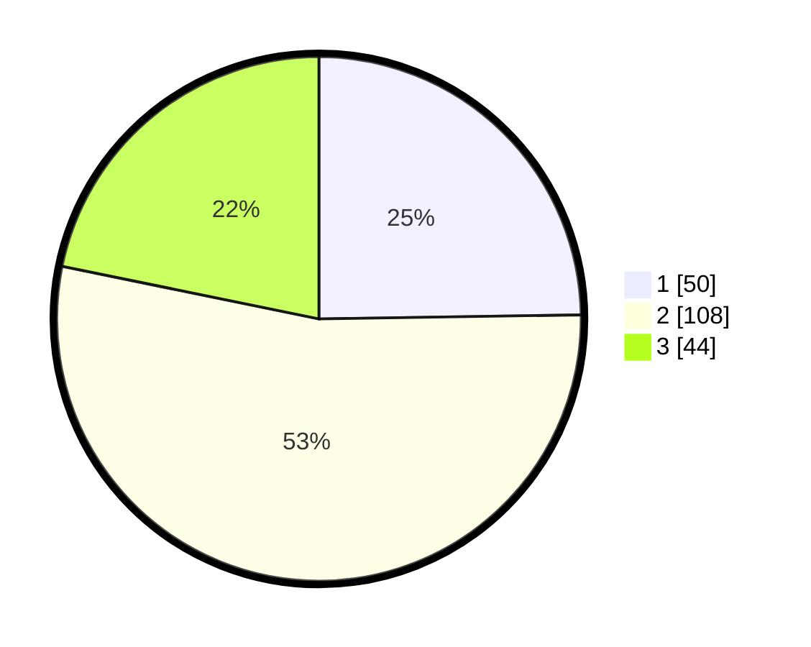

# Hasil

## Grafik

## Tabel

| No. | Nama Paslon    | Suara | Suara (raw) | Persentase |
|:--- |:-------------- | -----:| -----------:| ----------:|
| 1   | ANIES MUHAIMIN | 50    | [50][p-1]   | 24,75      |
| 2   | PRABOWO GIBRAN | 108   | [108][p-2]  | 53,47      |
| 3   | GANJAR MAHFUD  | 44    | [44][p-3]   | 21,78      |

[p-1]: https://github.com/gigit-pemilu/pemilu-2024/blob/main/pilpres/hitung-suara/sub/16-sumatera-selatan/sub/71-kota-palembang/sub/05-ilir-timur-satu/sub/1009-dua-puluh-ilir-satu/sub/006-tps/sub/paslon-1.txt
[p-2]: https://github.com/gigit-pemilu/pemilu-2024/blob/main/pilpres/hitung-suara/sub/16-sumatera-selatan/sub/71-kota-palembang/sub/05-ilir-timur-satu/sub/1009-dua-puluh-ilir-satu/sub/006-tps/sub/paslon-2.txt
[p-3]: https://github.com/gigit-pemilu/pemilu-2024/blob/main/pilpres/hitung-suara/sub/16-sumatera-selatan/sub/71-kota-palembang/sub/05-ilir-timur-satu/sub/1009-dua-puluh-ilir-satu/sub/006-tps/sub/paslon-3.txt

## Foto C Plano

https://sirekap-obj-formc.kpu.go.id/d585/pemilu/ppwp/16/71/05/10/09/1671051009006-20240215-000654--93659a40-e870-49b2-8de1-cdf3f142089a.jpg

https://sirekap-obj-formc.kpu.go.id/d585/pemilu/ppwp/16/71/05/10/09/1671051009006-20240215-001033--e403b504-acab-4825-8aa4-12fee240f17b.jpg

https://sirekap-obj-formc.kpu.go.id/d585/pemilu/ppwp/16/71/05/10/09/1671051009006-20240215-001238--fcd08cae-31a1-4131-9308-ff734ae259d5.jpg

## Metadata

| Key        | Value               |
| ---------- | ------------------- |
| Time Stamp | 2024-02-25 16:00:00 |

