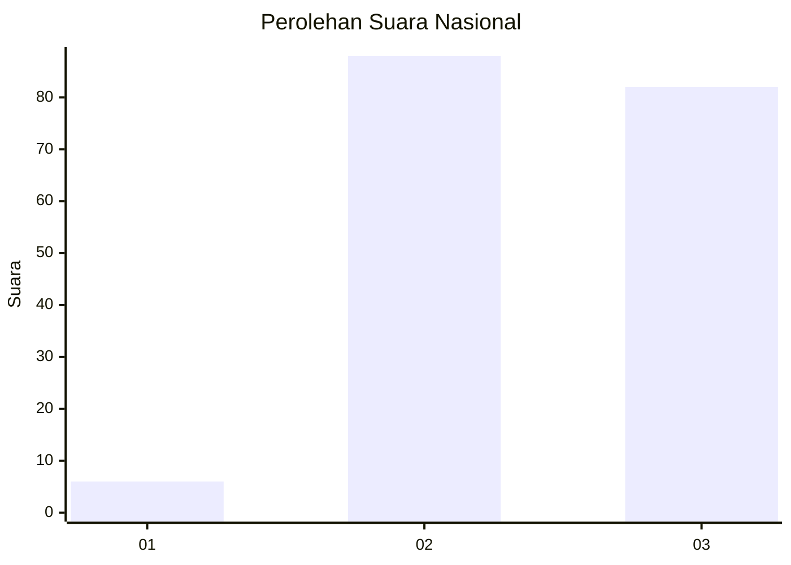
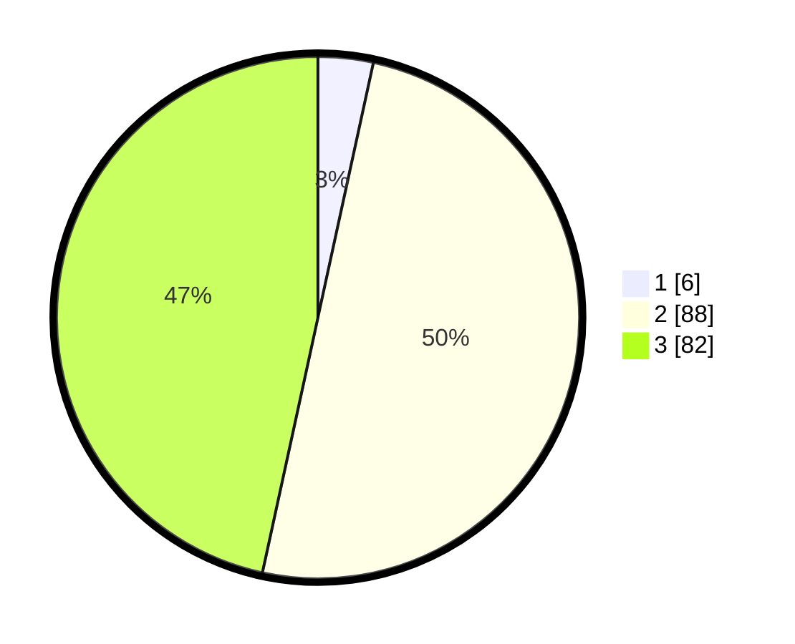

# Hasil

## Grafik

## Tabel

| No. | Nama Paslon    | Suara | Suara (raw) | Persentase |
|:--- |:-------------- | -----:| -----------:| ----------:|
| 1   | ANIES MUHAIMIN | 6     | [6][p-1]    | 3,41       |
| 2   | PRABOWO GIBRAN | 88    | [88][p-2]   | 50,00      |
| 3   | GANJAR MAHFUD  | 82    | [82][p-3]   | 46,59      |

[p-1]: https://github.com/gigit-pemilu/pemilu-2024/blob/main/pilpres/hitung-suara/sub/16-sumatera-selatan/sub/71-kota-palembang/sub/05-ilir-timur-satu/sub/1009-dua-puluh-ilir-satu/sub/013-tps/sub/paslon-1.txt
[p-2]: https://github.com/gigit-pemilu/pemilu-2024/blob/main/pilpres/hitung-suara/sub/16-sumatera-selatan/sub/71-kota-palembang/sub/05-ilir-timur-satu/sub/1009-dua-puluh-ilir-satu/sub/013-tps/sub/paslon-2.txt
[p-3]: https://github.com/gigit-pemilu/pemilu-2024/blob/main/pilpres/hitung-suara/sub/16-sumatera-selatan/sub/71-kota-palembang/sub/05-ilir-timur-satu/sub/1009-dua-puluh-ilir-satu/sub/013-tps/sub/paslon-3.txt

## Foto C Plano

https://sirekap-obj-formc.kpu.go.id/f24b/pemilu/ppwp/16/71/05/10/09/1671051009013-20240214-222524--4e75eb67-b94b-4fe4-83ca-d19976de963c.jpg

https://sirekap-obj-formc.kpu.go.id/f24b/pemilu/ppwp/16/71/05/10/09/1671051009013-20240214-222545--da135a91-41ec-4b13-9510-4e249d3ecc1d.jpg

https://sirekap-obj-formc.kpu.go.id/f24b/pemilu/ppwp/16/71/05/10/09/1671051009013-20240214-222557--3dff11bd-48d2-4716-915c-25fe4b91ffb6.jpg

## Metadata

| Key        | Value               |
| ---------- | ------------------- |
| Time Stamp | 2024-02-25 21:00:00 |

